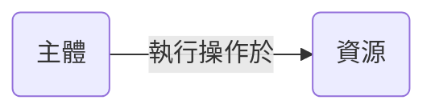
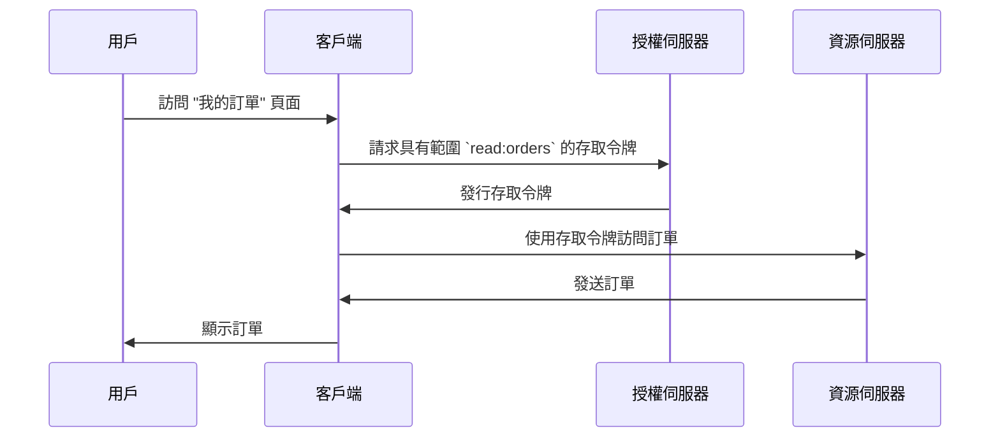

## 什麼是存取控制 (Access control)？

存取控制 (Access control) 涉及三個主要組件：

- **主體**：在資源上執行操作的實體。主體可以是用戶、服務或設備。
- **資源**：由存取控制 (Access control) 保護的實體。資源可以是文件、資料庫、API 或任何其他數字資產。
- **操作**：主體可以在資源上執行的操作。操作可以是讀取、寫入、執行或任何其他操作。

> 存取控制 (Access control) 根據**主體**和**操作**定義對**資源**的選擇性存取限制。

以下是一些存取控制 (Access control) 的實際例子：

- 在電子商務系統中，用戶 (subject) **可以** 讀取 (action) 他們的訂單 (resource)。
- 在社交網路中，用戶 (subject) **不能** 刪除 (action) 其他用戶的個人資料 (resource)。
- 在微服務架構中，服務 (subject) **可以** 寫入 (action) 數據到資料庫 (resource)。

有時在技術實現中會忽略資源，存取控制 (Access control) 被定義為限制誰 (subject) 可以執行哪些操作。例如，基本的 OAuth 2.0 框架只使用範圍 (scope)（權限）來指定操作，並不定義資源。

對於存取控制 (Access control) 的支持可能會根據 <Ref slug="authorization-server" /> 或 <Ref slug="identity-provider" /> 而有所不同。一些系統可能會支持 [OAuth 2.0 的資源指示器 (Resource Indicators)](https://datatracker.ietf.org/doc/html/rfc8707)，這是一個允許客戶端指定他們想要訪問的資源的 OAuth 2.0 擴展。

## 存取控制 (Access control) 模型 ||access-control-models||

在少數主體與資源間決定限制是簡單的，但是不具有可擴展性。因此，業界開發了許多存取控制 (Access control) 模型來有效管理。在 <Ref slug="iam" /> 的背景下，以下是一些常見的存取控制 (Access control) 模型：

- <Ref slug="rbac" />：這是一個將權限分配給角色，然後將角色分配給主體的模型。例如，管理員角色可能對所有資源具有訪問權限，而用戶角色可能僅具有有限的資源訪問權限。
- <Ref slug="abac" />：這是一個使用主體、資源和環境的屬性 (properties) 來做出存取控制 (Access control) 決策的模型。例如，具有"部門=工程"屬性的用戶可能具有對工程資源的訪問權限。

還有其他的存取控制 (Access control) 模型，例如 [基於政策的存取控制 (PBAC)](https://csrc.nist.gov/glossary/term/policy_based_access_control)。每個模型都有其自身的優勢和劣勢，模型的選擇取決於你的使用案例和需求。

## OAuth 2.0 中的存取控制 (Access control)

在 OAuth 2.0 的背景下，存取控制 (Access control) 通常使用 <Ref slug="scope">scope</Ref> 實現。通常，範圍的值是一個將資源和操作結合在一起的字串。例如，`read:orders` 或 `write:profile`。

> [!Note]
> 在大多數情況下，"scopes" 與 "permissions" 是可以互換的。

值得注意的是，OAuth 2.0 並未定義範圍的結構和意義。範圍的解釋留給 <Ref slug="resource-server" />，而範圍的發行則留給 <Ref slug="authorization-server" />。

例如，一個用戶 (subject) 需要在電子商務系統中訪問他們的訂單 (resource)。通過利用 OAuth 2.0，你可以定義一個範圍 `read:orders` 且一個網絡應用程序 (client) 會從授權伺服器請求這個範圍。這是一個簡化的流程：

在這個流程中，根據技術架構，資源伺服器可以是 API 服務，或者只要具備訪問資源（訂單）能力，也可以是客戶端（網絡應用程序）本身。

### 資源指示器參數

儘管人們經常將範圍定義為資源和操作（例如，`read:orders`，其中 `orders` 是資源而 `read` 是操作），但當資源和操作的數量增加時，這種方法的可擴展性是有限的。RFC 8707 引入了 `resource` 參數（即 <Ref slug="resource-indicator">resource indicators</Ref>） 到 OAuth 2.0，這允許客戶端指定他們想要訪問的資源。

RFC 指定 `resource` 參數應為表示資源的 URI。例如，與其僅使用 `orders`，你可以使用 `https://api.example.com/orders`。這種方法有助於防止命名衝突並通過允許使用實際資源 URL 增強資源匹配的精確度。

### 授權伺服器支援

OAuth 2.0 並未定義授權伺服器應如何進行存取控制 (Access control)。它將實施細節留給授權伺服器。因此，授權伺服器的選擇可以極大地影響存取控制 (Access control) 機制。例如，一些授權伺服器可能支持資源指示器，而其他可能不支持。根據你的業務需求來決定使用哪種存取控制 (Access control) 模型，然後選擇支持該模型的授權伺服器是很重要的。如果你不確定使用哪種存取控制 (Access control) 模型，<Ref slug="rbac" /> 對於大多數情況來說已足夠。

<SeeAlso slugs={["rbac", "abac", "resource-indicator", "authorization"]} />

<Resources
  urls={[
    "https://blog.logto.io/mastering-rbac",
    "https://blog.logto.io/rbac-and-abac",
    "https://datatracker.ietf.org/doc/html/rfc8707",
    "https://blog.logto.io/organization-and-role-based-access-control",
  ]}
/>
