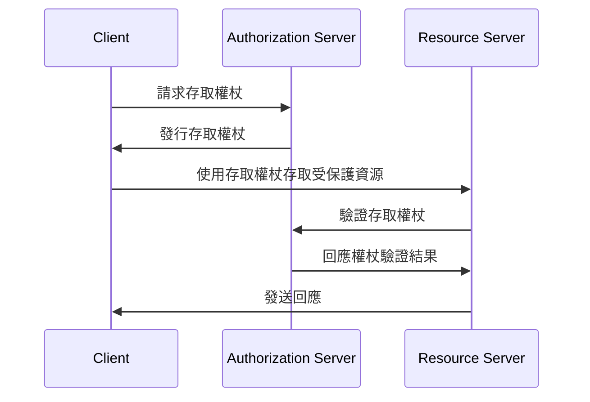
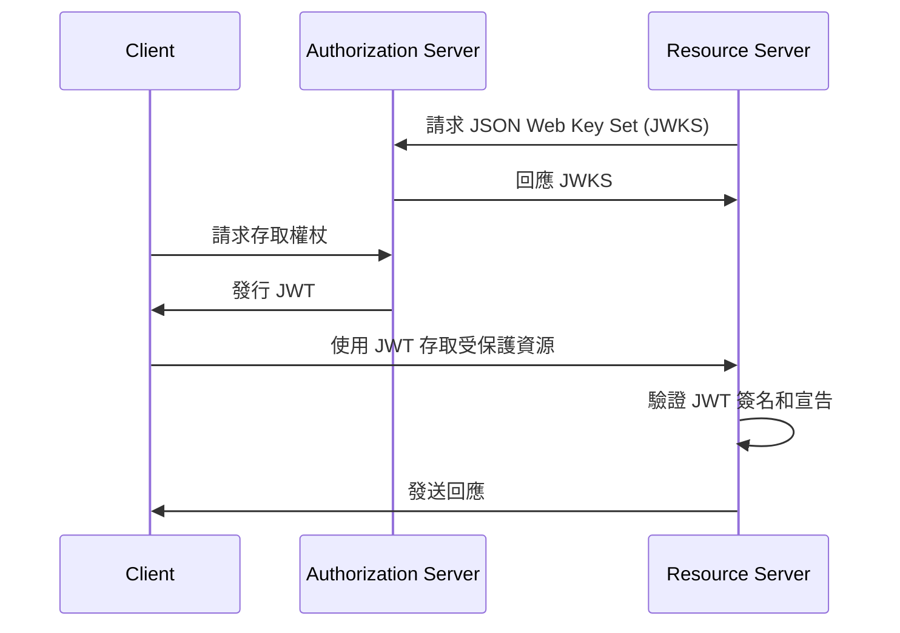
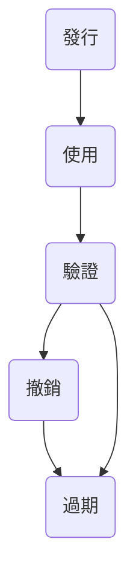

## 什麼是存取權杖 (Access token)？

存取權杖 (Access token) 是一種憑證，通常是一串字符，用於存取受保護的資源。在 OAuth 2.0 和 OpenID Connect (OIDC) 的上下文中，<Ref slug="authorization-server">授權伺服器 (Authorization server)</Ref> 可以在成功認證 (Authentication) 和授權 (Authorization) 後向客戶端（應用程序）發行存取權杖。

儘管 OAuth 2.0 和 OIDC 的 RFC 未對存取權杖 (Access token) 的實現細節進行規範，但實際上有兩種常見類型的存取權杖被使用：

- <Ref slug="opaque-token" />：對客戶端來說，這是一個無意義的隨機字符串（「不透明」）。客戶端向資源伺服器提交權杖，由資源伺服器通過授權伺服器來驗證權杖。
- <Ref slug="jwt" />：一個自包含的權杖，其中包含<Ref slug="claim">宣告 (Claims)</Ref>（如用戶 ID、過期時間）與數位簽名。資源伺服器可以在不向授權伺服器發出額外請求的情況下驗證此權杖。

## 存取權杖 (Access token) 如何運作？

根據存取權杖 (Access token) 類型的不同，使用存取權杖的流程可能會有所不同。

以下是一個使用不透明存取權杖的簡化示例：

以下是一個使用 JWT 的簡化示例：

兩種存取權杖的區別在於資源伺服器如何驗證權杖：

- 每次接收到不透明權杖時，資源伺服器必須向授權伺服器發出額外請求以驗證權杖。
- 因為 JWT 包含所有必要的信息，並且資源伺服器可以從授權伺服器的 JSON Web Key Set (JWKS) 中緩存公鑰，所以資源伺服器可以在不向授權伺服器發出額外請求的情況下驗證 JWT。

存取權杖通常是短期有效的，具有過期時間（例如，1 小時）。當目前的權杖過期時，客戶端必須請求新的存取權杖。

## 我應該使用哪種類型的權杖？

在不透明權杖和 JWT 之間的選擇取決於用例和應用程序的安全需求。以下是這兩種類型權杖的比較：

|                | 不透明權杖                     | JWT                                                           |
|----------------|--------------------------------|---------------------------------------------------------------|
| 格式           | 隨機字符串                     | 自包含的 JSON 對象                                            |
| 效能           | 需要額外的請求                  | 驗證速度更快                                                  |
| 自包含         | 否                             | 是                                                            |
| 權杖大小       | 較小                            | 較大                                                           |
| 撤銷            | 即時                            | 需要權杖過期或授權伺服器互動                                   |
| 擴展性          | 有限                            | 自定義宣告                                                    |
| 無狀態          | 否                             | 是                                                            |
| 安全            | 需要權杖驗證                   | 需要簽名驗證                                                  |
| 標準            | 否                             | 是 (RFC 7519)                                                 |

欲了解更多關於選擇兩者之間的權杖的資訊，請參閱[不透明權杖 vs JWT](https://blog.logto.io/opaque-token-vs-jwt)。

## 授權伺服器和資源伺服器的角色

在大多數情況下，<Ref slug="authorization-server" /> 承擔以下責任：

- 在成功認證 (Authentication) 和授權 (Authorization) 後，向客戶端發行存取權杖。授權伺服器可能根據存取控制 (Access control) 策略（例如用戶同意，<Ref slug="rbac" />, <Ref slug="abac" />）縮小範圍（將範圍減少到一個子集）或拒絕權杖請求。
- 檢查存取權杖是否由授權伺服器發行且未過期或撤銷（<Ref slug="token-introspection" />）。
- 通過權杖內省或 <Ref slug="userinfo-endpoint" /> 提供有關權杖的信息（例如範圍、過期時間）。

你可能注意到，授權伺服器不會解釋存取權杖的含義。例如，存取權杖可能包含範圍 `read:orders`，但授權伺服器不知道該範圍的含義。資源伺服器負責解釋存取權杖，並根據權杖的範圍執行 <Ref slug="access-control" />。也就是說，<Ref slug="resource-server" /> 通常承擔以下責任：

- 驗證存取權杖中的<Ref slug="claim">宣告 (Claims)</Ref>（如過期時間、資源指標、範圍）。
- 根據權杖中的宣告（通常是範圍）執行存取控制。
- 如果存取權杖有效，提供受保護的資源。

## 存取權杖生命周期

存取權杖的生命周期通常涉及以下階段：

<SeeAlso slugs={['opaque-token', 'jwt', 'token-introspection', 'userinfo-endpoint', 'access-control']} />

<Resources
  urls={[
    "https://blog.logto.io/opaque-token-vs-jwt",
    "https://blog.logto.io/oauth2-token-introspection",
    "https://blog.logto.io/understanding-tokens-in-oidc",
    {
      url: "https://datatracker.ietf.org/doc/html/rfc6749#section-1.4",
      result: {
        ogTitle: "OAuth 2.0 Access Token",
      },
    },
    "https://datatracker.ietf.org/doc/html/rfc7662",
  ]}
/>