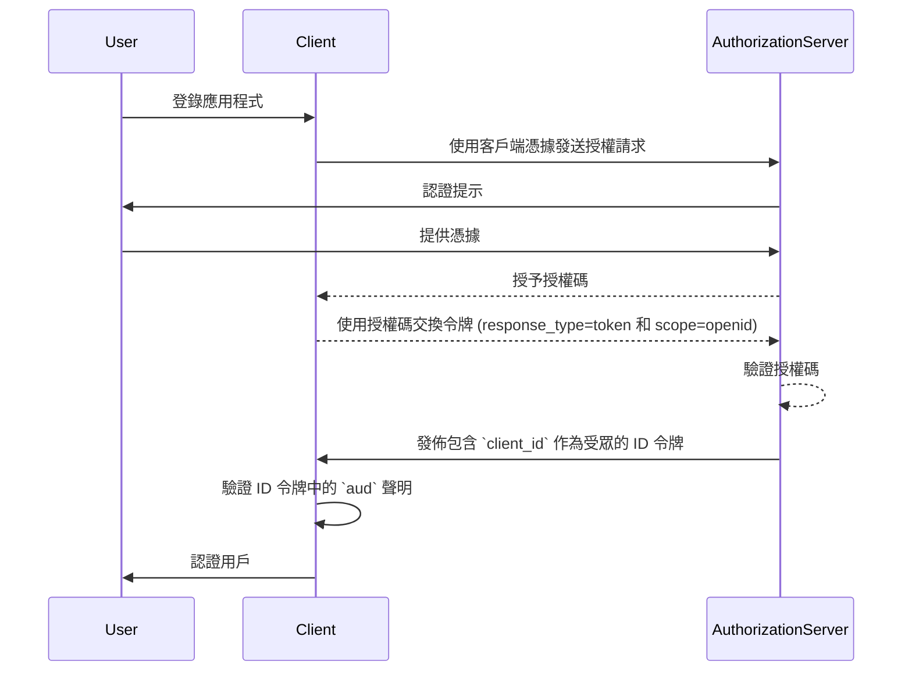
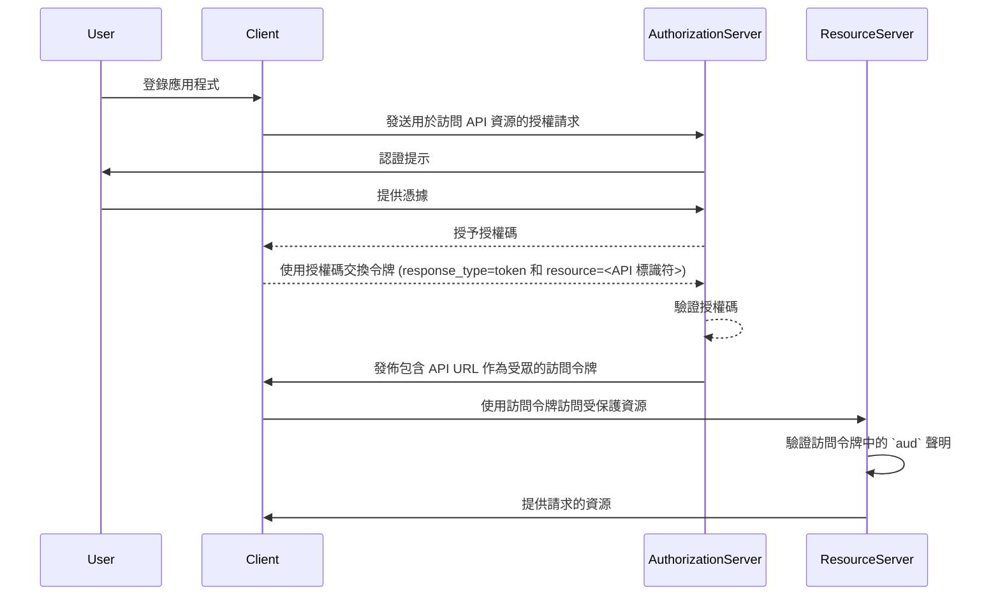

## 什麼是受眾 (Audience)？

在認證 (Authentication) 和授權 (Authorization) 的環境中，受眾 (audience) 是定義授權令牌預期接收者的關鍵組成部分。在 <Ref slug="jwt" /> 中被稱為 [aud](https://datatracker.ietf.org/doc/html/rfc7519#section-4.1.3) 聲明，此聲明確保令牌僅被指定的服務或應用程序接受。通常，受眾聲明包含令牌預期用於的應用程序的 client_id，或代表令牌被授權訪問的 API 或資源的 URL。通過指定受眾，它作為一種安全控制，以防止未經授權的服務或用戶濫用。

## 受眾 (Audience) 如何運作？

當客戶端向授權伺服器請求訪問令牌 (access token) 時，受眾聲明被包含在令牌響應中。當令牌被使用時，資源伺服器會驗證其受眾值。資源伺服器會檢查令牌中的受眾聲明是否與其自己的標識符或其保護的服務的標識符匹配。如果不符合，令牌將被拒絕，這在分佈式系統中增強了安全性，特別是在涉及多個微服務或 API 的情況下。通過控制受眾聲明，開發者可以確保令牌在正確的上下文中使用，為應用程序的認證和授權工作流程增添了一層保護。

- **請求者**：客戶端應用程序在請求令牌時指定受眾值。
- **發布者 (Issuer)**：授權伺服器在令牌響應中包含受眾聲明。
- **驗證者**：令牌的接收者檢查受眾聲明是否與其自身的標識符匹配。如果受眾聲明與接收者的標識符匹配，則令牌被視為有效。否則，它將被拒絕。

## JWT 中受眾的範例

### OpenID Connect (OIDC) ID 令牌中的受眾聲明

```json
{
  "header": {
    "alg": "RS256",
    "typ": "JWT",
    "kid": "abc123"
  },
  "payload": {
    "iss": "https://auth.logto.io",
    "sub": "test_user",
    "aud": "client_id_foo",
    "exp": 1516239022,
    "iat": 1516239022,
    "nonce": "n-0S6_WzA2Mj",
    "primary_email": "foo@logto.io",
    "email_verified": true,
    "username": "foo"
  },
  "signature": "..."
}
```

OpenID Connect (OIDC) 中的 <Ref slug="id-token" /> 是一種安全令牌，包含有關已認證用戶的信息。它在成功認證後交付給客戶端應用程序。與用於授權訪問資源的訪問令牌不同，ID 令牌專門設計來向依賴方（客戶端）傳達用戶身份信息。這些令牌通常編碼為 JWT（JSON Web Tokens），並包含用戶的標識符（sub 聲明）、發布者 (issuer)（iss 聲明）和受眾（aud 聲明）等聲明。

在此情況下，`aud` 聲明指定了 ID 令牌的預期受眾，即客戶端應用程序。`aud` 聲明的值通常對應於請求令牌的應用程序的 `client_id`。當客戶端應用程序收到 ID 令牌時，可以驗證受眾聲明，以確保該令牌是為其使用而發布的。這個驗證步驟有助於防止令牌濫用和未經授權訪問用戶信息，從而增強認證過程的安全性。



### 訪問令牌 (Access Token) 中的受眾聲明

```json
{
  "header": {
    "alg": "RS256",
    "typ": "JWT",
    "kid": "abc123"
  },
  "payload": {
    "iss": "https://auth.logto.io",
    "sub": "test_user",
    "aud": "https://example.logto.app/api/users",
    "exp": 1516239022,
    "iat": 1516239022,
    "scope": "read write",
    "client_id": "client_id_foo"
  },
  "signature": "..."
}
```

與 ID 令牌不同，訪問令牌用於授權進入受保護的資源，例如 API 或服務。訪問令牌中的 `aud` 聲明指定了令牌的預期接收者，通常是令牌被授權訪問的 API 或服務。通常，託管 API 的資源伺服器與請求令牌的客戶端應用程序具有不同的域。在這種情況下，`aud` 聲明不是 `client_id`，而是令牌預期的 API 端點的 URL。這個 URL 通常被稱為資源指標或 API 標識符，以唯一地標識目標資源。

當資源伺服器收到訪問令牌時，它會驗證 `aud` 聲明以確保該令牌是為其使用而發佈的。通過檢查受眾，資源伺服器可以防止未經授權進入其資源，並根據令牌的預期受眾執行訪問控制策略。此機制有助於保護敏感數據，並確保訪問令牌在適當的上下文中使用，從而增強整個系統的安全性。



## 常見問題

### 為什麼在令牌驗證中受眾聲明很重要？

受眾聲明在令牌驗證中至關重要，因為它確保令牌僅被預期的接收者接受。通過驗證受眾聲明，接收者可以防止令牌濫用和未經授權進入資源。此安全控制在多個服務互相作用的分佈式系統中特別重要，因為它幫助執行訪問控制策略並保護敏感數據。

### 一個令牌可以有多個受眾嗎？

出於安全原因，建議一個令牌只有單一受眾，以防止歧義並確保令牌在正確的上下文中使用。然而，某些情景可能需要多個受眾的令牌，例如當一個令牌預期用於同一域內的多個服務或 API。 在這種情況下，開發者應仔細考慮使用多受眾令牌的影響，並實施適當的安全措施來減輕潛在風險。

### 我應該用什麼作為受眾聲明中的 API 標識符？

當指定代表 API 或服務的訪問令牌中的受眾聲明時，建議使用唯一標識資源的絕對 URI。這個 URI 可以是 API 端點的基本 URL，或令牌被授權訪問的特定資源路徑。通過使用 URI 作為 API 標識符，你可以確保受眾聲明無歧義，並準確表示令牌的預期接收者。