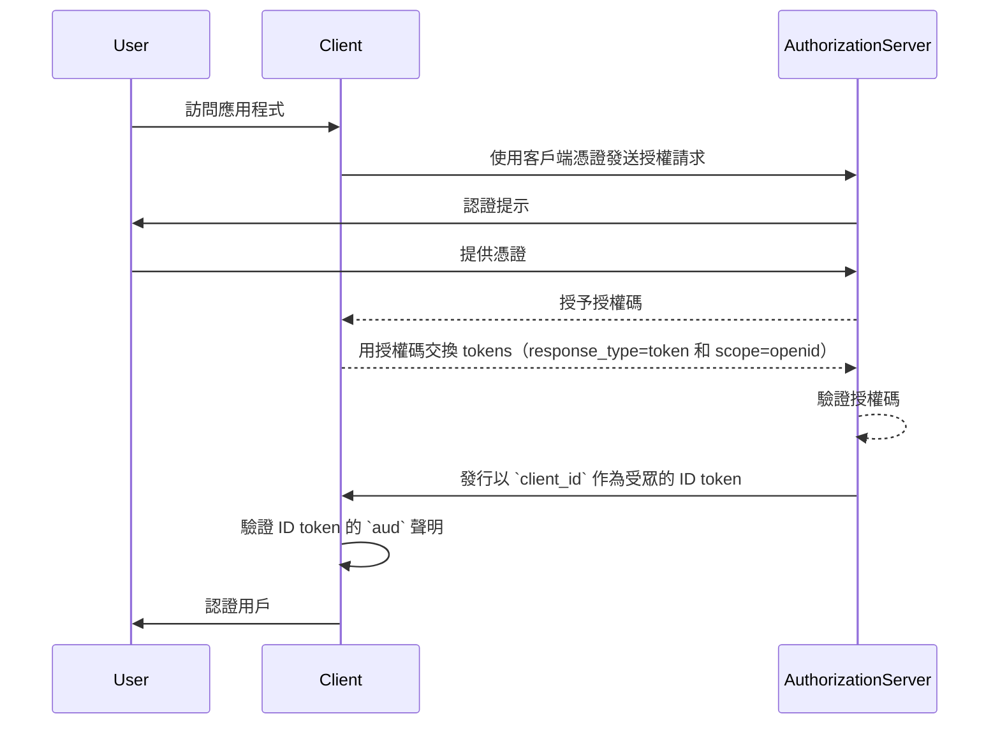
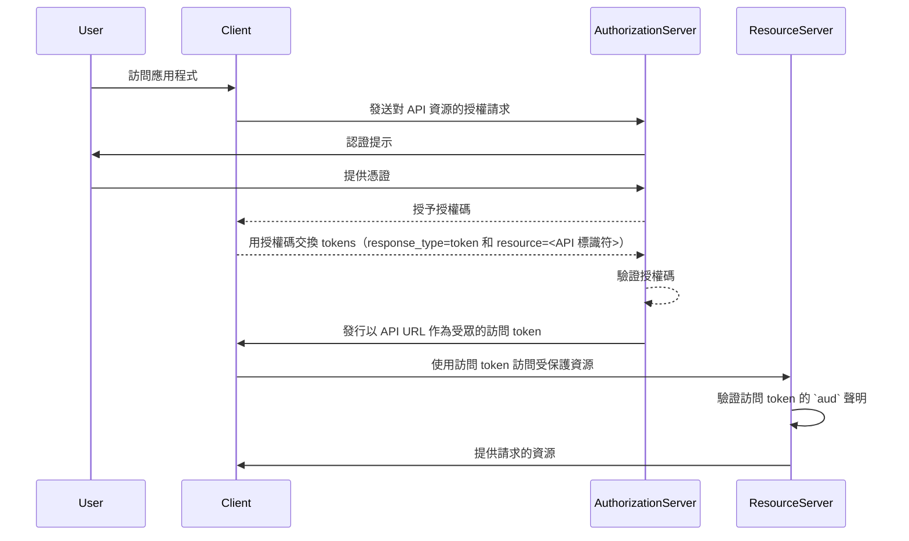

## 什麼是受眾 (Audience)？

在<Ref slug="authentication" />和<Ref slug="authorization" />的上下文中，受眾 (audience) 是定義授權 token 的預期接收者的一個關鍵組成部分。在<Ref slug="jwt" />中被稱為 [aud](https://datatracker.ietf.org/doc/html/rfc7519#section-4.1.3) 聲明，該聲明確保 token 只能被指定的服務或應用程式接受。通常，受眾聲明包含 token 所針對的應用程式的 client_id 或代表 API 或資源的 URL。通過指定受眾，它作為一種安全控制措施來防止未經授權的服務或用戶的誤用。

## 受眾 (Audience) 如何運作？

當客戶端從授權伺服器請求<Ref slug="access-token" />時，受眾聲明被包含在 token 響應中。當 token 被展示時，資源伺服器會驗證這個受眾值。資源伺服器檢查 token 中的受眾聲明是否符合其自身的標識符或其保護的服務的標識符。如果不符合，token 將被拒絕，這增強了分佈式系統中的安全性，特別是在涉及多個微服務或 API 的場景中。通過控制受眾聲明，開發者可以確保 token 在正確的上下文中使用，為應用程式的身份驗證和授權工作流增添額外的保護層。

- **請求者**：客戶端應用程式在請求 token 時指定受眾值。
- **發行者 (Issuer)**：授權伺服器在 token 響應中包含受眾聲明。
- **驗證者**：token 的接收者將受眾聲明與其自身標識符進行對比。如果受眾聲明與接收者的標識符匹配，則 token 被視為有效。否則，將其拒絕。

## JWT 中受眾 (Audience) 的示例

### OpenID Connect (OIDC) ID token 中的受眾 (Audience) 聲明

```json
{
  "header": {
    "alg": "RS256",
    "typ": "JWT",
    "kid": "abc123"
  },
  "payload": {
    "iss": "https://auth.logto.io",
    "sub": "test_user",
    "aud": "client_id_foo",
    "exp": 1516239022,
    "iat": 1516239022,
    "nonce": "n-0S6_WzA2Mj",
    "primary_email": "foo@logto.io",
    "email_verified": true,
    "username": "foo"
  },
  "signature": "..."
}
```

在<Ref slug="openid-connect" />中的<Ref slug="id-token" />是一個包含已驗證用戶資訊的安全 token，在成功驗證後傳遞給客戶端應用程式。與用於授權訪問資源的訪問 token 不同，ID token 專門用於向信賴方（客戶端）傳達用戶身份資訊。這些 token 通常編碼為 JWT，並包括用戶標識符（sub 聲明）、發行者（iss 聲明）和受眾（aud 聲明）等聲明。

在此案例中，`aud` 聲明指定了 ID token 的預期受眾，這是客戶端應用程式。`aud` 聲明的值通常對應於請求 token 的應用程式的 `client_id`。當客戶端應用程式接收到 ID token 時，它可以驗證受眾聲明，確保 token 是針對其消費而發行的。此驗證步驟有助於防止 token 誤用和未授權訪問用戶資訊，增強身份驗證過程的安全性。



### 訪問 token 中的受眾 (Audience) 聲明

```json
{
  "header": {
    "alg": "RS256",
    "typ": "JWT",
    "kid": "abc123"
  },
  "payload": {
    "iss": "https://auth.logto.io",
    "sub": "test_user",
    "aud": "https://example.logto.app/api/users",
    "exp": 1516239022,
    "iat": 1516239022,
    "scope": "read write",
    "client_id": "client_id_foo"
  },
  "signature": "..."
}
```

與 ID token 不同，<Ref slug="access-token" /> 用於授權訪問受保護的資源，例如 API 或服務。訪問 token 中的 `aud` 聲明指定了 token 的預期接收者，通常是授權 token 訪問的 API 或服務。通常，主機 API 的資源伺服器與請求 token 的客戶端應用程式具有不同的域。在這種情況下，代替 `client_id`，`aud` 聲明包含 token 用於的 API 端點的 URL。該 URL 通常被稱為資源指標或 API 標識符，它唯一地標識目標資源。

當資源伺服器收到訪問 token 時，它會驗證 `aud` 聲明以確保 token 是為其消費而發行的。通過檢查受眾，資源伺服器可以防止未經授權的訪問其資源，並根據 token 的預期受眾執行訪問控制策略。這種機制有助於保護敏感數據，並確保訪問 token 在適當的上下文中使用，增強整體系統的安全性。



## 常見問題

### 為什麼受眾 (Audience) 聲明在 token 驗證中很重要？

受眾聲明在 token 驗證中至關重要，因為它確保 token 只被預定的接收者接受。通過驗證受眾聲明，接收者可以防止 token 誤用和未經授權的資源訪問。在多個服務相互交互的分佈式系統中，這一安全控制特別重要，因為它有助於執行訪問控制策略和保護敏感數據。

### 一個 token 可以有多個受眾嗎？

出於安全原因，建議一個 token 應只有一個受眾，以避免模糊性，並確保 token 在正確的上下文中使用。然而，一些場景可能需要具有多個受眾的 tokens，例如當 token 針對同一域中的多個服務或 API 時。在這種情況下，開發者應仔細考慮使用多受眾 tokens 的影響，並實施適當的安全措施來減輕潛在風險。

### 我應該在受眾 (Audience) 聲明中使用什麼作為我的 API 標識符？

當指定訪問 token 中代表 API 或服務的受眾聲明時，建議使用唯一標識資源的絕對 URI。該 URI 可以是 API 端點的基本 URL 或 token 被授權訪問的特定資源路徑。通過使用 URI 作為 API 標識符，可以確保受眾聲明是明確的，並準確地表示 token 的預定接收者。