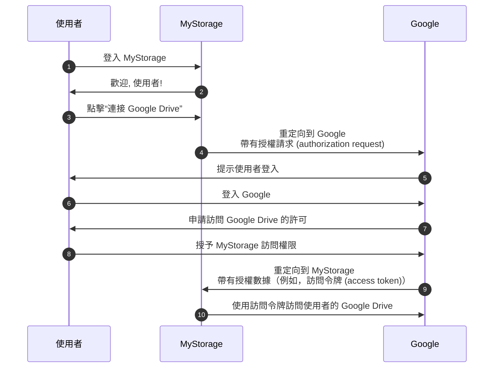

## 認證 (Auth)

這個頁面是針對 "auth" 這個詞的消歧義。它常用作以下的縮寫：

- <Ref slug="authentication" />：驗證身份所有權的過程（例如，使用者或服務）。它回答 "你擁有哪個身份？"
- <Ref slug="authorization" />：決定一個身份可以對資源執行哪些操作的過程。它回答 "你可以做什麼？"

> [!Note]
> 有時，認證 (authentication) 和授權 (authorization) 分別被稱為 "AuthN" 和 "AuthZ"。

這兩個概念都是 <Ref slug="iam" /> 領域中不可或缺的，但它們本質上是不同的。讓我們看看一個例子：一個名為 MyStorage 的網頁應用有上傳文件和連接到 Google Drive 的功能。典型的使用者流程如下：

在此流程中，使用者進行了兩次認證 (authentication) 步驟：一次是在 MyStorage (步驟 1)，一次是在 Google (步驟 6)；以及一次授權 (authorization) 步驟：授予 Google Drive 的訪問權限 (步驟 8)。

## 你的意思是哪一個？

當你看到 "auth" 這個詞時，重要的是要明確它是指認證 (authentication)還是授權 (authorization)；否則，你可能期望兩個過程都涵蓋在內（就像這個網站一樣）。

<SeeAlso slugs={["authentication", "authorization", "iam", "oauth-2.0", "openid-connect"]} />
