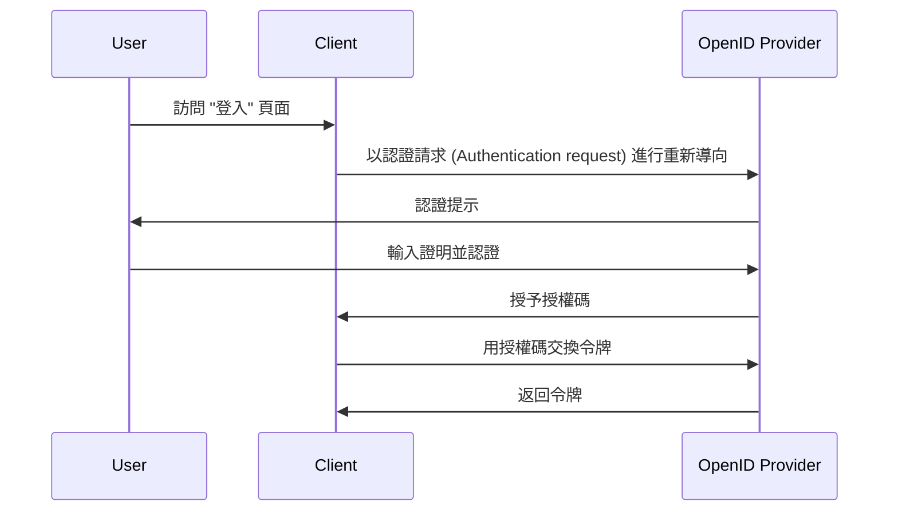

## 什麼是認證請求 (Authentication request)？

雖然認證請求 (Authentication request) 的意義可能因上下文而異，我們將專注於 OpenID Connect (OIDC) 規範中的定義。在 OIDC 中，認證請求 (Authentication request) 是向授權伺服器 (Authorization Server) 發出的用於認證用戶的 <Ref slug="authorization-request" />。

標準定義似乎很混亂，因為使用了類似的術語，比如 "授權請求 (Authorization Request)"。這是因為 OIDC 建立在主要設計用於授權的 OAuth 2.0 之上，並繼承了 OAuth 2.0 的術語，並擴展以支持認證。

為了澄清，讓我們為定義添加一些上下文：

> 一個 (OpenID Connect) 認證請求 (Authentication request) 是發送給 (OpenID Connect 授權) 伺服器的 (OAuth 2.0 授權) 請求，用於認證用戶。

它變得更長了！現在讓我們去掉所有的括號：

> 認證請求 (Authentication request) 是發送給伺服器的用於認證用戶的請求。

去掉所有附加屬性後，定義變得簡單明瞭。以下是術語的分解：

- **認證請求 (Authentication request)**：來自 OIDC 規範中的術語。
- <Ref slug="authorization-request" />：來自 OAuth 2.0 規範中的術語。OIDC 重新使用此規範並進行擴展。
- <Ref slug="authorization-server" />：來自 OAuth 2.0 規範中的術語。OIDC 也使用 <Ref slug="openid-connect" headingId="openid-provider-op" /> 來指的是同一個能夠驗證用戶的實體。

在接下來的部分中，我們將使用 "OpenID 供應商 (OP)" 來指代支持 OIDC 的授權伺服器。

## 認證請求 (Authentication request) 如何運作？

當一個客戶端應用程序想要認證用戶時，它會向 OpenID 供應商 (OP) 發起一個認證請求 (Authentication request)。如前所述，認證請求 (Authentication request) 在 OAuth 2.0 中也是一個授權請求，因此，一些 OAuth 2.0 授權類型 (流) 可以用來完成認證過程。

OIDC 定義了支持認證的三種授權類型 (流)：

1. <Ref slug="authorization-code-flow" />：最推薦的認證流。通常與 <Ref slug="pkce" /> 一起使用以提高安全性，適合大多數應用程式。
2. <Ref slug="implicit-flow" />：由於安全問題而在 <Ref slug="oauth-2.1" /> 中被棄用的簡化流。
3. <Ref slug="hybrid-flow" />：授權碼流程與隱式流的組合。

認證請求 (Authentication request) 是 OIDC 認證流程中的第一步。具體要包括的參數和要遵循的步驟取決於你選擇的流。點擊上述流名稱以了解更多關於每種流的訊息。

以下是使用授權碼流程的認證請求 (Authentication request) 的簡化範例：

一旦客戶端獲得令牌，它可以使用這些令牌（例如，<Ref slug="access-token" />）代表用戶訪問受保護的資源（例如，API）。

### 認證請求 (Authentication request) 中的關鍵參數

以下是認證請求 (Authentication request) 中的一些關鍵參數：

- **`response_type`**：客戶端期望從授權伺服器獲得的回應類型。可以是 `code` 用於授權碼流程，`id_token` 用於隱式流，或者 `code id_token` 用於混合流。
- **`client_id`**：OpenID 供應商 (OP) 發出的客戶端標識符。
- **`redirect_uri`**：授權伺服器在認證請求 (Authentication request) 完成後會重定向用戶代理的 URI。
- **`scope`**：請求的 <Ref slug="scope">範圍</Ref>（許可）用於 <Ref slug="id-token" /> 和 <Ref slug="access-token" />。
- **`resource`**：指定請求資源的 <Ref slug="resource-indicator" /> 的可選參數。授權伺服器需要支持 [RFC 8707](https://datatracker.ietf.org/doc/html/rfc8707) 來使用此參數。

注意，上述參數並非詳盡。在進行認證請求 (Authentication request) 之前，你應參考你所使用的特定流的完整參數列表。

<SeeAlso slugs={["openid-connect", "oauth-2.0", "authorization-code-flow", "implicit-flow", "hybrid-flow"]} />

<Resources
  urls={[
    "https://openid.net/specs/openid-connect-core-1_0.html",
  ]}
/>
