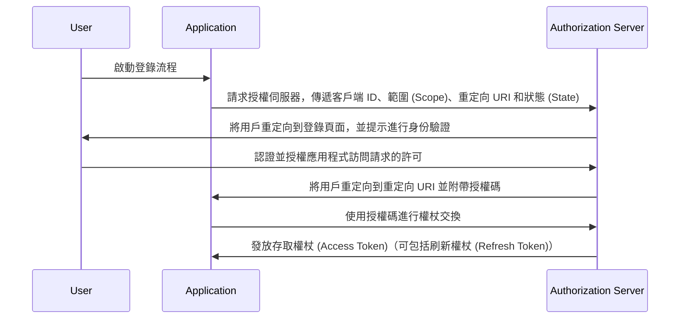

## 什麼是授權碼流程 (Authorization code flow)？

授權碼流程 (Authorization code flow，也稱為授權碼授權 (Authorization Code Grant))，定義於 [OAuth 2.0 RFC 6749，第 4.1 節](https://datatracker.ietf.org/doc/html/rfc6749#section-4.1)，是一種廣泛使用的 OAuth 2.0 授權機制，允許應用程式代表用戶獲取存取權杖 (Access Token)。此流程特別適合於可以安全儲存客戶端秘密的保密應用程式（例如：傳統伺服器端運行的網頁應用程式）。

授權碼流程 (Authorization code flow) 是獲取 OAuth 2.0 中存取權杖 (Access Tokens) 的一種穩固且安全的方法，因此成為許多網頁應用程式的首選。理解此流程對於使用 OAuth 2.0 和 API 集成的開發人員至關重要。

## 授權碼流程 (Authorization code flow) 如何運作？

授權碼流程 (Authorization code flow) 包含以下步驟：

1. **流程啟動**：用戶通常通過點擊應用程式中的鏈接或按鈕來登錄，啟動流程。該應用程式將用戶重定向到授權伺服器的授權端點，傳遞客戶端 ID、請求的範圍 (scope)、重定向 URI 和狀態參數。授權伺服器驗證參數並提示用戶在授權伺服器的登錄頁面上進行身份驗證。
2. **用戶身份驗證和授權**：用戶在授權伺服器上進行身份驗證，並授權應用程式訪問請求的資源。
3. **生成授權碼和重定向**：授權伺服器生成授權碼，並使用早先提供的重定向 URI 將用戶重定向回應用程式。授權碼包含在重定向 URI 的查詢字串中。
4. **代碼交換**：應用程式從查詢字串中提取授權碼，並向授權伺服器的權杖端點發出 POST 請求，以交換授權碼獲取存取權杖 (Access Token)。應用程式在請求中還必須包括客戶端 ID、客戶端秘密、重定向 URI 和授權碼。
5. **存取權杖 (Access Token) 獲取**：授權伺服器驗證授權碼，並在驗證成功時向應用程式發放存取權杖 (Access Token)（可選擇性地包括刷新權杖 (Refresh Token)）。應用程式然後可以使用存取權杖 (Access Token) 代表用戶發出授權的 API 請求。

以下序列圖可以說明這些步驟：



## 認證請求 (Authentication Request)

請求參數如下：

- **client_id**: 必填。有效的 OAuth 2.0 客戶端識別碼。
- **scope**: 必填。此值指定用戶從授權伺服器請求的一組資源。例如，`openid profile email`。
- **response_type**: 必填。此值必須是 `code`，表示應用程式預期獲得授權碼。
- **redirect_uri**: 必填。將發送認證響應的 URI，應與客戶端在授權伺服器上預先註冊的重定向 URI 完全匹配。
- **state**: 推薦。一個不透明的值，用於在請求和回調之間維持狀態。也用於防止 <Ref slug="csrf" /> 攻擊。
- **nonce**: 可選。一個隨機字符串，用於將客戶端會話與 ID 權杖 (ID Token) 關聯，並減輕重播攻擊。
- **prompt**: 可選。由字符串值組成的空格分隔且大小寫敏感的列表，指定授權伺服器是否提示終端用戶重新進行身份驗證和授權。定義的值如下：
  - **none**: 授權伺服器不顯示任何身份驗證或授權用戶介面頁面。如果終端用戶尚未經過身份驗證，或客戶端沒有對所請求的聲明 (Claims) 的預配置授權，或者不滿足處理請求的其他條件，則返回錯誤。錯誤代碼通常是 `login_required`、`interaction_required`。這可以用作檢查現有身份驗證和/或授權的方法。
  - **login**: 授權伺服器應提示終端用戶重新進行身份驗證。如果無法重新認證終端用戶，必須返回錯誤，通常是 `login_required`。
  - **consent**: 授權伺服器應在返回信息給客戶端之前提示終端用戶進行授權。如果無法獲得授權，必須返回錯誤，通常是 `consent_required`。
  - **select_account**: 授權伺服器應提示終端用戶選擇一個用戶帳戶。這使得擁有多個帳戶的終端用戶可以在授權伺服器上選擇多個帳戶中的一個。如果無法獲得終端用戶做出的賬戶選擇，必須返回錯誤，通常是 `account_selection_required`。

[完整請求參數定義](https://openid.net/specs/openid-connect-core-1_0.html#AuthRequest)

### 認證請求 (Authentication Request) 範例

```bash
curl -X GET "https://authorization-server.com/auth" \
  -d "response_type=code" \
  -d "client_id=YOUR_APPLICATION_ID" \
  -d "redirect_uri=https://yourapp.com/callback" \
  -d "scope=openid profile email" \
  -d "state=RANDOM_STRING_FOR_STATE"
```

一個典型的成功響應：

```http
HTTP/1.1 302 Found
Location: https://yourapp.com/callback?
  code=YOUR_AUTHORIZATION_CODE
  &state=RANDOM_STRING_FOR_STATE
```

## 權杖交換請求 (Token Exchange Request)

一旦上述認證請求成功響應，客戶端將自動重定向到回調 URI `https://yourapp.com/callback`，並將授權碼作為 URI 參數傳遞。

客戶端應獲取並處理 `code`，以後續的權杖交換請求換取存取權杖 (Access Token)。

### 權杖交換請求範例

```bash
curl -X POST "https://authorization-server.com/token" \
  -H "Content-Type: application/x-www-form-urlencoded" \
  -d "client_id=YOUR_CLIENT_ID" \
  -d "code=YOUR_AUTHORIZATION_CODE" \
  -d "redirect_uri=https://yourapp.com/callback" \
  -d "grant_type=authorization_code" \
```

## 優點

- **增強的安全性**：客戶端秘密永遠不會暴露給用戶的瀏覽器，降低了客戶端冒充的風險。
- **一次性授權碼**：授權碼的壽命很短，而且只能使用一次，降低了攔截和重放攻擊的風險。
- **短命權杖**：在此流程中發放的存取權杖 (Access Tokens) 是短期的（通常為 1 小時），減少了在權杖被洩露時發生未經授權訪問的風險。
- **刷新權杖 (Refresh Token)**：授權伺服器可以選擇性地發放刷新權杖 (Refresh Token)，允許應用程式在不需要用戶互動的情況下獲取新的存取權杖 (Access Token)。

## 授權碼流程 (Authorization code flow) 與隱式流程 (Implicit Flow) 的區別是什麼？

授權碼流程 (Authorization code flow) 和隱式流程 (Implicit Flow) 之間的主要區別在於存取權杖 (Access Token) 是如何獲取的：

- **授權碼流程 (Authorization code flow)**：客戶端應用程式首先從授權端點獲得授權碼，然後在後續的 POST 請求中使用該授權碼向權杖端點交換存取權杖 (Access Token)。
- **隱式流程 (Implicit Flow)**：客戶端應用程式直接從授權端點接收存取權杖 (Access Token)。

## 授權碼流程 (Authorization code flow) 與客戶端憑證流程 (Client Credentials Flow) 的區別是什麼？

授權碼流程 (Authorization code flow) 和客戶端憑證流程 (Client Credentials Flow) 主要的區別在於這些流程所用的上下文：

- **授權碼流程 (Authorization code flow)**：當客戶端應用程式需要代表用戶訪問資源時使用。該流程涉及用戶的身份驗證 (Authentication) 和授權 (Authorization)。
- **客戶端憑證流程 (Client Credentials Flow)**：當客戶端應用程式需要代表自身訪問資源時使用。該流程涉及客戶端的身份驗證 (Authentication)，而不涉及用戶身份驗證 (Authentication)，最適合於機器對機器的通信。

## 授權碼流程 (Authorization code flow) 的典型用例是什麼？

- 需要用戶身份驗證 (Authentication) 並訪問 API 的傳統網頁應用程式。
- 需要安全地從第三方服務訪問用戶數據的應用程式。

<SeeAlso slugs={['device-flow', 'implicit-flow', 'client-credentials-flow']} />

<Resources urls={['https://datatracker.ietf.org/doc/html/rfc6749']} />
