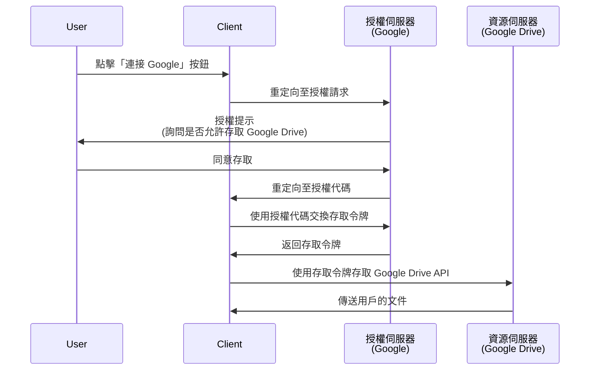

## 什麼是授權請求 (Authorization request)？

根據不同的上下文，「授權請求 (Authorization request)」可以指不同的事情。在本文中，我們將專注於 <Ref slug="oauth-2.0" /> 規範中的定義。

在 OAuth 2.0 中，有多種授權類型（流程）定義了<Ref slug="client" />如何從用戶獲取授權以存取受保護的資源。

> ![注意]
> 在 <Ref slug="openid-connect" /> 的上下文中，「授權請求 (Authorization requests)」常常與「認證請求 (authentication requests)」混淆。請參閱 <Ref slug="authentication-request" /> 以獲取 OIDC 特定的細節。

## 授權請求 (Authorization request) 如何運作？

當客戶端（應用程式）想要代表用戶存取受保護的資源時，它會向<Ref slug="authorization-server" />發起授權請求 (authorization request)。客戶端應在請求中指明所請求的授權類型，以及必要的參數。

以下是一些典型的終端用戶授權的授權類型（流程）在 OAuth 2.0 中：

- <Ref slug="authorization-code-flow" />：最推薦的用戶授權流程。通常搭配 <Ref slug="pkce" /> 使用以提高安全性，適合大多數應用程式。
- <Ref slug="implicit-flow" />：一種簡化的流程，由於安全問題，在 <Ref slug="oauth-2.1" /> 中已被棄用。
- [資源所有者密碼憑證 (ROPC) 授權](https://datatracker.ietf.org/doc/html/rfc6749#section-4.3)：使用者憑證直接換取存取令牌的授權（流程）。由於安全風險，不建議使用此流程。

還有其他擴展流程，例如用於輸入能力有限的設備的<Ref slug="device-flow" />。每個流程都有其特點和使用場景。對於大多數 Web 應用程式，授權代碼流程是推薦的選擇。

> <Ref slug="machine-to-machine" /> 授權通常使用<Ref slug="client-credentials-flow" />進行，這不涉及用戶交互。

例如，一個客戶端（應用程式）可能會要求授權以存取用戶的 Google Drive 文件。以下是授權代碼流程的簡化序列圖：

一旦獲得<Ref slug="access-token" />，客戶端可以代表用戶使用它來存取用戶的 Google Drive 文件。

### 授權請求 (Authorization request) 中的關鍵參數

OAuth 2.0 授權請求通常包括以下參數：

- **`response_type`**：客戶端期望的回應類型。常見的值包括 `code`（用於授權代碼流程）和 `token`（用於隱式流程）。
- **`client_id`**：由授權伺服器發出的客戶端識別碼。
- **`redirect_uri`**：授權處理完成後授權伺服器將用戶重定向的 URI。
- **`scope`**：要求的<Ref slug="scope">範圍</Ref>（許可權）作為存取令牌的範圍。
- **`resource`**：可選的參數，用來指定請求資源的<Ref slug="resource-indicator" />。授權伺服器需要支持 [RFC 8707](https://datatracker.ietf.org/doc/html/rfc8707) 才能使用此參數。

上述參數並不詳盡。實際的參數及其值取決於授權類型以及應用程式的具體需求。

<SeeAlso slugs={["oauth-2.0", "authentication-request", "authorization-code-flow", "implicit-flow", "device-flow"]} />

<Resources
  urls={[
    { url: "https://datatracker.ietf.org/doc/html/rfc6749#section-4", result: {
      ogTitle: "在 OAuth 2.0 中獲取授權",
      ogDescription: " 為了請求存取令牌，客戶端需要從資源所有者獲得授權。"
    } }
  ]}
/>