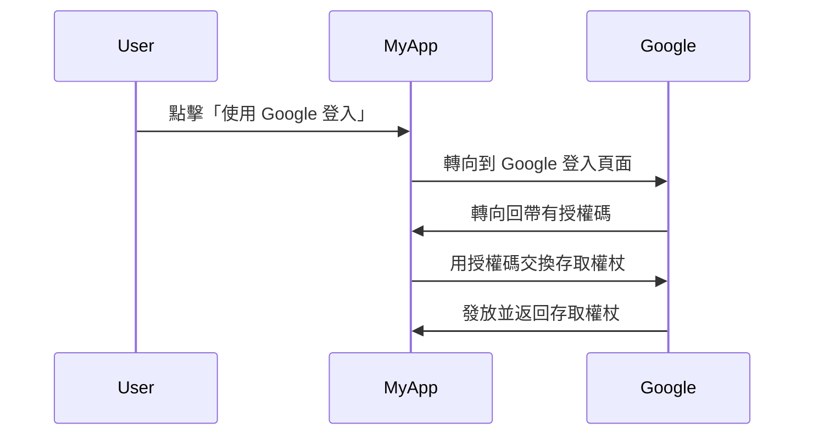

## 什麼是授權伺服器 (Authorization server)？

「授權伺服器 (authorization server)」這個術語可以泛指任何執行授權操作的伺服器。我們將專注於 <Ref slug="oauth-2.0" /> 和 <Ref slug="openid-connect" /> 框架中的定義。

在 OAuth 2.0 中，授權伺服器是負責在成功驗證和授權後向客戶端發布 <Ref slug="access-token">存取權杖 (access tokens)</Ref> 的組件。客戶端使用這些存取權杖以代表使用者（資源擁有者）來存取受保護的資源。

太多術語了嗎？讓我們看看一個現實世界的例子：用戶點擊應用 "MyApp" 中的「使用 Google 登入」，該應用使用 <Ref slug="authorization-code-flow" /> 進行 Google 登錄。

在這個例子中，Google 作為**授權伺服器 (authorization server)** 在用戶成功登錄後向**客戶端 (client)**（MyApp）發放一個存取權杖 (access token)。然後，客戶端可以使用這個**存取權杖 (access token)** 來獲取 Google 上的用戶個人資料（受保護的資源）。

### OpenID Connect (OIDC) 中的授權伺服器 (Authorization server)

由於 OpenID Connect 構建在 OAuth 2.0 的基礎上，它重用了部分來自 OAuth 2.0 的術語和概念。OIDC 增加了 OAuth 2.0 授權伺服器的身份驗證 (authentication) 功能，使得授權伺服器也變成了一個 <Ref slug="openid-connect" headingId="openid-provider-op" />。為了避免歧義，我們建議在 OIDC 中指代授權伺服器時，始終使用「OpenID 提供者 (OpenID Provider)」這個術語。

除了發放存取權杖 (access tokens) 外，OIDC 中的 OpenID 提供者 (authorization server) 還會發放 <Ref slug="id-token">ID 權杖 (ID tokens)</Ref> 給客戶端。ID 權杖包含用戶信息，並用於驗證用戶。

## 授權伺服器 (Authorization server) 如何運作？

授權伺服器 (Authorization server) 應支持 <Ref slug="oauth-2.0-grant">OAuth 2.0 授權 (grants，流)</Ref> 來向客戶端發放存取權杖 (access tokens)。授權類型通常包括客戶端和授權伺服器為獲得存取權杖所遵循的一系列步驟。

- 對於用戶授權，大多數授權類型要求客戶端向授權伺服器提交一個 <Ref slug="authorization-request">授權請求 (authorization request)</Ref>。在上述 Google 登錄示例中，「轉向到 Google 登入頁面」這一步就是由客戶端發起的授權請求。
- 對於 <Ref slug="machine-to-machine" /> 授權，客戶端可以使用 <Ref slug="client-credentials-flow" /> 來直接向授權伺服器發送一個 <Ref slug="token-request">權杖請求 (token request)</Ref>。

授權伺服器還應驗證客戶端的請求、驗證客戶端身份，並在發放存取權杖之前確認用戶身份。此外，它可能還會強制實施其他安全措施，例如在 <Ref slug="authorization-code-flow" /> 中使用 <Ref slug="pkce" />。

## 授權伺服器 (Authorization server) 的使用情境

顧名思義，授權伺服器 (authorization server) 是用來處理 <Ref slug="authorization">授權</Ref> 的。授權伺服器可能涉及第一方和第三方：

- 如上所述的 Google 登入例子。
- 電子商務網站（客戶端）請求從另一個網站存取用戶的支付信息（受保護的資源）。
- 手機應用程序（客戶端）請求從位置服務提供者存取用戶的位置信息（受保護的資源）。

或者，它可以僅用於內部授權，例如：

- 用戶需要存取他們在電子商務網站（客戶端）中的訂單（受保護的資源）。
- 服務（客戶端）需要在微服務架構中存取資料庫（受保護的資源）。

在現代應用中，授權伺服器也可以是一個 <Ref slug="identity-provider" />，同時支持 <Ref slug="openid-connect" /> 以進行用戶身份驗證 (authentication)。

<SeeAlso slugs={["oauth-2.0", "authorization-request", "access-token"]} />
 
<Resources
  urls={[
    "https://blog.logto.io/ciam-102-authz-and-rbac",
    "https://tools.ietf.org/html/rfc6749",
  ]}
/>