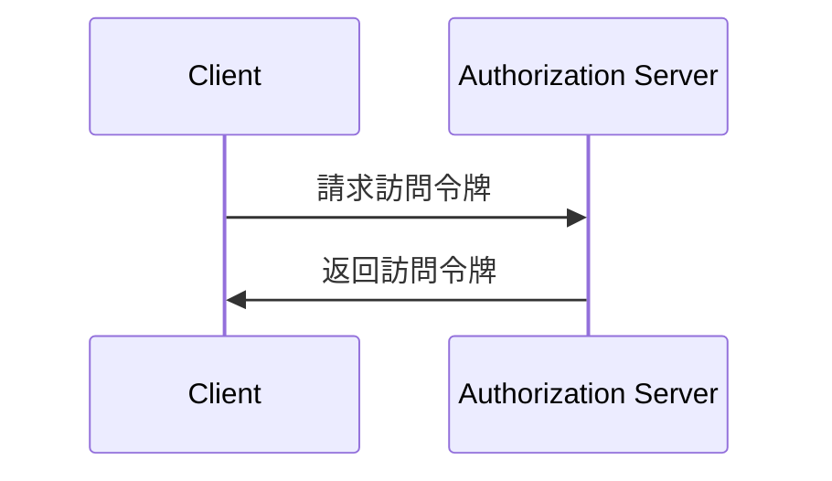
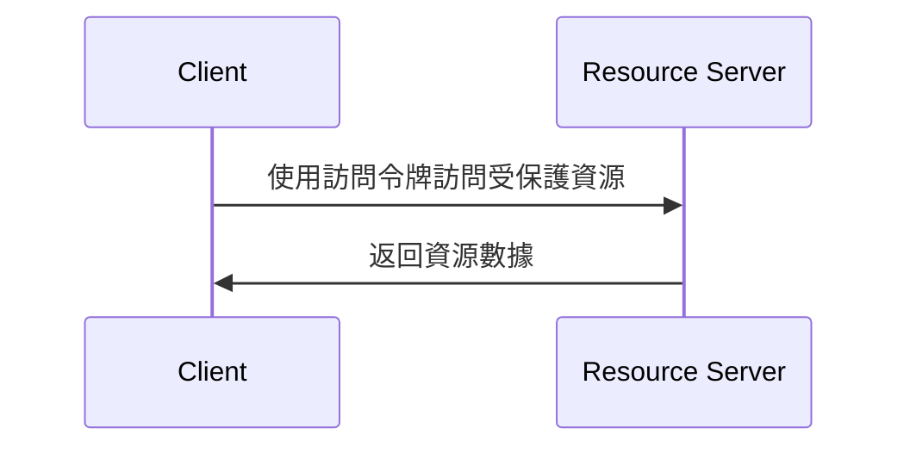

## 什麼是 委託流程 (Client credentials flow)？

委託流程 (Client credentials flow) 是一種 <Ref slug="oauth-2.0-grant" /> 類型，允許保密的 client (用戶端) 獲取 <Ref slug="access-token">access tokens (訪問令牌)</Ref> 以訪問受保護的資源。通常，此流程用於 <Ref slug="machine-to-machine" /> 通信，其中 client (用戶端) 是服務器或服務。

> [!Note]
> 委託流程 (Client credentials flow) 不適合最終用戶授權。對於最終用戶授權，應使用 <Ref slug="authentication-request" /> 或 <Ref slug="authorization-request" />。

## 委託流程 (Client credentials flow) 如何運作？

委託流程 (Client credentials flow) 是一個簡單的兩步驟過程：

1. **令牌請求**：client (用戶端) 發送一個 <Ref slug="token-request" />，包含其 client credentials (用戶端憑證)（client ID 和 client secret）以及請求的 <Ref slug="scope">範圍</Ref>。
2. **令牌響應**：<Ref slug="authorization-server" /> 驗證 client credentials (用戶端憑證)，如果 client (用戶端) 已被授權，則簽發一個 access token (訪問令牌)。

以下是 委託流程 (Client credentials flow) 的簡化序列圖：



以下是一個非規範的 委託流程 (Client credentials flow) 令牌請求的例子：

```http
POST /token HTTP/1.1
Host: your-authorization-server.com
Content-Type: application/x-www-form-urlencoded

grant_type=client_credentials
  &client_id=YOUR_CLIENT_ID
  &client_secret=YOUR_CLIENT_SECRET
  &scope=read write
```

authorization server (授權服務器) 將驗證 client credentials (用戶端憑證)，如果 client 已被授權，則簽發一個 access token (訪問令牌)。client 接收到 access token (訪問令牌) 後，可以用它來代表其自身訪問受保護的資源（例如 API）。以下是一個 client 使用 access token (訪問令牌) 訪問 API 的例子：



注意，<Ref slug="resource-server" /> 應驗證 access token (訪問令牌) 並執行 <Ref slug="access-control" /> 策略，以確保 client (用戶端) 擁有訪問資源的必要權限。

### 委託流程 (Client credentials flow) 令牌請求中的關鍵參數

與其他 OAuth 2.0 流程不同，委託流程 (Client credentials flow) 包含簡單的 <Ref slug="token-request" />，具有以下關鍵參數：

- **`grant_type`**：授權類型應設置為 `client_credentials` 以指示 委託流程 (Client credentials flow)。
- **`client_id`**：由 authorization server (授權服務器) 發佈的 client (用戶端) 標識符。
- **`client_secret`**：由 authorization server (授權服務器) 發佈的 client (用戶端) secret。
- **`scope`**：access token (訪問令牌) 請求的 <Ref slug="scope">範圍</Ref>（權限）。
- **`resource`**：可選參數，指定請求資源的 <Ref slug="resource-indicator" />。authorization server (授權服務器) 需要支持 [RFC 8707](https://datatracker.ietf.org/doc/html/rfc8707) 才能使用此參數。

## 安全考量

### 保密客戶端

委託流程 (Client credentials flow) 適合能夠安全存儲 client secret 的 <Ref slug="client" headingId="confidential-clients" /> (保密客戶端)。如果 client 是公共客戶端（例如單頁應用程序），則不應使用 委託流程 (Client credentials flow) 因為 client secret 可能會被暴露。

### 令牌到期

雖然在 委託流程 (Client credentials flow) 中獲取的 access token (訪問令牌) 可以有較長的到期時間，但建議使用短期訪問令牌（例如 1 個小時）以減少令牌被洩露時未經授權訪問的風險。

### 客戶端秘密輪換

為了增強安全性，建議定期更換 client secret。authorization server (授權服務器) 應支持客戶端秘密輪換，而不影響 client 獲得 access tokens 的能力。例如，authorization server (授權服務器) 應支持多個客戶端 secret，以便在輪換過程中保持向後兼容性。

<SeeAlso slugs={["machine-to-machine", "token-request", "access-token", "scope", "resource-indicator"]} />

<Resources
  urls={[
    "https://blog.logto.io/programmatic-authentication-methods",
    { 
      url: "https://datatracker.ietf.org/doc/html/rfc6749#section-4.4",
      result: {
        ogTitle: "Client Credentials Grant",
        ogDescription: "The client can request an access token using only its client credentials (or other supported means of authentication) when the client is requesting access to the protected resources under its control, or those of another resource owner that have been previously arranged with the authorization server."
      }
    }
  ]}
/>
