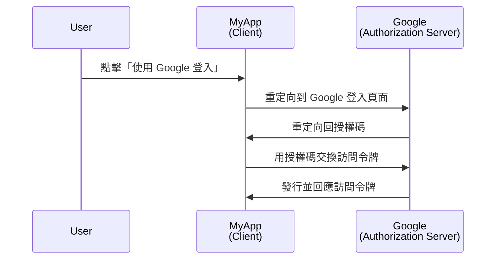
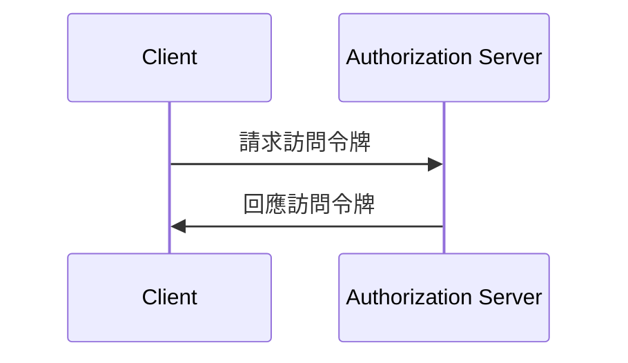

## 什麼是客戶端？

在 <Ref slug="oauth-2.0" /> 和 <Ref slug="openid-connect" /> 的上下文中，客戶端是請求認證 (Authentication) 或授權的應用程式。例如，當使用者在應用程式上點擊「使用 Google 登入」時，該應用程式即是作為一個請求 Google 授權的 **客戶端**。

> 「客戶端」和「應用程式」在 <Ref slug="iam" /> 的上下文中經常可以互換使用。

根據其能力和信任級別，客戶端有多種分類，但對於框架而言，公共客戶端和機密客戶端之間的顯著區別會影響客戶端如何獲取令牌以及它可以使用的授權類型。

### 公共客戶端 ||public-clients||

公共客戶端是指那些無法保密其憑證的應用程式，這意味著資源擁有者（使用者）可以訪問這些憑證。公共客戶端的例子有：

- 單頁應用程式 (SPAs)
- 移動應用程式
- 桌面應用程式

你可能認為移動和桌面應用程式擁有安全的存儲能力，但大多數框架將其視為公共客戶端，因為它們被分發給終端使用者，並假設終端使用者可以訪問這些憑證。

### 機密客戶端 ||confidential-clients||

機密（私人）客戶端是指那些能夠保密存儲敏感資訊且不暴露給資源擁有者（終端使用者）的應用程式。機密客戶端的例子有：

- 網頁伺服器
- 後端服務

## 客戶端如何運作？

### 使用者認證 (Authentication) 和授權

當客戶端想要認證 (Authenticate) 使用者時，客戶端會啟動一個 <Ref slug="authorization-request" /> 到 <Ref slug="authorization-server" /> 以獲取一個 <Ref slug="access-token" />。客戶端應在請求中包含必要的參數，如客戶端 ID、重定向 URI 和範圍。以下是一個授權碼流程的簡化序列圖：

在這個例子中，Google 扮演作為 **授權伺服器** 的角色，當使用者成功登入後，向 **客戶端**（MyApp）發行一個訪問令牌。客戶端然後可以使用這個 **訪問令牌** 來獲取 Google 上的使用者個人資料（受保護資源）。

對於 OpenID Connect (OIDC) 客戶端，客戶端需要啟動一個 <Ref slug="authentication-request" /> 以認證使用者。它使用的端點與授權請求相同，但參數和回應不同。

### 機器對機器的通信

對於 <Ref slug="machine-to-machine" /> 通信，客戶端可以使用 <Ref slug="client-credentials-flow" /> 直接向授權伺服器發送 <Ref slug="token-request" />。客戶端應在請求中包含客戶端 ID、客戶端密鑰和範圍。以下是客戶端憑證流的簡化序列圖：

授權伺服器將驗證客戶端憑證，若客戶端被授權，則發行訪問令牌。由於客戶端需要傳送客戶端密鑰，因此僅應為機密客戶端使用客戶端憑證流。

## 安全考量

### 客戶端類型

客戶端類型（公共或私有）會影響客戶端的安全考量。

- 公共客戶端不應使用客戶端憑證流，因為它們無法安全地存儲客戶端密鑰。相反，建議公共客戶端使用帶有 <Ref slug="pkce" /> 的 <Ref slug="authorization-code-flow" /> 來認證使用者。
- 機密客戶端可以使用客戶端憑證流進行機器對機器通信。它們應安全地存儲客戶端密鑰，並僅在安全環境中使用。

### 令牌存儲

客戶端應使用最高級別的安全性來存儲令牌。例如，在網頁應用程式中，建議使用僅限 HTTP 的 Cookie 來存儲訪問令牌，以防止 XSS 攻擊。

### 令牌過期

訪問令牌有有限的存續期，以減少未授權訪問的風險。客戶端應優雅地處理令牌過期，使用 <Ref slug="refresh-token">刷新令牌</Ref> 獲取新的訪問令牌。

### 令牌撤銷

客戶端應準備處理令牌撤銷。如果使用者登出或授權伺服器撤銷令牌，客戶端應清除客戶端存儲中的令牌。

<SeeAlso slugs={["oauth-2.0", "oauth-2.0-grant", "openid-connect", "authorization-request", "authentication-request"]} />

<Resources
  urls={[
    "https://blog.logto.io/secure-cloud-apps-with-oauth-and-openid-connect",
    "https://datatracker.ietf.org/doc/html/rfc6749",
    "https://openid.net/specs/openid-connect-core-1_0.html"
  ]}
/>
