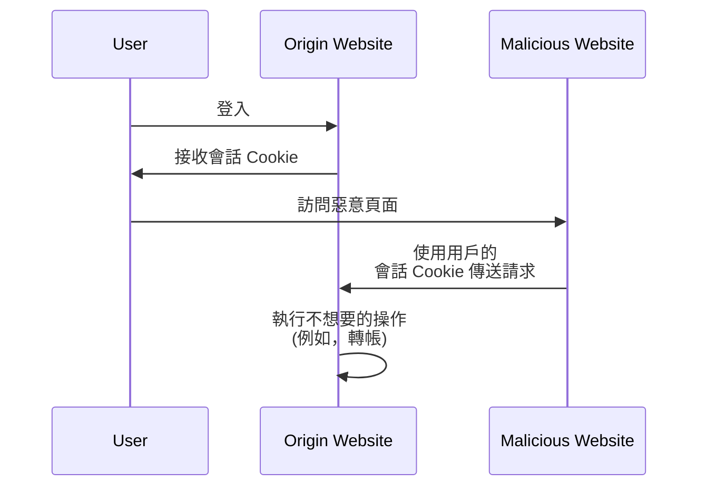

## 什麼是跨站請求偽造 (CSRF)？

在開發網路應用時，CSRF 是一個常被提到的術語，讓開發人員和安全專業人員感到恐懼。這是一種攻擊，能夠欺騙（或引誘）已認證的用戶在未經同意的情況下，在網路應用中執行不想要的操作。

CSRF 也被稱為「一鍵攻擊」或「會話駕乘」，因為它依賴用戶的活躍會話來執行惡意操作。

## CSRF 如何運作？

CSRF 攻擊透過利用網路應用對用戶瀏覽器的信任來運作。通常情況如下：



你可能對這個執行過程有一些疑問。讓我們來探索一下其中的原因。

### 為什麼惡意網站可以向原網站發送請求？

同源策略 (SOP) 是一種網頁瀏覽器的安全功能，用來限制從一個源加載的文件或腳本如何與另一個源的資源（如 Cookie、DOM）互動。然而，SOP 並不阻止瀏覽器向另一個源發送請求。

因此，即使惡意網站無法直接讀取或修改會話 Cookie，它仍然可以使用用戶的活躍會話向原網站發送請求。

你可能會認為大多數網路應用也使用 [CORS](https://developer.mozilla.org/en-US/docs/Web/HTTP/CORS) 來防止未授權的跨源請求，但 CSRF 仍有辦法繞過它：

1. 基於 GET 的攻擊：惡意網站可以欺騙用戶訪問某個 URL，該 URL 會在原網站執行某個操作：

    - 重定向到 `https://example.com/transfer?amount=1000&to=attacker`。
    - 一個圖像標籤加載 `https://example.com/transfer?amount=1000&to=attacker`。

    這就是為什麼 GET 請求不應該有副作用的一個重要原因。

2. 基於表單的攻擊：惡意網站可以創建一個隱藏表單，將資料提交到原網站。例如，一個包含隱藏表單欄位的 POST 請求到 `https://example.com/transfer`。

### 為什麼惡意網站擁有用戶的會話 Cookie？

用戶的瀏覽器在發送請求時會自動將 Cookie 發送到原網站。這就是原網站知道用戶已認證且可以代表他們執行操作的方式。

實際上，惡意網站並沒有「擁有」會話 Cookie；它只是利用瀏覽器的行為來附帶 Cookie 傳送請求。

## 如何防止 CSRF 攻擊？

防止 CSRF 攻擊需要一種多層次的方法，涉及到服務器和用戶端。以下是一些常見的減輕 CSRF 脆弱性的方法：

### 使用抗 CSRF 令牌

抗 CSRF 令牌是由服務器生成並嵌入到網路應用表單中的隨機值。當表單提交時，服務器會驗證令牌以確保請求是合法的。

例如，HTML 表單中的隱藏輸入字段：

```html
<form action="/transfer" method="post">
  <input type="hidden" name="csrf_token" value="random_token_here" />
  <!-- Other form fields -->
  <button type="submit">Transfer</button>
</form>
```

使用這種方法，惡意網站無法偽造請求，因為它不知道抗 CSRF 令牌。<Ref slug="redirect-uri" /> 中的 `state` 參數就是一個類似的概念。

### 使用 SameSite Cookie

Cookie 中的 `SameSite` 屬性可以通過限制 Cookie 發送到服務器的時機來防止 CSRF 攻擊：

| `SameSite` 值   | 描述                                                                                         |
|------------------|---------------------------------------------------------------------------------------------|
| `Strict`         | Cookie 僅在第一方上下文中發送。                                                            |
| `Lax`            | Cookie 在第一方上下文中發送，並且允許外部網站的 GET 請求。                                |
| `None`           | Cookie 在所有上下文中發送。需要 `Secure` 屬性。                                           |

通過將 `SameSite` 屬性設置為 `Strict` 或 `Lax` 並確保 GET 請求沒有副作用，可以避免 CSRF 攻擊。

此外，應始終設置 `Secure` 屬性，以確保 Cookie 僅透過 HTTPS 連接傳輸。

### 檢查標頭

1. **Origin header**: `Origin` 標頭由瀏覽器發送以表明請求的來源。服務器可以檢查此標頭以確保請求來自預期的來源。
2. **Referer header**: `Referer` 標頭包含上一頁的 URL。雖然可以被偽造，但它仍可作為額外的保護層來使用。

<SeeAlso slugs={["authorization-code-flow", "redirect-uri"]} />

<Resources
  urls={[
    'https://blog.logto.io/csrf',
    "https://cheatsheetseries.owasp.org/cheatsheets/Cross-Site_Request_Forgery_Prevention_Cheat_Sheet.html",
  ]}
/>
