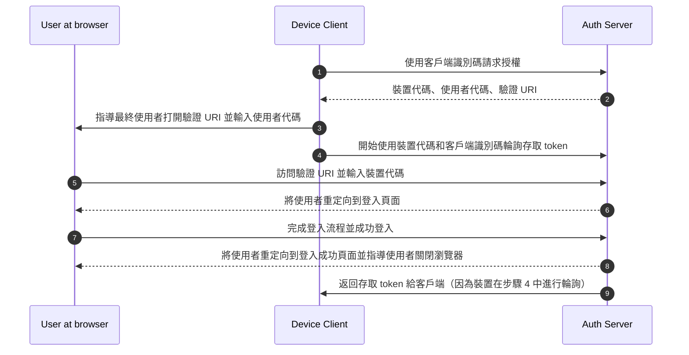

## 什麼是裝置流程 (Device flow)？

[OAuth 裝置授權流程 (Device Authorization Flow)](https://www.rfc-editor.org/rfc/rfc8628)，也稱為裝置流程 (Device flow)，是一種 <Ref slug="oauth-2.0-grant" />，專為輸入能力有限的裝置（例如，智慧電視、物聯網裝置、遊戲主機）或無頭應用程式（例如，CLI 工具）設計。它允許使用者在這些裝置上啟動 <Ref slug="authorization-request">授權請求</Ref>，然後使用輸入能力更強的裝置（如智慧手機或筆記型電腦）完成流程。

## 何時使用裝置流程 (Device flow)？

1. **輸入受限的裝置**
    - 在智慧電視上登入（例如，媒體應用程式）
    - 在遊戲主機上登入（例如，遊戲系統或媒體應用程式）
    - 在會議裝置上登入（例如，官方應用程式或視訊會議應用程式）
    - 在可穿戴裝置上登入（例如，輸入受限的智慧手錶）
    - 存取物聯網裝置（例如，印表機、視訊編碼器或揚聲器）
2. **無頭應用程式**
    - 命令列介面登入（例如，GitHub CLI 或 Stripe CLI）
3. **桌面應用程式的 QR 碼登入**
    - 通過使用智慧手機掃描 QR 碼快速且安全地登入桌面應用程式（例如，Telegram、Steam 在桌面上的登入）。此 QR 碼登入流程可視為傳統 OAuth 2.0 裝置流程的一種變體。

## 裝置流程 (Device flow) 的最終使用者流程是什麼樣的？

忽略 QR 碼登入變體，我們來專注於標準的 OAuth 2.0 裝置流程。涉及兩種類型的裝置：

### 裝置代碼顯示裝置

這是需要使用者授權存取的輸入受限裝置或無頭應用程式。它顯示 [裝置代碼和驗證 URI](#what-does-device-flow-workflow-look-like)，指導使用者如何繼續。

基本的使用者介面是：


為了提升使用者體驗，服務通常會為驗證 URL 生成 QR 碼：


為了提高效率，將 `verification_uri` 中的 QR 碼資源（例如，`https://example.com/device`）替換為 `verification_uri_complete`（例如，`https://example.com/device?user_code=DSHP-SNCT`），這樣 URL 中包含裝置代碼，幫助使用者預先填入裝置代碼到欄位中。

### 授權裝置

按照登入目標裝置上的指示，使用者將：

1. 使用具有瀏覽器存取和輸入能力的另一裝置打開驗證 URL。
2. 輸入顯示的裝置代碼（可能已預先填入）並繼續。
3. 如果瀏覽器上沒有現有會話，使用者將首先登入服務。
4. 同意頁面將提示使用者授權裝置登入。
5. 最後，授權後將顯示成功頁面。


以下是一些已建立產品的裝置流程驗證 URL，供你測試：

- 在 [智慧電視上登入 YouTube](https://www.youtube.com/watch?v=yTcuazSy5Cs)：[youtube.com/activate](https://youtube.com/activate)
- 在智慧電視上登入 Disney+：[disneyplus.com/begin](https://disneyplus.com/begin)
- 在 [三星 Galaxy Watch 上登入 Shopify](https://www.drmare.com/spotify-music/spotify-on-galaxy-watch.html)：[spotify.com/pair](https://spotify.com/pair)
- 在 [會議裝置上登入 Zoom](https://developers.zoom.us/blog/device-authorization/)：[zoom.us/oauth_device](https://zoom.us/oauth_device)
- 在 [GitHub CLI 上登入](https://docs.github.com/en/apps/oauth-apps/building-oauth-apps/authorizing-oauth-apps#device-flow)：[github.com/login/device](https://github.com/login/device)
- 使用 [Google 裝置流程](https://www.oauth.com/oauth2-servers/device-flow/user-flow/)：https://www.google.com/device

## 裝置流程 (Device flow) 的工作流程是什麼樣的？

首先，你應該了解裝置授權回應的參數，這些參數用於處理裝置代碼顯示裝置上顯示的信息：

| 參數                                   | 描述                                                                                                                                                                    |
| -------------------------------------- | ----------------------------------------------------------------------------------------------------------------------------------------------------------------------- |
| `device_code`                          | 裝置驗證代碼。                                                                                                                                                          |
| `user_code`                            | 最終使用者驗證代碼。                                                                                                                                                    |
| `verification_uri`                     | 授權伺服器上的最終使用者驗證 URI。該 URI 應該簡短且易於記憶，因為最終使用者將被要求手動輸入到其使用者代理中。                                                          |
| `verification_uri_complete` (可選)     | 包含 "user_code"（或具有與 "user_code" 相同功能的其他信息）的驗證 URI，專為非文本傳輸設計。                                                                              |
| `expires_in`                           | "device_code" 和 "user_code" 的有效期（以秒為單位）。                                                                                                                   |
| `interval`                             | 客戶端在輪詢 token 端點之間應等待的最小時間（以秒為單位）。如果未提供值，客戶端必須使用 5 作為默認值。                                                                  |

```json
{
    "device_code": "GmRhmhcxhwAzkoEqiMEg_DnyEysNkuNhszIySk9eS",
    "user_code": "WDJBMJHT",
    "verification_uri": "https://custom.domain.com/device",
    "verification_uri_complete":
        "https://custom.domain.com/device?user_code=WDJB-MJHT",
    "expires_in": 900,
    "interval": 5
}
```

當使用者使用裝置流程進行認證 (Authentication) 時，主要包括以下步驟：



1. 裝置客戶端使用客戶端識別碼（通常是授權伺服器平台上的客戶端 ID）向授權伺服器請求授權。
2. 授權伺服器回應裝置客戶端，提供裝置代碼、使用者代碼和驗證 URI。
3. 裝置客戶端以文本（或 QR 碼等）形式向使用者顯示驗證 URI 和使用者代碼，指導使用者訪問 URI 並輸入代碼。
4. 與步驟 3 同時，裝置客戶端開始使用裝置代碼和客戶端識別碼從授權伺服器輪詢存取 token，並開始等待使用者審核 <Ref slug="authorization-request" /> 並完成使用者授權。
5. 使用者通過另一裝置上的瀏覽器訪問由授權伺服器託管的驗證 URI，並輸入使用者代碼。
6. 授權伺服器將使用者重定向到登入頁面，並指導使用者完成登入。
7. 使用者完成登入流程並成功登入。
8. 授權伺服器將使用者重定向到登入成功頁面，並指導使用者關閉瀏覽器。
9. 與步驟 8 同時，授權伺服器返回存取 token 給裝置客戶端，因為客戶端自步驟 4 開始進行輪詢。

經過這些流程後，裝置客戶端將能夠獲取 <Ref slug="access-token" /> 以進行後續服務。

欲了解更多詳情，請閱讀 [RFC 8628 OAuth 2.0 Device Authorization Grant](https://datatracker.ietf.org/doc/html/rfc8628#autoid-3)。

## 裝置流程 (Device flow) 的安全考量是什麼？

裝置流程涉及兩個裝置之間的互動，使其暴露於潛在的安全風險，如裝置代碼暴露、暴力攻擊或中間人 (MitM) 攻擊。

雖然僅獲取裝置代碼不會立即授權（因為使用者仍必須進行身份驗證和授權），但攻擊者可能會在其有效期內嘗試重播裝置代碼請求。這可能導致未經授權的重複存取。為了增強安全性，請考慮以下預防措施：

- **縮短 `expires_in` 時間：** 通過縮短裝置代碼的有效期來減少攻擊的機會窗口。
- **限制失敗嘗試次數：** 限制錯誤代碼輸入的次數，以防止暴力攻擊。
- **強制使用 HTTPS：** 確保裝置與授權伺服器之間的所有通信均使用 HTTPS 加密，以防止中間人攻擊。
- **限制單次使用裝置代碼：** 限制每個裝置代碼僅用於**單次會話**，以防止未經授權的重複使用。

請注意，單次使用裝置代碼不是 OAuth 2.0 裝置流程的內建要求。這是一種可選的最佳實踐。一些開發者可能會故意設計為使用相同代碼進行並發裝置授權（例如，在數百個裝置上），但這種方法會增加安全風險，應謹慎評估。

## OIDC 提供者是否支持裝置流程 (Device flow)？

雖然裝置流程傳統上與 OAuth 相關，<Ref slug="openid-connect" /> 提供者也可以支持它。OIDC 提供了超越 OAuth 主要授權功能的額外優勢。它擴展到身份驗證，允許應用程式在單一流程中獲取 <Ref slug="access-token" /> 和 <Ref slug="id-token" />。

OIDC 的強大統一身份管理，包括 token 驗證和 <Ref slug="refresh-token">刷新</Ref>，使其非常適合於裝置和應用程式之間的安全、可靠的 <Ref slug="authentication" /> 和 <Ref slug="authorization" />，特別是那些輸入能力有限的裝置。

<SeeAlso slugs={['oauth-2.0-grant', 'authorization-code-flow', 'implicit-flow', 'client-credentials-flow']} />

<Resources urls={['https://blog.logto.io/a-brief-introduction-to-oauth2-device-flow', 'https://datatracker.ietf.org/doc/html/rfc8628']} />