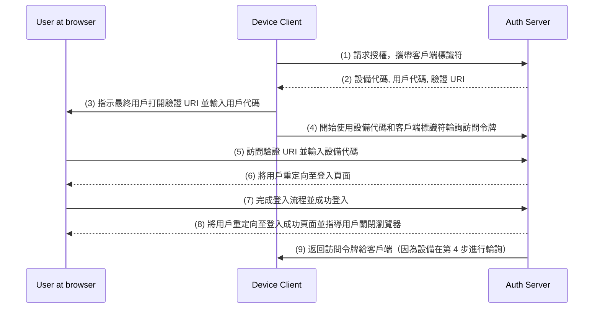

## 什麼是設備流 (Device flow)？

[OAuth 設備授權流](https://www.rfc-editor.org/rfc/rfc8628)，也稱為設備流 (Device Flow)，是一種為輸入能力有限的設備（如智能電視、物聯網設備、遊戲機）或無頭應用程式（如 CLI 工具）設計的 [OAuth 2.0](https://oauth.net/2/) 實現。它允許用戶在這些設備上發起授權請求，然後使用更具輸入能力的設備（如智能手機或筆記本電腦）完成該過程。

## 何時使用設備流 (Device flow)？

1. **輸入受限設備**
    - 在智能電視上簽到（例如，媒體應用）
    - 在遊戲機上簽到（例如，遊戲系統或媒體應用）
    - 在會議設備上簽到（例如，官方應用或視頻會議應用）
    - 在可穿戴設備上簽到（例如，具有有限輸入的智能手錶）
    - 訪問物聯網設備（例如，打印機、視頻編碼器或揚聲器）
2. **無頭應用程式**
    - 命令行界面登入（例如，GitHub CLI 或 Stripe CLI）
3. **桌面應用程式的 QR 碼登入**
    - 使用智能手機掃描 QR 碼快速安全地登入桌面應用程式（例如，Telegram、Steam 在桌面上的登入）。此 QR 碼登入流可視為傳統 OAuth 2.0 設備流的變體。

## 設備流 (Device flow) 的最終用戶流程是什麼樣的？

忽略 QR 碼登入變體，我們來關注標準的 OAuth 2.0 設備流。涉及兩種類型的設備：

### 設備代碼顯示設備

這是輸入受限的設備或無頭應用程式，用戶需要在此授權訪問。它顯示[設備代碼和驗證 URI](#what-does-device-flow-workflow-look-like)，指導用戶如何繼續操作。

基礎用戶介面是：


為了提升用戶體驗，服務通常會為驗證 URL 生成 QR 碼：


為了更高效，可以將 QR 碼資源中的 `verification_uri`（例如，`https://example.com/device`）替換為 `verification_uri_complete`（例如，`https://example.com/device?user_code=WDJB-MJHT`），URL 包含設備代碼，幫助用戶預先填寫設備代碼到欄位中。

### 授權設備

按照登入目標設備上的指令，用戶將：

1. 使用另一個具有瀏覽器訪問和輸入能力的設備打開驗證 URL。
2. 輸入顯示的設備代碼（可能已預先填寫）並繼續。
3. 如果瀏覽器上沒有現有會話，用戶首先將登入該服務。
4. 同意頁面將提示用戶授權設備登入。
5. 最後，授權後將顯示成功頁面。

以下是一些已建立產品的設備流驗證 URL 供你測試：

- 登入 [YouTube 在智能電視](https://www.youtube.com/watch?v=yTcuazSy5Cs)：[youtube.com/activate](https://youtube.com/activate)
- 登入 Disney+ 在智能電視：[disneyplus.com/begin](https://disneyplus.com/begin)
- 登入 [Shopify 在三星 Galaxy 手錶](https://www.drmare.com/spotify-music/spotify-on-galaxy-watch.html)：[spotify.com/pair](https://spotify.com/pair)
- 登入 [Zoom 在會議設備](https://developers.zoom.us/blog/device-authorization/)：[zoom.us/oauth_device](https://zoom.us/oauth_device)
- 登入 [GitHub CLI](https://docs.github.com/en/apps/oauth-apps/building-oauth-apps/authorizing-oauth-apps#device-flow)：[github.com/login/device](https://github.com/login/device)
- 使用 [Google 設備流](https://www.oauth.com/oauth2-servers/device-flow/user-flow/)：https://www.google.com/device

## 設備流 (Device flow) 工作流程是什麼樣的？

首先，你應該了解設備授權響應的參數，用來處理顯示在設備代碼顯示設備上的資訊：

| 參數                                  | 描述                                                                                                                                                                  |
| ------------------------------------ | ------------------------------------------------------------------------------------------------------------------------------------------------------------------- |
| `device_code`                          | 設備驗證代碼。                                                                                                                                                       |
| `user_code`                            | 最終用戶驗證代碼。                                                                                                                                                   |
| `verification_uri`                     | 授權伺服器上的最終用戶驗證 URI。該 URI 應當簡短且易於記憶，因為最終用戶將被要求手動輸入到他們的用戶代理中。                                                                |
| `verification_uri_complete` (可選)   | 包含 "user_code"（或具有與 "user_code" 相同功能的其他資訊）的驗證 URI，為非文本傳輸設計。                                                                           |
| `expires_in`                           | "device_code" 和 "user_code" 的有效期，以秒為單位。                                                                                                                  |
| `interval`                             | 客戶端在輪詢請求令牌端點之間應該等待的最小時間，以秒為單位。如果未提供值，客戶端必須使用 5 作為預設值。                                                            |

```json
{
    "device_code": "GmRhmhcxhwAzkoEqiMEg_DnyEysNkuNhszIySk9eS",
    "user_code": "WDJBMJHT",
    "verification_uri": "https://custom.domain.com/device",
    "verification_uri_complete":
        "https://custom.domain.com/device?user_code=WDJB-MJHT",
    "expires_in": 900,
    "interval": 5
}
```

當用戶使用設備流進行認證 (authentication) 時，主要包括以下步驟：



1. 設備客戶端使用客戶端標識符（通常是 auth 伺服器平台上的客戶端 id）向 auth 伺服器請求授權。
2. auth 伺服器響應設備客戶端，提供設備代碼、用戶代碼和驗證 URI。
3. 設備客戶端以文本（或 QR 碼等）形式向用戶顯示驗證 URI 和用戶代碼，指導用戶訪問 URI 並輸入代碼。
4. 與步驟 3 同時，設備客戶端開始使用設備代碼和客戶端標識符從 auth 伺服器輪詢訪問令牌，並等待用戶審核授權請求和完成用戶授權。
5. 用戶通過其他設備的瀏覽器訪問由 auth 伺服器托管的驗證 URI，並輸入用戶代碼。
6. auth 伺服器將用戶重定向至登入頁面並指導用戶完成登入。
7. 用戶完成登入流程並成功登入。
8. auth 伺服器將用戶重定向至登入成功頁面並指導用戶關閉瀏覽器。
9. 與步驟 8 同時，auth 伺服器返回訪問令牌給設備客戶端，因為客戶端從步驟 4 開始一直在輪詢。

完成這些過程後，設備客戶端將能夠獲取訪問令牌以便後續服務！

如需更多細節，請閱讀 [RFC 8628 OAuth 2.0 設備授權授權](https://datatracker.ietf.org/doc/html/rfc8628#autoid-3)。

<SeeAlso slugs={['authorization-code-flow', 'implicit-flow', 'client-credentials-flow']} />

<Resources urls={['https://blog.logto.io/a-brief-introduction-to-oauth2-device-flow', 'https://datatracker.ietf.org/doc/html/rfc8628']} />