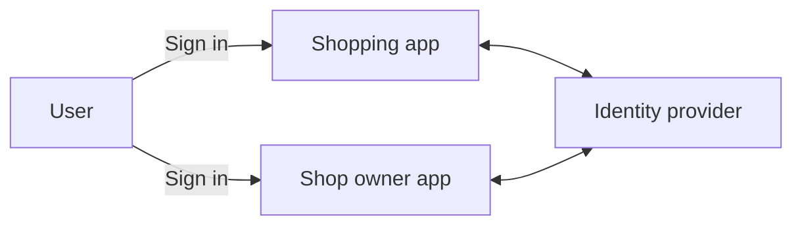
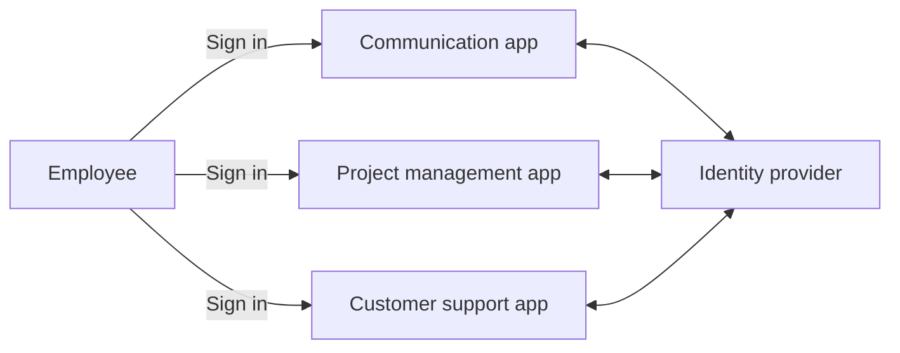
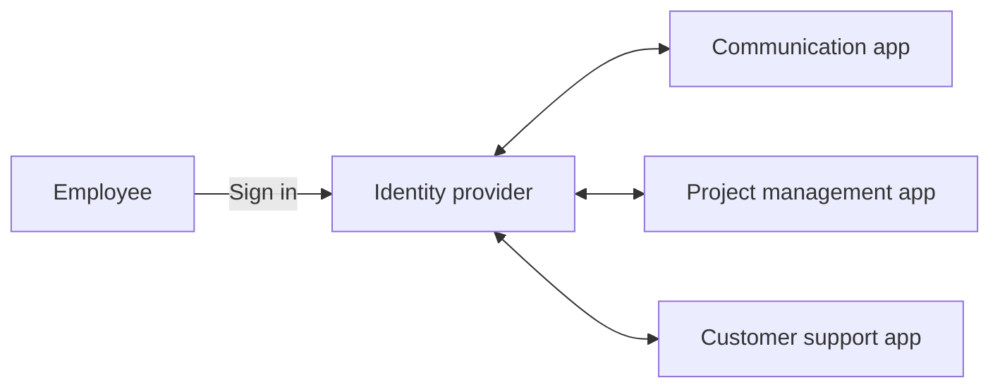
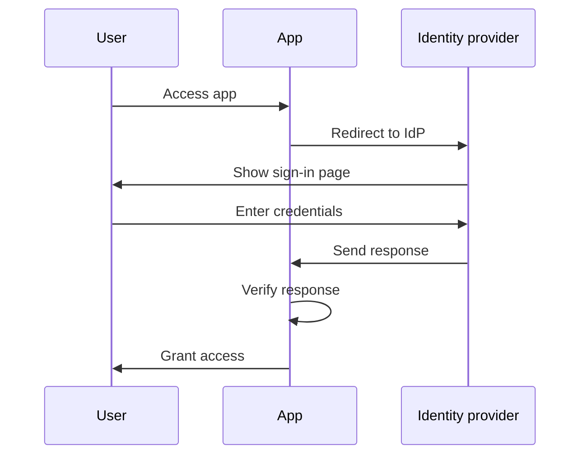
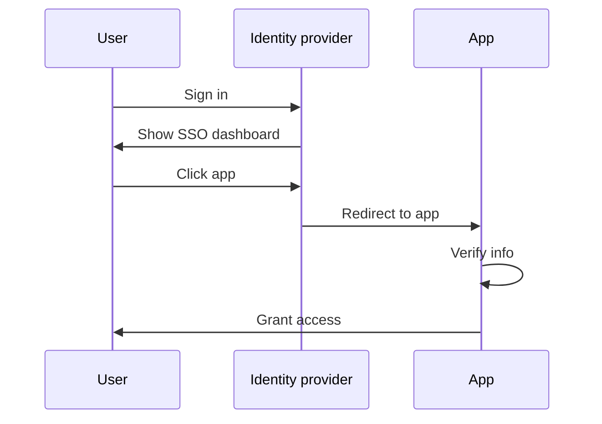
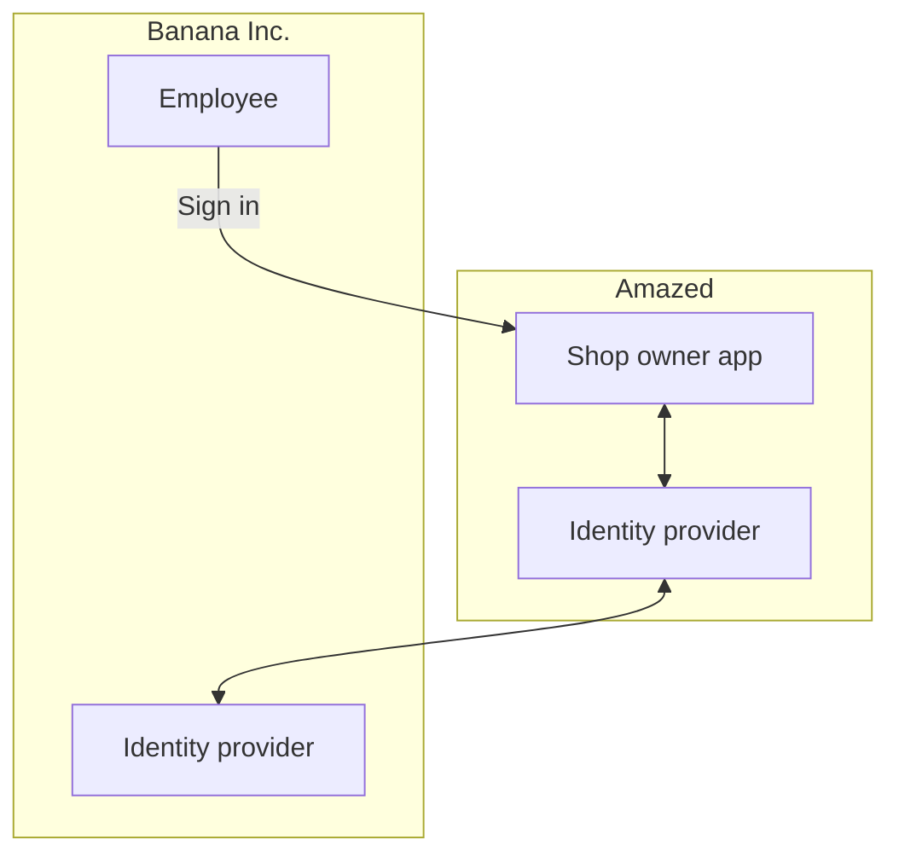

## 什么是 Enterprise SSO？

在深入探討定義之前，重要的是要澄清 SSO 和 Enterprise SSO 之間的區別，因為這往往會引起混淆。

- <Ref slug="single-sign-on" /> 是指用戶只需登錄一次即可訪問多個應用程式或資源，而無需再次登錄的通用術語。
- Enterprise SSO 是為企業內部員工設計的特定類型的 SSO。

還是不確定？我們來看一個例子：

一家名為 _Amazed_ 的在線購物網站有兩個 Web 應用程式：一個是針對顧客的，另一個是給商店店主的。顧客登錄購物應用程式來購買商品，而商店店主則登錄店主應用程式來管理他們的商店。這兩個應用程式使用相同的身份提供商 (Identity Provider) 進行認證 (Authentication)。因此，用戶只需登錄一次即可訪問這兩個應用程式，提供單一登入體驗。

在內部，_Amazed_ 使用多個應用程式進行團隊溝通、項目管理和客戶支持。為簡化日常工作流程，_Amazed_ 為其員工實施了 Enterprise SSO。通過 Enterprise SSO，員工只需一次登錄即可訪問所有內部應用程式。

通常，Enterprise SSO 方案還提供一個集中化儀表板，讓員工只需一鍵即可訪問所有應用程式。這個儀表板通常被稱為 SSO 儀表板。

簡而言之，這兩種情況都是單一登入的例子。不同之處在於，第一個例子是通用的 SSO，而第二個是 Enterprise SSO。這些分別是 Customer IAM (Identity and Access Management) 和 Workforce IAM 的典型用例。

## Enterprise SSO 如何運作？

Enterprise SSO 通過將多個應用程式連接到一個集中化的身份提供商來運作。這種連接可以是單向的（從應用程式到身份提供商）或者雙向的（應用程式與身份提供商之間）。SAML、OpenID Connect 和 OAuth 2.0 等各種標準和協議被用於這些連接。

不論協議是什麼，基本工作流程通常是類似的：

1. 用戶訪問需要認證的應用程式（例如，溝通應用程式）。
2. 應用程式將用戶重定向到身份提供商進行認證。
3. 用戶登錄身份提供商。
4. 身份提供商將認證響應發送回應用程式。
5. 應用程式驗證響應並授予用戶訪問權限。

當用戶訪問另一個連接到相同身份提供商的應用程式（例如，項目管理應用程式）時，將自動登錄，而不需要再次輸入憑證。在這種情況下，第 3 步被跳過，並且因為第 2、4 和 5 步是在後台進行的，用戶可能甚至不會注意到認證過程。

這個過程稱為服務提供商 (Service Provider, SP) 發起的 SSO，其中應用程式 (SP) 發起認證過程。

在另一種情況下，身份提供商提供了一個集中化的儀表板，供用戶訪問所有連接的應用程式。簡化的工作流程是：

1. 用戶登錄身份提供商。
2. 身份提供商顯示用戶可以訪問的應用程式列表。
3. 用戶點擊一個應用程式（例如，客戶支持應用程式）來訪問。
4. 身份提供商攜帶認證信息將用戶重定向到應用程式。
5. 應用程式驗證信息並授予用戶訪問權限。

這個過程稱為身份提供商 (IdP) 發起的 SSO，其中身份提供商 (IdP) 發起認證過程。

## Enterprise SSO 有什麼重要性？

### Workforce IAM 中的 Enterprise SSO

#### 集中化管理

Enterprise SSO 的主要好處不僅是為員工提供便利，也為組織提供增強的安全性和合規性。組織可以將用戶身份、存取控制策略和審計日誌的管理集中化，而不必為不同的應用程式單獨管理多個憑證或配置認證和授權。

例如，當一名員工離開公司時，IT 部門可以禁用其在身份提供商中的賬戶，立即撤銷對所有應用程式的訪問權限。這對於防止未經授權的訪問和數據洩露至關重要，這個過程被稱為生命周期管理。

#### 存取控制

Enterprise SSO 解決方案通常包含存取控制功能，如基於角色的存取控制 (RBAC) 和基於屬性的存取控制 (ABAC)。這些功能允許組織基於用戶角色、屬性和其他上下文信息定義詳細的存取政策，確保員工擁有合適級別的存取權限。

欲了解 RBAC 和 ABAC 之間的詳細比較，請查看 [RBAC 和 ABAC：你應該知道的存取控制模型](https://blog.logto.io/rbac-and-abac)。

#### 增強安全性

另一個好處是可以在所有應用程式中強制實施強認證方法，如多因素認證 (MFA)、無密碼認證和自適應認證。這些方法有助於保護敏感數據並遵守行業規範。

更多有關 MFA 的信息，請參見 [探索 MFA：從產品角度看認證](https://blog.logto.io/elaborate-mfa)。

### Customer IAM 中的 Enterprise SSO

"Enterprise SSO" 一詞在 Customer IAM 解決方案中也出現。這在這裡意味著什麼？讓我們重新審視 _Amazed_ 例子：某些商店店主是作為企業註冊的。一位店主，_Banana Inc._，為其員工實施了 Enterprise SSO。作為協議的一部分，_Banana Inc._ 要求 _Amazed_ 強制執行對所有來自 _Banana Inc._ 的電子郵箱地址（例如，`*@banana.com`）的 Enterprise SSO，當其訪問店主應用程式時。

在這種情況下，_Amazed_ 需要將其身份提供商與 _Banana Inc._ 的身份提供商集成，以使 _Banana Inc._ 員工能夠進行 Enterprise SSO。這種集成通常通過 SAML、OpenID Connect 或 OAuth 等標準協議進行，常被稱為 Enterprise SSO 连接、Enterprise SSO 連接器或 SSO 聯盟。

如需深入了解 Customer IAM，請查看 CIAM 系列：

- [CIAM 101: 認證、身份、SSO](https://blog.logto.io/ciam-101-intro-authn-sso)
- [CIAM 102: 授權 & 基於角色的存取控制](https://blog.logto.io/ciam-102-authz-and-rbac)

#### 準備好迎接企業

在 B2B（企業對企業）場景中，Enterprise SSO 是像 _Amazed_ 這樣的 SaaS 提供商支持其企業客戶的必備功能。這不僅僅是便利性問題；這是對雙方的安全性和合規性問題。Enterprise SSO 可以強制管理的所有身份通過企業身份提供商進行驗證，確保企業能夠控制其用戶、數據、存取和安全政策。

Enterprise SSO 是實現 _企業準備_ 的關鍵因素，意味著能夠滿足企業客戶的需求。然而，身份和存取管理，尤其是在企業客戶的環境中，是複雜的，需要大量的時間、資源和專業知識的投入。現代 SaaS 供應商通常選擇 IAM 平台來處理這些複雜性。

<SeeAlso slugs={['single-sign-on']} />