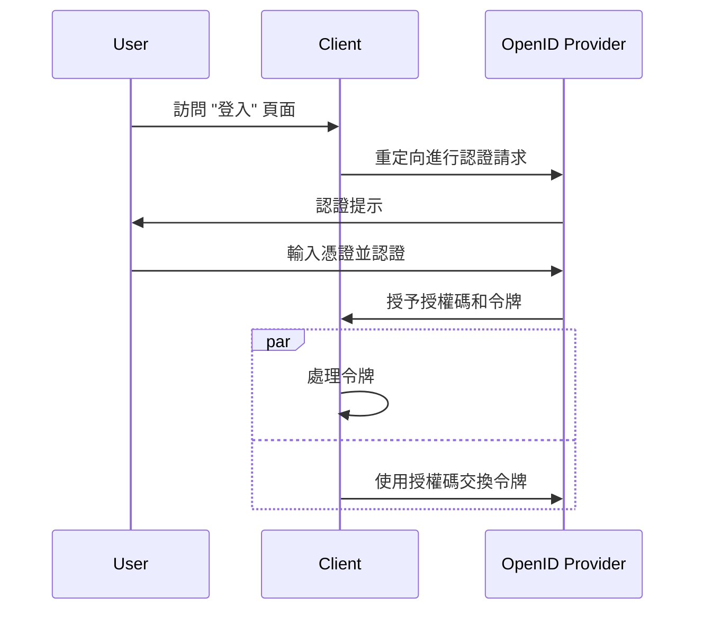

## 什麼是混合流程 (Hybrid Flow)？

混合流程 (Hybrid Flow) 是結合了 <Ref slug="authorization-code-flow" /> 和 <Ref slug="implicit-flow" /> 特徵的认证 (Authentication) 過程。值得注意的是，混合流程 (Hybrid Flow) 並不是 <Ref slug="oauth-2.0" /> 規範的一部分，而是由 <Ref slug="openid-connect" /> 提供的擴展。

這個流程設計的目的是在用戶认证 (Authentication) 中提供安全性和可用性之間的平衡。然而，由於與隐式流程 (Implicit Flow) 相關的[安全考量](#security-considerations)，不建議在新應用中使用混合流程 (Hybrid Flow)。混合流程 (Hybrid Flow) 的一種流行替代方法是使用帶有 <Ref slug="pkce" /> 的授权码流程 (Authorization Code Flow) 以提升安全性。

## 混合流程 (Hybrid Flow) 如何運作？

以下是混合流程 (Hybrid Flow) 的主要步驟：

1. 與其他 OIDC 流程類似，混合流程 (Hybrid Flow) 從 <Ref slug="client" /> 發起一個 <Ref slug="authentication-request" /> 給 <Ref slug="openid-connect" headingId="openid-provider-op" /> 開始。

    注意：客户端應包含 `response_type` 參數，與 `code` 和至少一個 `id_token` 或 `token` 的組合，這意味著有三種可能的組合：

      - `code id_token`: 客户端期望获得一个授权码 (Authorization Code) 和一个 ID 令牌 (ID Token)。
      - `code token`: 客户端期望获得一个授权码 (Authorization Code) 和一个访问令牌 (Access Token)。
      - `code id_token token`: 客户端期望获得一个授权码 (Authorization Code)、一个 ID 令牌 (ID Token) 和一个访问令牌 (Access Token)。

    要求是顯而易見的：客户端希望同時获得授权码 (Authorization Code) 和一個或多個令牌，分別對應于授权码流程 (Authorization Code Flow) 和隐式流程 (Implicit Flow)。
2. 用戶在 <Ref slug="openid-connect" headingId="openid-provider-op" /> 上進行认证 (Authentication)。
3. <Ref slug="openid-connect" headingId="openid-provider-op" /> 將用戶重定向回客户端應用，附带授权码 (Authorization Code) 和請求的令牌。
4. 客户端應用處理令牌，可以代表用戶訪問受保護資源；它也可以通過 <Ref slug="token-request" /> 使用授权码 (Authorization Code) 獲取額外的令牌。

以下是混合流程 (Hybrid Flow) 的簡化序列圖：



以下是一個非規範的混合流程 (Hybrid Flow) 认证 (Authentication) 請求示例：

```http
GET /authorize?response_type=code%20id_token
  &client_id=YOUR_CLIENT_ID
  &redirect_uri=https%3A%2F%2Fclient.example.com%2Fcallback
  &scope=openid%20profile%20email
  &nonce=123456
  &state=abc123 HTTP/1.1
Host: your-openid-provider.com
```

### 混合流程 (Hybrid Flow) 认证 (Authentication) 請求的關鍵參數

混合流程 (Hybrid Flow) 认证 (Authentication) 請求包含以下關鍵參數：

- **`response_type`**: 值應是 `code` 與至少一個 `id_token` 或 `token` 的組合。例如，`code id_token` 或 `code token`。
- **`client_id`**: 由 <Ref slug="openid-connect" headingId="openid-provider-op" /> (认证伺服器) 簽發的客户端標識符。
- **`redirect_uri`**: 认证服务器在认证過程後发送用户的 URI。
- **`scope`**: 請求的<Ref slug="scope">權限 (Scopes)</Ref>。
- **`resource`**: 指定請求資源的<Ref slug="resource-indicator" />的選擇性參數。认证服务器需要支持 [RFC 8707](https://datatracker.ietf.org/doc/html/rfc8707) 才能使用此參數。

完整的參數列表及其描述，請參閱[使用混合流程进行认证](https://openid.net/specs/openid-connect-core-1_0.html#HybridFlowAuth)。

## 安全考量

混合流程包含了隐式流程 (Implicit Flow)，其已知安全限制。令牌仍然通過前端渠道 (瀏覽器) 傳輸，可能會被潛在攻擊者攔截。因為這些顧慮，隐式流程 (Implicit Flow) 將在 <Ref slug="oauth-2.1" /> 中被棄用。

使用帶有 <Ref slug="pkce" /> 的授权码流程 (Authorization Code Flow) 是混合流程 (Hybrid Flow) 的建議替代方案。它提供了一種更安全的方式來进行用户认证，而不需要在前端渠道暴露令牌。

<SeeAlso slugs={["openid-connect", "oauth-2.1", "authorization-code-flow", "pkce", "implicit-flow"]} />

<Resources
  urls={[
    "https://blog.logto.io/implicit-flow-is-dead",
    "https://blog.logto.io/oauth-2-1",
    "https://openid.net/specs/openid-connect-core-1_0.html#HybridFlowAuth",
  ]}
/>