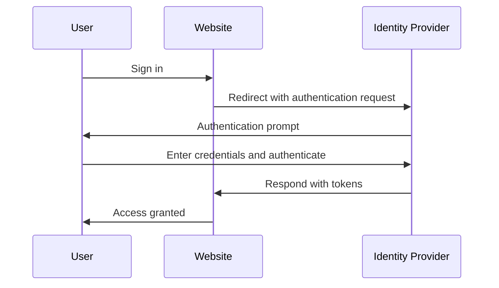

## 什麼是身分與存取管理 (IAM)？

如定義所示，身分與存取管理 (Identity and access management, IAM) 是一個涉及眾多管理數位身份和進行 <Ref slug="access-control" /> 的廣泛概念。我們首先來拆解這些術語：

- **身份**：使用者、服務或裝置的數位表示。一個身份可以包括識別符、角色和權限等屬性。
- **存取**：與資源互動、執行操作或使用服務的能力。簡而言之，存取是關於在特定資源上執行的操作。

### 身份管理

身份管理是管理、驗證和保護數位身份的過程。其涉及以下關鍵活動：

- **身份註冊**：為使用者、服務或裝置建立新身份。
- **身份驗證**：通過各種機制（如密碼、生物識別或多因素驗證）驗證身份的所有權。
- **身份安全**：保護身份免受未經授權的訪問、濫用或洩露。

每個主題都很龐大，可以進一步細分為例如密碼管理、身份聯合和身份生命周期管理等子主題。

### 存取管理

存取管理 (或 <Ref slug="access-control" />) 是控制誰能對某些資源執行何種操作的過程。其涉及以下關鍵活動：

- **存取控制政策**：定義規則和政策，以規定誰可以訪問哪些資源以及可以執行什麼操作。
- **存取執行**：通過身份驗證、授權和審計等機制執行存取控制政策。
- **存取治理**：監控和管理存取權限，以確保符合法規和安全最佳實踐。

每項活動在現代應用程式和系統中扮演著重要角色，以確保只有根據定義的政策獲得授權的身份（使用者、服務或裝置）能夠訪問資源。

## IAM 的組成部分是什麼？

在應用中，IAM 是通過軟體、服務和最佳實踐的組合來實現的。IAM 的兩個重要組成部分是：

- **<Ref slug="identity-provider" />**：管理使用者身份和身份驗證的服務。
- **<Ref slug="service-provider" />**：依賴身份提供商進行身份驗證和授權的服務。在大多數情況下，這是你正在開發的應用或服務。

在身份提供商和服務提供商之間進行明確的分離將有助於將 IAM 與應用邏輯解耦，使其更易於管理和擴展。

## 身分與存取管理的實踐

讓我們看看 IAM 的工作示例：當你登入一個網站時，驗證你的身份並授予你訪問該網站的過程可以被視為一個身分與存取管理過程。

通常，IAM 過程涉及兩個主要步驟：身份驗證和授權：

- <Ref slug="authentication" /> 回答問題“你的身份是什麼？”
- <Ref slug="authorization" /> 回答問題“你可以做什麼？”

> 有時候，身份驗證會被解釋為“你是誰？”然而，當討論數位身份時，更準確的說法是通過“證明身份的所有權”來展示身份驗證。

此外，身分與存取管理的概念甚至足夠大，以至於產生了新的概念，如 WIAM（Workforce IAM）和 CIAM（Customer IAM）。

雖然 WIAM 和 CIAM 共享相同的基礎，但它們有不同的用例：WIAM 通常用於內部使用者，而 CIAM 用於外部顧客。一些例子：

- **WIAM**: 你的公司有一個統一的員工身份系統，因此每個人都可以使用相同的帳戶訪問公司資源，如軟體訂閱、雲計算服務等。
- **CIAM**: 你的線上書店需要一個供顧客和賣家使用者身份系統。登入體驗是客戶引導的重要部分，同時位於轉化漏斗的頂端。

要了解有關 CIAM 概念和相關話題的更多資訊，你可以參考 [CIAM 101: Authentication, Identity, SSO](https://blog.logto.io/ciam-101-intro-authn-sso)。

### 身份驗證

以下是 IAM 中常用的一些身份驗證方法：

- **基於密碼的身份驗證**：最常見的方法，使用者提供用戶名和密碼以證明其身份。
- **<Ref slug="passwordless" /> 驗證**：允許使用者在沒有密碼的情況下登入的方法，例如使用發送到其電子郵件或手機的一次性代碼。注意，無密碼認證也可能指其他方法，例如生物識別認證。
- **社交登入**：允許使用者使用其社交媒體帳戶（例如 Google、Facebook 或 Twitter）登入的方法。
- **<Ref slug="passkey" /> (WebAuthn)**：允許使用者使用安全密鑰（如 USB 密鑰或支援 WebAuthn 的智慧型手機）登入的方法。
- **生物識別身份驗證**：使用物理特徵（如指紋、面部識別或語音識別）來驗證使用者身份的方法。
- **<Ref slug="machine-to-machine" /> 身份驗證**：允許服務或裝置在無需人工干預的情況下相互驗證的方法，例如使用 API 金鑰或證書。

為了增加額外的安全層，<Ref slug="mfa" /> 可以與這些身份驗證方法一起使用。MFA 要求使用者提供兩種或多種因素來證明其身份，例如他們知道的東西（密碼）、他們擁有的東西（安全密鑰或 <Ref slug="totp" />）或他們的生物數據。

### 授權

在身份驗證到位後，授權決定身份可以執行什麼操作。授權可以基於多種因素，如身份的角色、群組成員資格、權限、屬性、政策等。常見的授權模型有：

- **<Ref slug="rbac" />**：一種將權限分配給角色，然後將角色分配給身份的模型。例如，員工角色可能有訪問某些資源的權限，而管理員角色可能有訪問所有資源的權限。
- **<Ref slug="abac" />**：一種使用身份、資源和環境的屬性來做出存取控制決策的模型。例如，具有“部门=工程”屬性的身份可能可以訪問工程資源。
- **基於政策的存取控制 (PBAC)**：一種使用政策來定義存取控制規則的模型。政策可以基於多種因素，如一天中的時間、位置、裝置類型等。
- **細粒度存取控制**：一種提供更精細的存取控制的模型，允許在個別資源或操作的層級設置權限。

## IAM 廣泛使用的開放標準有哪些？

IAM 中廣泛使用的開放標準和協定有：

- **<Ref slug="oauth-2.0" />**：一種協定，允許應用在不共享使用者憑證的情況下代表使用者訪問資源。OAuth 2.0 通常用於授權，如允許第三方應用訪問使用者的 Google Drive 文件。
- **<Ref slug="openid-connect" />**：基於 OAuth 2.0 之上的一個身份層，允許應用驗證使用者身份並獲取使用者的基本個人資訊。單一登入 (Single Sign-On, SSO) 是 OpenID Connect 的常見使用案例。將 OAuth 2.0 和 OpenID Connect 結合是現代 IAM 的常見做法。
- **<Ref slug="saml" />**：一種基於 XML 的標準，用於在身份提供商和服務提供商之間交換身份驗證和授權數據。SAML 通常用於企業環境中的 SSO。
- **SCIM (跨域身份管理系統)**：一種標準，用於在身份提供商和服務提供商之間自動交換使用者身份信息。SCIM 通常用於基於雲的應用中的使用者供應和解除供應。

## IAM 的關鍵設計考量是什麼？

設計 IAM 系統時，有幾個關鍵考量需要記住：

- **安全性**：安全性在 IAM 中至關重要。確保身份驗證方法遵循最佳實踐，例如使用強密碼雜湊、強制執行 MFA，並保護免受釣魚和暴力破解等常見攻擊。
- **隱私**：通過僅收集必要的信息並在需要時獲得使用者同意來尊重使用者的隱私。
- **可擴展性**：使 IAM 系統可擴展，以處理大量使用者和應用。考慮使用基於雲的身份提供商來提高可擴展性。
- **互操作性**：使用開放標準的一個好處是它允許不同系統之間的互操作性。例如，大多數流行的身份提供商如 Google、Facebook 和 Microsoft 支援 OAuth 2.0 和 OpenID Connect。
- **使用者體驗**：身份驗證和授權的使用者體驗對用戶轉化和保存有很大影響。平衡安全與易用是 IAM 中的一門藝術。

<SeeAlso slugs={['openid-connect', 'oauth-2.0', 'single-sign-on', 'enterprise-sso']} />

<Resources
  urls={[
    "https://blog.logto.io/ciam-101-intro-authn-sso",
    "https://blog.logto.io/ciam-102-authz-and-rbac"
  ]}
/>
