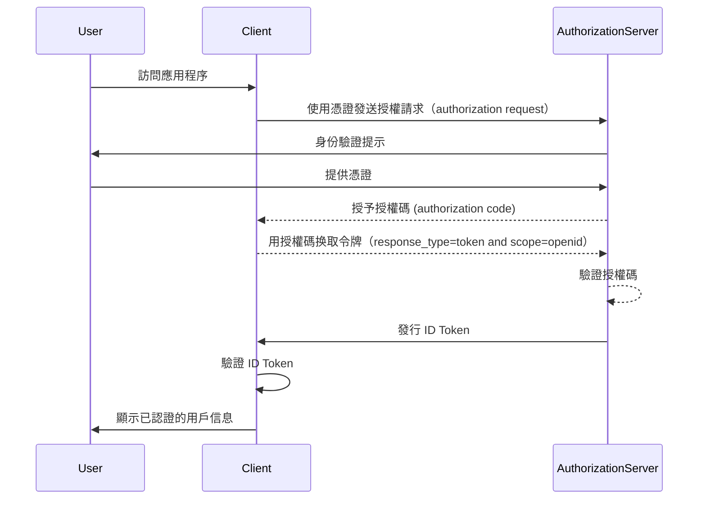

## 什麼是 ID Token？

ID Token 是一种特定类型的安全令牌，包含有关经过身份验证的用户的信息，在成功<Ref slug="authentication" />后传递给客户端应用程序。ID Token 是区分<Ref slug="openid-connect" />和<Ref slug="oauth-2.0" />的关键功能。虽然 OAuth 2.0 仅专注于授权 (authorization)，但 OIDC 基于它通过引入 ID Token 来添加用户认证 (authentication)。

在 OIDC 认证请求 (authentication request)过程中，客户端应用程序（依赖方）通过将用户重定向到授权伺服器（authorization server）来启动认证请求 (authentication request)。经过成功认证后，伺服器响应包括 ID Token 在内的多个令牌，例如<Ref slug="access-token" />。ID Token 通常编码为<Ref slug="jwt" />，并包括关键声明（claims），如用户的标识符（sub）、发行者 (issuer)（iss）、audience (aud) 和其他用户特定信息。

ID Token 的主要功能是验证用户的身份，并将此信息传输给客户端应用程序。这使得应用程序能够在无需直接处理凭证的情况下验证用户身份。由于客户端仅在用户已由授权伺服器进行认证后接收到 ID Token，因此可以用作验证用户身份的安全方式。

## ID Token 如何運作？

客户端应用程序通过将用户重定向到授权伺服器来启动认证过程。用户通过伺服器进行认证，之后伺服器连同其他令牌例如访问令牌（access token）一起发布 ID Token。ID Token 被返回给客户端应用程序，后者可以使用它来验证用户身份。

由于 OIDC 是一個流行且標準化的協議，許多庫和框架都提供內置支持來處理 ID Token。這使得 ID Token 易於整合到客戶端應用程序中，並廣泛用於<Ref slug="single-sign-on" />和聯合身份（federated identity）場景中。

## ID Token 中的聲明 (Claims)

ID Token 是一個JWT，包含一系列有關經過身份認證的用戶的<Ref slug="claim" />。這些声明包括在 [JWT 规范](https://datatracker.ietf.org/doc/html/rfc7519#section-4)中定义的标准 JWT 声明，以及用于传递用户身份信息的 OIDC 特定声明。

JWT 标准令牌声明：

- **iss (Issuer)**: REQUIRED. 发行者声明标识 ID token 的发行者。通常是发布令牌的授权伺服器的 URL。
- **sub (Subject)**: REQUIRED. 主体声明标识 ID token 所涉及的用户。通常是用户的唯一标识符。
- **aud (Audience)**: REQUIRED. audience 声明标识 ID token 的<Ref slug="audience" />。通常是请求令牌的客户端应用程序。
- **exp (Expiration time)**: REQUIRED. 过期时间声明标识令牌到期的时间。超过此时间后，令牌不应被接受进行处理。
- **iat (Issued at)**: REQUIRED. 签发时间声明标识令牌的签发时间。
- **auth_time (Authentication time)**: OPTIONAL. 认证时间声明标识用户进行认证的时间。仅在用户在当前会话期间经过认证时存在。
- **nonce**: OPTIONAL. nonce 声明用于将客户机会话与 ID token 关联。通常用于防止重放攻击。

OIDC 标准用户信息声明：

- **name**: 用户的全名。
- **given_name**: 用户的名字。
- **family_name**: 用户的姓氏。
- **middle_name**: 用户的中间名。
- **nickname**: 用户的昵称或其他简称。
- **preferred_username**: 用户的首选用户名。
- **profile**: 指向用户个人资料页面的 URL。
- **picture**: 用户头像的 URL。
- **website**: 用户网站的 URL。
- **email**: 用户的电子邮件地址。
- **email_verified**: 布尔值，指示用户的电子邮件地址是否已验证。
- **gender**: 用户的性别。
- **birthdate**: 用户的出生日期。表示为格式为 YYYY-MM-DD 的字符串。
- **zoneinfo**: 用户的时区。字符串来自 [IANA 时区数据库](https://www.iana.org/time-zones)。
- **locale**: 用户的语言环境。表示用户在格式化日期、时间和数字时的首选语言和地区。
- **phone_number**: 用户的电话号码。
- **phone_number_verified**: 布尔值，指示用户的电话号码是否已验证。
- **address**: 用户的邮政地址。该值是包含用户地址信息的 JSON 对象。
- **updated_at**: 用户信息最后更新的时间。

这些声明提供了一种在 ID Token 中传递用户身份信息的标准化方式。虽然规范仅定义一组标准声明，但也可以在 ID Token 中包含自定义声明，以根据需要传递其他用户特定信息。

## ID Token 的驗證

当客户端应用程序收到 ID Token 时，它必须验证此令牌以确保其真实性和完整性。验证过程通常包括以下步骤：

1. **验证签名**: 客户端必须使用授权伺服器的公钥验证 ID Token 的签名。这确保了令牌没有被篡改，并且是由预期的一方发布的。
2. **检查发行者**: 客户端应验证 ID Token 中的 `iss` 声明是否与发布令牌的授权伺服器的 URL 相匹配。这有助于防止令牌替换攻击。
3. **检查受众**: 客户端应验证 ID Token 中的 `aud` 声明是否与客户端应用程序的 `client_id` 相匹配。这确保了令牌是为客户端应用程序发布的。
4. **检查过期时间**: 客户端应验证 ID Token 中的 `exp` 声明是否未过期。如果令牌已过期，则不应接受。实现可能会提供余地以考虑时钟偏差。
5. **检查 nonce**: 如果客户端在认证请求中包含了 `nonce` 参数，则应验证 ID Token 中的 `nonce` 声明是否与 `nonce` 参数的值匹配。这有助于防止重放攻击。

## ID Token 与访问令牌的比较

虽然 ID Token 和访问令牌在 OIDC 中被广泛使用，但它们的用途不同，并具有不同的特性：

|              | ID Token                                                                                             | 访问令牌 (Access Token)                                                                                                   |
| ------------ | ----------------------------------------------------------------------------------------------------- | --------------------------------------------------------------------------------------------------------------------------- |
| **用途**     | 验证用户的身份并将用户信息传递给客户端应用程序。                                                          | 代表用户提供对受保护资源的访问。                                                                                             |
| **格式**     | 通常是包含用户身份声明的 JWT。                                                                          | 可以是 JWT 或<Ref slug="opaque-token" />。                                                                                    |
| **受众**     | 为请求令牌的客户端应用程序准备的。                                                                      | 为托管受保护资源的资源伺服器准备的。                                                                                         |
| **生命周期** | 短期有效的令牌，通常有效期仅为几分钟。仅可一次性使用。                                                   | 有效期较长的令牌，有效期更长（例如，数小时）。在其有效期内可以多次重用。                                                     |
| **内容**     | 包含用户身份信息，如姓名、电子邮件和其他用户特定数据。                                                   | 包含有关用户在特定资源上的权限（scope）的信息。                                                                                |

## 使用 ID Token 的最佳实践

在 OIDC 中使用 ID Token 时，遵循最佳实践以确保认证过程的安全性和完整性是很重要的。一些关键的最佳实践包括：

1. **验证 ID Token**: 始终验证从授权伺服器收到的 ID Token 以确保其真实性和完整性。这有助于防止令牌替换攻击和未经授权的访问。
2. **使用安全通道**: 确保 ID Token 通过安全通道（例如，HTTPS）传输，以防止拦截和篡改。
3. **保护敏感信息**: 由于 JWTs 通常是编码的但未加密，这使得内容透明。避免在 ID Token 负载中包含敏感信息，以防止令牌泄露时敏感数据的暴露。
4. **不用于授权**: ID Token 仅用于用户认证 (authentication)，不应用于授权 (authorization)。使用访问令牌来进行授权以访问受保护资源。
5. **单次使用**: ID Token 通常用于一次性使用。一旦客户端应用程序已验证一个 ID Token，它不应在后续请求中重用或用于会话状态保留。为了维护用户会话状态，客户端应用程序应采用<Ref slug="refresh-token" />和令牌交换请求等机制。（刷新令牌是长期有效的不透明令牌，可以在访问令牌和 ID Token 到期时用于获取新令牌。）

<SeeAlso slugs={["openid-connect", "jwt", "signing-key", "access-token"]} />