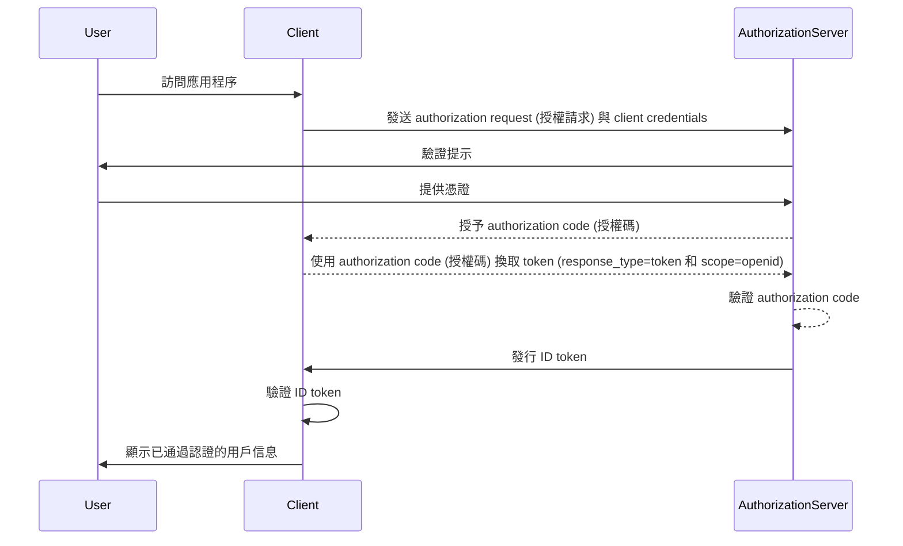

## 什麼是 ID token？

ID token 是一種特定類型的安全 token，包含有關已認證用戶的信息，並在成功的 authentication (認證) 後傳遞給 client application。ID token 是區分 OpenID Connect (OIDC) 和 OAuth 2.0 的關鍵特徵。儘管 OAuth 2.0 只專注於 authorization (授權)，OIDC 則在其之上添加用戶 authentication (認證)，引入了 ID token。

在 OIDC 的 authentication (認證) 過程中，client application（依賴方）通過將用戶重定向到 authorization server 來啟動 authentication (認證)。在成功的 authentication (認證) 後，伺服器回應一個 ID token，還有其他 token，如 access token。在一般情況下，ID token 會被編碼為 JWT (JSON Web Token)，並包括關鍵 claims，例如用戶的標識符 (sub)、issuer (發行者) (iss)、audience (受眾) (aud) 和其他用戶特定的信息。

ID token 的主要功能是驗證用戶的身份，並將此信息傳遞給 client application。這使應用程序能夠在不直接處理憑據的情況下驗證用戶。由於 client 僅在用戶已被 authorization server 認證後才接收 ID token，ID token 可以作為驗證用戶身份的安全方式。

## ID token 如何運作？

client application 通過將用戶重定向到 authorization server 來啟動 authentication (認證) 過程。用戶與伺服器進行身份驗證，然後伺服器簽發一個 ID token，還有其他 token，如 access token。ID token 被返回給 client application，然後可以用來驗證用戶的身份。

由於 OIDC 是一種流行且標準化的協議，許多庫和框架提供對 ID token 的內建支持。這使得 ID token 易於集成到 client application 中，並在 single sign-on (SSO) 和聯合身份場景中廣泛使用。

## ID token 中的 claims

ID token 是一個 JWT (JSON Web Token)，包含一組有關已認證用戶的 claims。這些 claims 包括在 [JWT 規範](https://datatracker.ietf.org/doc/html/rfc7519#section-4) 中定義的標準 JWT claims，以及用於傳遞用戶身份信息的 OIDC 特定 claims。

JWT 標準 token claims：

- **iss (Issuer)**：必需。issuer (發行者) claim 標識 ID token 的發行者。這通常是發行此 token 的 authorization server 的 URL。
- **sub (Subject)**：必需。subject claim 標識 ID token 的相關用戶。這通常是用戶的唯一標識符。
- **aud (Audience)**：必需。audience (受眾) claim 標識 ID token 的受眾。這通常是請求此 token 的 client application。
- **exp (Expiration time)**：必需。expiration time claim 標識 token 到期的時間。過了這個時間，token 不應被接受處理。
- **iat (Issued at)**：必需。issued at claim 標識 token 發行的時間。
- **auth_time (Authentication time)**：可選。authentication time claim 標識用戶被認證的時間。此 claim 只有在用戶於當前 session 認證時才會出現。
- **nonce**：可選。nonce claim 用於將 client session 與 ID token 關聯。通常用於防止重放攻擊。

OIDC 標準用戶信息 claims：

- **name**：用戶的全名。
- **given_name**：用戶的名字。
- **family_name**：用戶的姓氏。
- **middle_name**：用戶的中間名。
- **nickname**：用戶的暱稱或其他短名。
- **preferred_username**：用戶的首選用戶名。
- **profile**：指向用戶個人資料頁面的 URL。
- **picture**：指向用戶個人資料圖片的 URL。
- **website**：指向用戶網站的 URL。
- **email**：用戶的電子郵件地址。
- **email_verified**：表明用戶的電子郵件地址是否已驗證的布爾值。
- **gender**：用戶的性別。
- **birthdate**：用戶的出生日期。表示為 YYYY-MM-DD 格式的字符串。
- **zoneinfo**：用戶的時區。來自 [IANA 時區數據庫](https://www.iana.org/time-zones) 的字符串。
- **locale**：用戶的語言區域。代表用戶對格式化日期、時間和數字的首選語言和區域。
- **phone_number**：用戶的電話號碼。
- **phone_number_verified**：表示用戶的電話號碼是否已驗證的布爾值。
- **address**：用戶的郵寄地址。值是一個 JSON 對象，包含用戶的地址信息。
- **updated_at**：用戶信息最後更新的時間。

這些 claims 提供了一種標準化的方式在 ID token 中傳遞用戶身份信息。儘管規範只定義了一組標準 claims，但也可以在 ID token 中包括自定義 claims，以根據需要傳遞其他用戶特定信息。

## ID token 驗證

當 client application 接收到 ID token 時，必須驗證此 token 以確保其真實性和完整性。驗證過程通常涉及以下步驟：

1. **驗證簽名**：client 必須使用 authorization server 的公共密鑰驗證 ID token 的簽名。這保證了 token 未被篡改，並且由預期方發行。
2. **檢查 issuer (發行者)**：client 應該驗證 ID token 中的 `iss` claim 是否與發行 token 的 authorization server 的 URL 相匹配。這有助於防止 token 替換攻擊。
3. **檢查 audience (受眾)**：client 應該驗證 ID token 中的 `aud` claim 是否與 client application's `client_id` 相匹配。這保證了 token 是為 client application 發行的。
4. **檢查過期時間**：client 應該驗證 ID token 中的 `exp` claim 是否未過期。如果 token 過期，則應不被接受。實現可能為時計差提供餘量。
5. **檢查 nonce**：如果 client 在 authentication request 中包含了一個 `nonce` 參數，則應該驗證 ID token 中的 `nonce` claim 是否與 `nonce` 參數的值相匹配。這有助於防止重放攻擊。

## ID token 與 access token 的對比

儘管 ID token 和 access token 在 OIDC 中被廣泛使用，但它們服務於不同的目的並且具有不同的特徵：

|              | ID token                                                                                | Access token                                                                                                                  |
| ------------ | --------------------------------------------------------------------------------------- | ----------------------------------------------------------------------------------------------------------------------------- |
| **目的**     | 驗證用戶的身份並將用戶信息傳遞到 client application。   | 提供代表用戶訪問受保護資源的能力。                                                            |
| **格式**     | 通常是一個包含用戶身份 claims 的 JWT。                                | 可以是 JWT 或者是一個 opaque token (不透明的 token) (隨機字符串)。                                 |
| **受眾**     | 面向請求 token 的 client application。                            | 面向託管受保護資源的 resource server。                                                              |
| **存活時間** | 短命 token，通常只能使用數分鐘。一-time 使用。 | 較長存活時間的 token，有效期較長（如數小時）。在其有效期內可以重複多次使用。 |
| **內容**     | 包含用戶身份信息，如姓名、電子郵件和其他用戶特定數據。               | 包含有關用戶對特定資源的權限 (scopes) 的信息。                                                 |

## 使用 ID token 的最佳實踐

在 OIDC 中使用 ID token 時，遵循最佳實踐以確保 authentication (認證) 過程的安全性和完整性是很重要的。一些關鍵的最佳實踐包括：

1. **驗證 ID token**：始終驗證從 authorization server 接收到的 ID token，以確保其真實性和完整性。這有助於防止 token 替換攻擊和未經授權的訪問。
2. **使用安全通道**：確保 ID tokens 通過安全通道（例如 HTTPS）傳輸，以防止攔截和篡改。
3. **保護敏感信息**：由於 JWT 通常被編碼但未加密，這使得內容透明。避免在 ID token payload 包含敏感信息，以防止在 token 洩漏的情況下暴露敏感數據。
4. **不作為授權用**：ID token 用於用戶 authentication (認證)，不應用於 authorization (授權) 目的。應使用 access token 進行授權以訪問受保護資源。
5. **一次性使用**：ID token 通常是一次性使用的。一旦 client application 驗證了一個 ID token，它不應該在隨後的請求或會話狀態保存中重用。為了維持用戶會話狀態，client application 應採用 refresh token 和 token 換取請求等機制。（Refresh token 是長存活的 opaque token，可以在 access token 和 ID token 過期時用來獲取新的 token。）

<SeeAlso slugs={["openid-connect", "jwt", "signing-key", "access-token"]} />