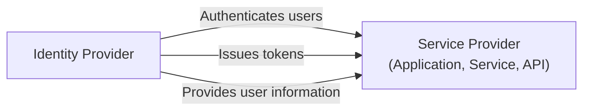
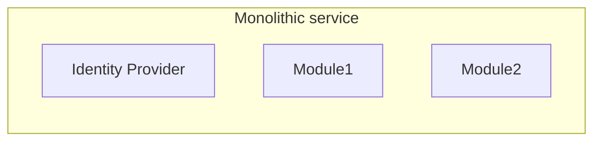
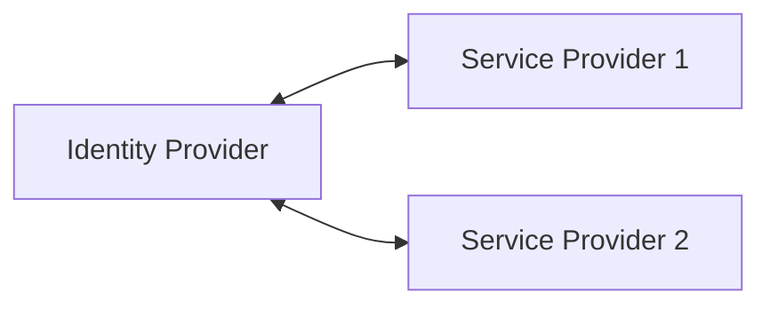

## 什麼是身分提供者 (Identity provider, IdP)？

在 <Ref slug="iam" /> 的領域中，身分提供者 (IdP) 是用於管理身分的核心服務。它負責對用戶進行身份驗證，發行身分 token 並向 <Ref slug="service-provider">服務提供者</Ref> （例如應用程序、服務、API）提供用戶信息。

除了 <Ref slug="authentication" />，現代的身分提供者還負責 <Ref slug="authorization" /> （執行 <Ref slug="access-control" /> 政策）並支持一些先進特性，例如 <Ref slug="single-sign-on" /> 和 <Ref slug="multi-tenancy" />。

## 身分提供者的標準

由於身分管理的特性以及互操作性的需求，不採用標準來構建身分提供者是不切實際且效率低下的。以下是一些典型的場景：

- 兩個身分提供者需要彼此通訊來交換用戶信息（例如，社會登錄）。
- 一個應用需要使用多個身分提供者進行用戶 authentication （例如，聯邦身份）。
- 一個身分提供者需要支持多種類型的 client（例如，網頁、移動、IoT）。

為了解決這些場景，行業中開發了幾個熱門標準：

- <Ref slug="oauth-2.0" />：一個廣泛使用的 authorization 框架，允許應用程序代表用戶或服務獲得訪問權限。
- <Ref slug="openid-connect" />：構建在 OAuth 2.0 之上的身份層，提供 authentication 和用戶信息。
- <Ref slug="saml" />：一種在安全領域間交換 authentication 和 authorization 數據的標準。

對於新應用程序，OpenID Connect (OIDC) 是建議用來構建身分提供者或與現有身分提供者集成的標準。

## 身分提供者的架構

“身分提供者”這個術語並不指特定的架構或實現。也就是說，身分提供者可以是單體應用程序、一個微服務或者是一個雲服務。

由於身分管理的複雜性和關鍵性，現代應用程式趨向於使用專門的身分提供者作為獨立的服務或供應商方案。

## 身分提供者的特徵

現代的身分提供者提供了範圍廣泛的功能來支持各種用例和需求。以下是一些常見功能：

- <Ref slug="authentication" />：使用多種方法驗證用戶身份（例如，使用者名稱/密碼、社會登錄、<Ref slug="mfa" />）。
- <Ref slug="authorization" />：執行 access control 政策並管理用戶權限（例如，<Ref slug="rbac" />，<Ref slug="abac" />）。
- **用戶管理**：創建、更新和刪除用戶賬戶和配置檔；向 <Ref slug="service-provider">服務提供者</Ref> 提供用戶數據。
- **Token 管理**：發行和管理身份 token（例如，ID token，access token，refresh token）。
- <Ref slug="single-sign-on" />：使用戶僅需 authentication 一次即可訪問多個應用程式。
- <Ref slug="multi-tenancy" />：支持多個組織或租戶，具有隔離的用戶數據和配置。

<SeeAlso slugs={["service-provider", "iam", "openid-connect", "oauth-2.0"]} />

<Resources
  urls={[
    "https://blog.logto.io/secure-cloud-apps-with-oauth-and-openid-connect",
    "https://blog.logto.io/incorporate-identity-solution",
    "https://blog.logto.io/centralized-identity-system"
  ]}
/>