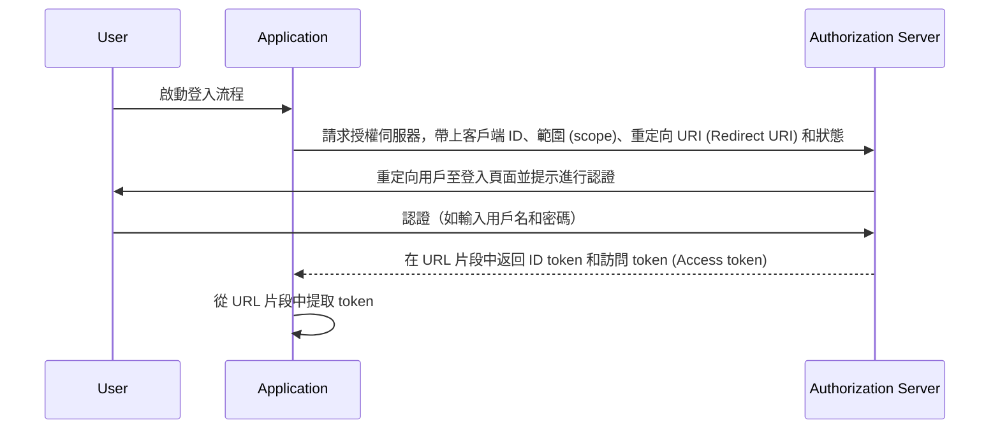

## 什麼是隱式流程 (Implicit flow)

OIDC (OpenID Connect) 隱式流程 (Implicit flow) 是一種主要用於由瀏覽器中的腳本語言實現的客戶端應用程序的認證 (Authentication) 過程，例如單頁應用程序 (SPAs)。它允許客戶端應用程序直接從授權伺服器 (Authorization server) 獲取 ID token 和訪問 token (Access token)，而不需要執行客戶端認證 (Client authentication)。

## 隱式流程 (Implicit flow) 如何工作？

隱式流程 (Implicit flow) 的主要步驟如下：

1. **發送認證請求 (Authentication request)**: 用戶通常通過點擊應用程序中的鏈接或按鈕來啟動流程，應用程序向授權伺服器 (Authorization server) 的授權端點發送認證請求 (Authentication request)。授權伺服器 (Authorization server) 驗證參數並重定向用戶前往授權伺服器的登入頁面進行認證。
2. **用戶認證 (User authentication)**: 用戶在授權伺服器（如輸入用戶名和密碼）上進行認證。
3. **授權伺服器響應**: 授權伺服器返回 ID token 和訪問 token (Access token)（如果有請求的話）給客戶端應用程序，作為 URL 片段。
4. **客戶端處理 token**: 客戶端應用程序從 URL 片段中提取 token。



### 認證請求 (Authentication request)

請求參數如下：
- **client_id**: 必需。有效的 OAuth 2.0 客戶端識別碼，可在 Logto 中以應用 ID（或 app ID）獲得。
- **scope**: 必需。此值指定用戶請求授權伺服器的資源集合。如 `openid profile email`。
- **response_type**: 必需。值為 `id_token` 或 `id_token token`。當值為 `id_token` 時不返回訪問 token (Access token)。
- **redirect_uri**: 必需。認證響應將發送至的 URI，應與客戶端在 <Ref slug="openid-connect" headingId="openid-provider-op" /> 中預先註冊的重定向 URI (Redirect URI) 完全匹配。如 Logto 管理控制台中的 `Sign-in redirect URI`。
- **nonce**: 必需。用於減輕重放攻擊的隨機字符串，從認證請求 (Authentication request) 傳遞至 ID token 宣告 (Claim)。

### 認證請求 (Authentication request) 範例

```bash
curl -X GET "https://authorization-server.com/auth" \
  -d "response_type=id_token token" \
  -d "client_id=YOUR_APPLICATION_ID" \
  -d "redirect_uri=https://yourapp.com/callback" \
  -d "scope=openid profile email" \
  -d "nonce=RANDOM_STRING"
```

## 限制

隱式流程 (Implicit flow) 是在瀏覽器尚未廣泛採用跨來源資源共享 (Cross-Origin Resource Sharing, CORS) 的時候開發的。因此，禁止向位於不同域的授權伺服器發送 POST 請求。

由於此限制，授權伺服器直接在 URL 片段中返回 token，這可能會使得用戶端用戶和能訪問用戶端用戶代理的應用程序得以查看這些 token。

此外，隱式流程 (Implicit flow) 中不執行客戶端認證 (Client authentication)，這意味著任何應用程序都可以偽裝成請求認證的客戶端，因為客戶端 ID 總是在基於瀏覽器的應用程序中暴露。

由於上述限制，隱式流程 (Implicit flow) 通常被認為不如授權碼流程 (Authorization Code Flow) 安全。

## 隱式流程 (Implicit flow) 的替代方案

考慮到隱式流程 (Implicit flow) 的安全限制，通常推薦使用其他流程：
- **授權碼流程 (Authorization Code Flow)**: 此流程包含額外步驟，客戶端通過授權碼交換 token，提供了額外的安全層。
- **PKCE (Proof Key for Code Exchange)**: 授權碼流程的擴展，通過使用代碼驗證器和代碼挑戰增加了一層額外的安全性。

<SeeAlso slugs={['device-flow', 'authorization-code-flow', 'client-credentials-flow']} />

<Resources
  urls={[
    "https://blog.logto.io/implicit-flow-is-dead",
    {
      url: "https://tools.ietf.org/html/rfc6749#section-4.2",
      result: {
        ogTitle: "The OAuth 2.0 Authorization Framework: Implicit Grant",
        ogDescription: "隱式授權類型用於獲取訪問 token（它不支持發放刷新 token），並針對已知運行特定重定向 URI 的公共客戶端進行優化。這些客戶端通常使用腳本語言（例如 JavaScript）在瀏覽器中實現。"
      }
    },
    "https://openid.net/specs/openid-connect-core-1_0.html",
  ]}
/>
