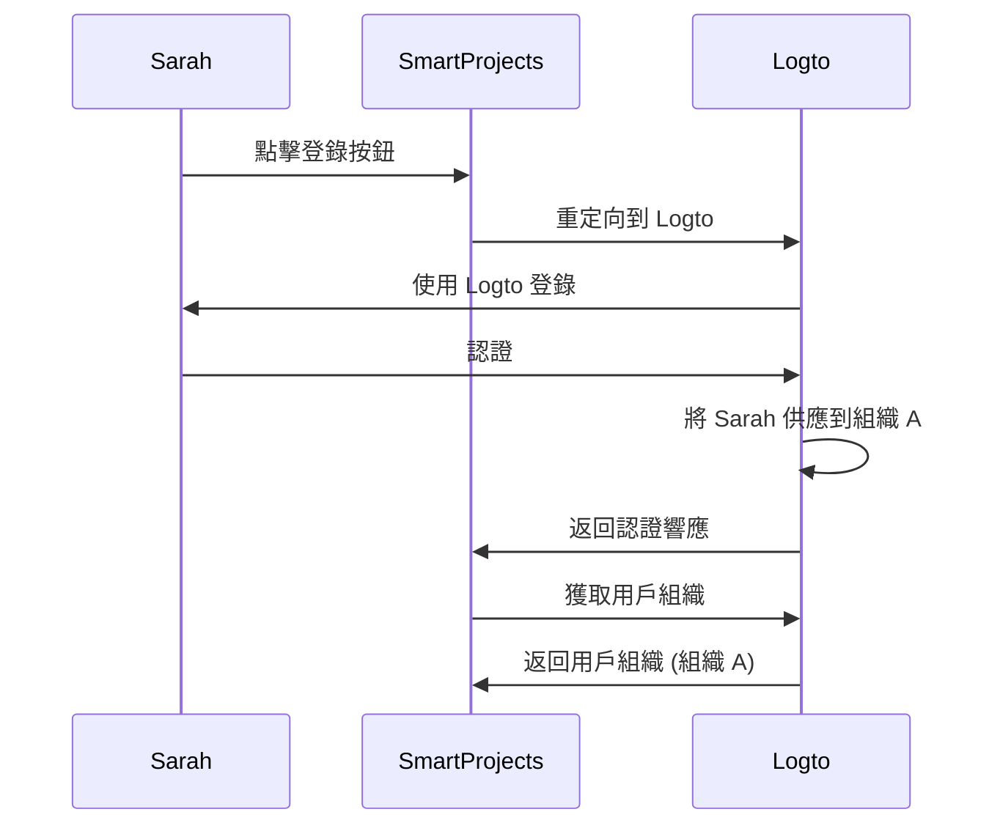
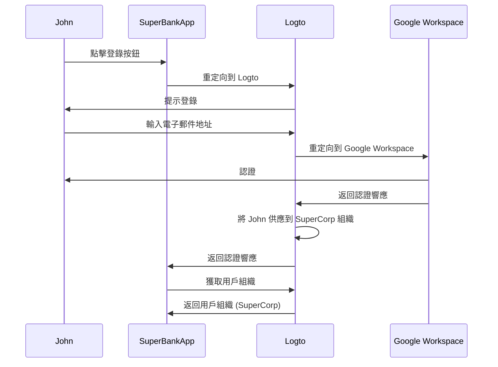

## 什麼是即時供應？

即時 (JIT) 供應是一種在 <Ref slug="iam" /> 中使用的過程，當用戶首次嘗試登錄時，根據用戶的身份和系統的配置動態地供應用戶帳戶。

## 即時供應的使用案例有哪些？

這些情況在構建涉及多租戶架構、企業 SSO (Enterprise SSO) 或需要團隊入職功能的 B2B 應用時很常見。以下是一些你或你的客戶可能遇到的示例場景。

### 員工入職

想像一下，你的一個客戶 *SuperFantasy* 正在經歷頻繁的招聘或快速增長，可以使用 JIT 供應快速為新員工設置用戶帳戶。*SuperFantasy* 使用 Logto 進行身份和存取管理，並使用 SmartProjects 進行項目管理。當新員工 Sarah 第一次登錄 SmartProjects 時，她的帳戶會根據她的 Logto 憑據自動創建和配置。

根據上圖，當 Sarah 第一次登錄 SmartProjects 時，她的帳戶會自動供應到 Logto 的組織 A。此過程確保 Sarah 擁有訪問 SmartProjects 的必要權限，而不需要 IT 團隊的手動干預。

### 企業客戶入職

想像另一個客戶 *SuperBank* 是一家為其客戶提供在線銀行服務的金融機構。*SuperBank* 使用 Logto 進行身份和存取管理，並使用 SuperBankApp 進行在線銀行。*SuperBank* 最近與新企業客戶 *SuperCorp* 簽訂了合同，為其員工提供在線銀行服務。

*SuperCorp* 使用 Google Workspace 作為其員工帳戶。SuperBankApp 需要確保當 *SuperCorp* 的員工首次登錄時，他們的帳戶會自動添加到 Logto 的 *SuperCorp* 組織中。

在上圖中，當 John 第一次登錄 SuperBankApp 時，他的帳戶會根據他的 Google Workspace 身份自動供應到 Logto 的 SuperCorp 組織中。

## 它是否特定於 SAML 和企業 SSO？

即時 (JIT) 供應通常與 SAML 認證中的 <Ref slug="enterprise-sso" /> 相關聯，但它並不僅限於 <Ref slug="saml" />。JIT 供應也可以與其他認證協議一起使用，如 <Ref slug="oauth-2.0" /> 和 <Ref slug="openid-connect" />，並且不一定需要 <Ref slug="enterprise-sso" /> 設置。

例如，當你的 <Ref slug="identity-provider" /> 支持此功能時，可以使用基於電子郵件的 JIT 供應。在這種情況下，用戶的電子郵件地址是供應所需的唯一屬性，無論認證協議或 SSO 配置如何。

## 它適用於應用的新用戶還是現有用戶？

即時 (JIT) 供應通常指首次嘗試訪問應用。然而，不同的產品對此功能的理解不同。有些僅將 JIT 供應用於身份和帳戶創建，而其他則包括即時帳戶更新，如重新供應和屬性同步。

例如，SAML JIT 供應允許在供應過程中授予和撤銷組成員資格。它還可以更新已供應的用戶，以保持其屬性與 <Ref slug="service-provider" /> 存儲中的屬性與 <Ref slug="identity-provider" /> 用戶存儲屬性同步。

如果你確實想考慮後續現有用戶登錄的情況，請確保你有一個健全的供應系統以及你的 JIT 系統。例如：

- **衝突解決**：如果在 JIT 過程中 IdP 提供的信息與現有帳戶不同，你的系統應該有處理衝突的策略。這可能需要詳細控制你的組織政策和 IdP 配置。
- **審計跟踪**：維護通過 JIT 過程創建的新帳戶和更新現有帳戶的日誌對於安全和合規性非常重要。
- **性能**：雖然 JIT 供應發生得很快，但要考慮對登錄時間的潛在影響，特別是對於現有用戶，如果你在每次登錄時更新他們的信息。
- **數據一致性**：確保你的 JIT 供應過程保持數據一致性，特別是在更新現有用戶帳戶時。

## JIT 和跨域身份管理系統 (SCIM) 有什麼區別？

SCIM 是一種開放標準協議，旨在簡化和自動化跨不同系統和域的用戶身份管理。它通常用於目錄同步場景。

JIT 和 SCIM 的主要區別在於，JIT 通常指首次嘗試訪問應用（或新用戶入職），它是一個描述動態供應用戶帳戶過程的廣義術語；而 SCIM 是一種特定的協議，用於跨系統管理用戶生命周期，它不限於首次登錄。

此外，JIT 缺乏跨系統的標準化實施，而 SCIM 是一種標準化協議，定義在 [RFC 7644](https://datatracker.ietf.org/doc/html/rfc7644) 中，用於身份管理。

一些大型組織使用 SCIM 進行帳戶供應，將其與自己的系統集成。這可能非常複雜，並且因情況而異。對於大多數使用案例，JIT 供應是一種更簡單和直接的方法。

<Resources urls={['https://blog.logto.io/jit-provisioning', 'https://datatracker.ietf.org/doc/html/rfc7644']} />