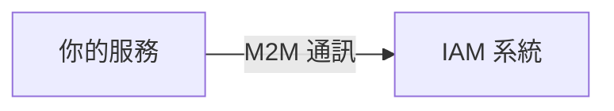
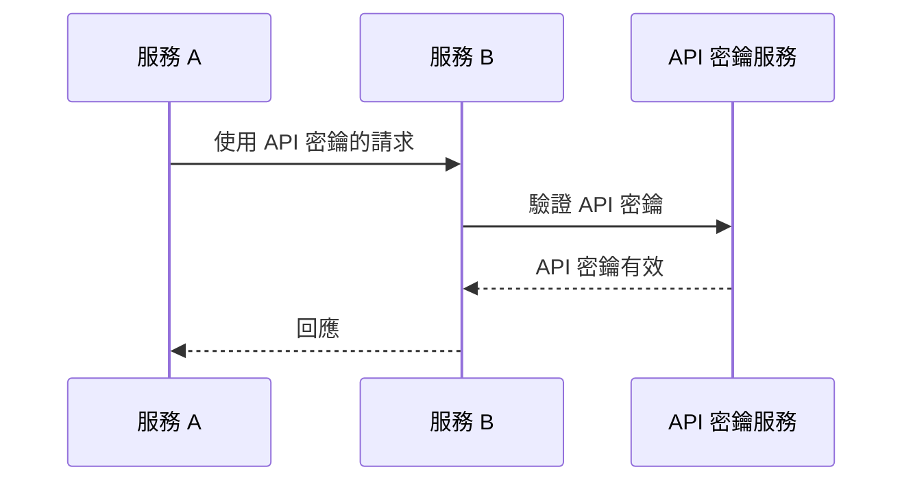
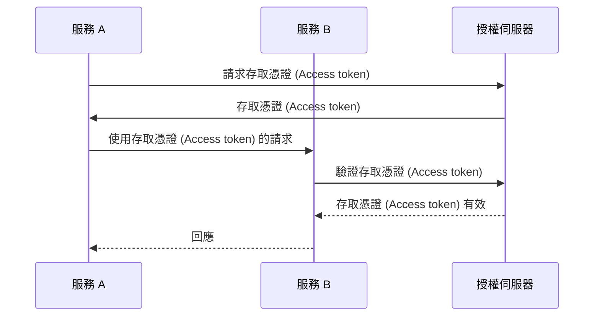
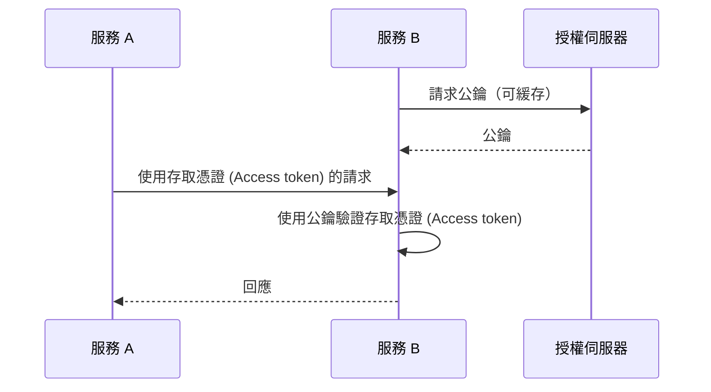

## 什麼是機器對機器 (Machine-to-machine) 通訊？

機器對機器 (M2M) 通訊是指設備之間不需人為介入的自動資料交換。在認證 (Authentication) 和授權的情境中，M2M 通訊通常涉及需要訪問資源的客戶端應用程式，其中客戶端應用程式是機器（服務）或代表使用者行動的機器。

## 為什麼我們需要處理機器對機器 (Machine-to-machine) 通訊？

如果你只有一個沒有任何依賴的服務，它很可能不需要與其他服務通訊。當你的系統擴展，或你想要與身份和存取管理系統整合時，你需要處理機器對機器 (M2M) 通訊。

然而，它看起來仍然很簡單——你需要做的只是識別服務並對其進行認證。但是實際上，你需要解決幾個挑戰：

### 1. 認證 (Authentication)

你如何認證 (Authenticate) 服務？你不能使用用戶名和密碼，因為沒有使用者輸入它們。你需要使用不同的機制，例如 API 密鑰 (API keys)、客戶證書或 OAuth 客戶端憑證 (client credentials)。

### 2. 授權

一旦你認證 (Authenticate) 了服務，如何確定該服務可以做什麼？你需要為該服務定義權限和角色，類似於你如何為使用者定義它們。你最不想要的就是在代碼中硬編碼權限。

### 3. 安全

你如何確保服務之間的通訊是安全的？憑據是否會定期更新？你如何監控和審核通訊？

### 4. 可擴展性

隨著服務數量的增長，你如何管理每個服務的認證 (Authentication) 和授權？

## 機器對機器 (Machine-to-machine) 通訊的常見方法

有鑑於這些挑戰，行業中有幾種常見的方法：

### 1. API 密鑰 (API keys)

<Ref slug="api-key">API 密鑰 (API keys)</Ref> 是一種認證 (Authenticate) 服務的簡單方法。每個服務可以有一個或多個 API 密鑰，用於認證 (Authentication)（有時也用於授權）。你可能會看到一些服務要求你在請求標頭中提供 API 密鑰，例如 `X-API-Key: your-api-key`。

下面是一個關於 API 密鑰如何運作的非規範示例：

優勢：

- 實施和使用簡單。
- 使用安全的隨機生成和足夠長，API 密鑰是難以猜測的。
- 驗證是動態的，這意味著你可以隨時撤銷 API 密鑰。

劣勢：

- 需要網路通信來驗證 API 密鑰。
- 它不是自包含的，這意味著需要服務來檢視。
- 其他服務擁有與擁有 API 密鑰的服務相同的訪問權限（這可以通過使用 API 閘道部分緩解）。
- 很難管理跨服務的大量 API 密鑰。

### 2. OAuth 客戶端憑證 (Client Credentials)

OAuth（或 OIDC，因為 OpenID Connect 基於 OAuth 2.0）<Ref slug="client-credentials-flow" /> 是一種更先進的用於認證 (Authenticate) 服務的方法。它基於 OAuth 2.0 框架，廣泛用於使用者認證 (Authentication) 和授權。通過 OAuth 客戶端憑證，服務可以通過向授權伺服器提出其客戶端 ID 和客戶端密鑰來獲取存取憑證 (access token)。

下面是一個關於 OAuth 客戶端憑證如何運作的非規範示例：

通常，存取憑證 (Access token) 是 JSON Web Token (JWT)，其中包含關於服務及其權限的信息。然後其他服務可以在不與授權伺服器通信的情況下驗證存取憑證 (Access token)（只要它擁有驗證 JWT 簽署的公鑰）。工作流程變為：

有關 JSON Web Token 的更多信息，請參見 <Ref slug="jwt" />。

優點（使用 JWT）：

- 自包含的，這意味著其他服務可以立即知道必要的信息，如權限，無需額外的網路通信。
- 存取憑證 (Access token) 可以是短期的，減少濫用風險。
- 其他服務不需要知道客戶端密鑰，只需要公共鑰匙來驗證 JWT 簽名即可。
- 存取憑證 (Access token) 可以用來審核服務的操作（例如，哪個服務訪問了哪個資源）。
- 較容易管理大量服務，因為它設置了服務和權限之間的明確界限。

劣勢：

- 比 API 密鑰更複雜的實現和使用。
- 如果其他服務僅執行離線驗證，它可能不知道存取憑證 (Access token) 是否被撤銷。

### 3. Mutial TLS

Mutual TLS (mTLS) 是一種使用客戶證書來認證 (Authenticate) 服務的方法。使用 mTLS，每個服務都持有帶有私鑰的客戶證書，其他服務使用公鑰來驗證該證書。然而，mTLS 專注於 TLS 層，這意味著它通常不適合用於應用程式層的認證 (Authentication) 和授權。

對於更高級的用例，mTLS 可以與證書綁定的存取憑證 (certificate-bound access tokens) 結合使用，以進一步保護通信。參見 [RFC 8705: OAuth 2.0 互通 TLS 客戶端認證 (Mutual-TLS Client Authentication) 和證書綁定的存取憑證 (Certificate-Bound Access Tokens)](https://datatracker.ietf.org/doc/html/rfc8705) 以獲取更多信息。

優勢：

- 強身份認證，因為它基於公鑰加密。
- 通信是加密和默認安全的。
- 客戶證書可以用來識別服務，類似於 JWT 的運作方式。

劣勢：

- 比 API 密鑰和 OAuth 客戶憑證更複雜的實現與管理。
- 客戶證書需要定期更新。
- 需要更多技術知識來正確管理客戶證書。
- 其他服務可能不支持 mTLS，這意味著你需要有一個備用機制。

<SeeAlso slugs={["api-key", "client-credentials-flow", "jwt"]} />