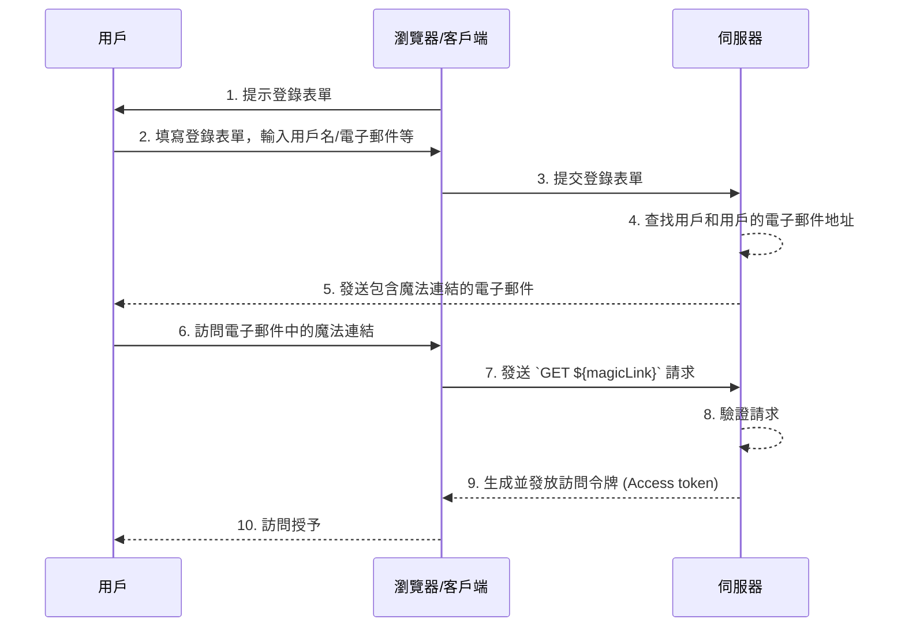

## 什麼是魔法連結 (Magic link)？

魔法連結 (Magic link) 是在認證 (Authentication) 過程中發送給用戶的一次性使用連結。

通過訪問此連結，用戶完成授權流程 (Authorization flow) 以訪問所需的資源，並獲得適當的資源訪問權限。之後，魔法連結 (Magic link) 便會失效。

## 魔法連結 (Magic link) 和一次性密碼 (OTP) 有什麼區別？

假設用戶使用電子郵件接收魔法連結 (Magic link) 或 <Ref slug='otp' />。

在許多情況下，用戶使用電子郵件接收一次性密碼 (OTP) 以驗證登錄或作為 <Ref slug='mfa' /> 的附加驗證因素。使用電子郵件魔法連結 (Magic link) 和電子郵件一次性密碼 (OTP) 有什麼區別？

使用一次性密碼 (OTP) 時，用戶需要檢查他們的電子郵件，記住一次性密碼 (OTP)，然後在登錄/驗證過程中輸入它。這需要用戶在不同的應用程序或頁面之間反覆手動切換。

使用電子郵件魔法連結 (Magic link)，用戶只需在他們的電子郵件應用程序中打開包含魔法連結 (Magic link) 的電子郵件並點擊連結。這提供了一個更簡單的用戶體驗。

此外，使用魔法連結 (Magic link) 可以在連結中包含超過一次性令牌的資訊，例如與登錄相關的會話資訊。這可以提高安全性和用戶體驗。

## 魔法連結 (Magic link) 如何運作？

在此序列圖中，我們展示了用戶如何使用魔法連結 (Magic link) 登錄並獲得適當資源的訪問權限。

在此序列圖中，我們假設魔法連結 (Magic link) 是通過電子郵件發送的。然而，還有其他可能的發送魔法連結 (Magic link) 的方法，例如通過短信發送到手機。這些替代方法不會在此處涵蓋，因為流程幾乎相同。

1. **提示登錄表單**  
   瀏覽器/客戶端通過提示用戶登錄表單來啟動認證 (Authentication) 過程。
2. **用戶填寫登錄表單**  
   用戶在登錄表單中輸入其標識符，例如用戶名、電子郵件地址或電話號碼。  
   提供的信息需要足以幫助系統識別唯一用戶。例如，在大多數系統中，用於登錄的用戶名是唯一的。在這樣的系統中，用戶只需提供其用戶名即可幫助系統唯一識別他們想要登錄的帳戶。
3. **提交登錄表單**  
   瀏覽器/客戶端將表單提交給伺服器，包含步驟 2 中描述的用戶信息。
4. **查找用戶和電子郵件**  
   伺服器通過在數據庫中定位唯一用戶並檢索用戶的相關電子郵件地址來處理請求。
5. **發送包含魔法連結的電子郵件**  
   伺服器向用戶的電子郵件地址發送一封電子郵件。此電子郵件包含用於認證 (Authentication) 的魔法連結。
6. **用戶訪問魔法連結**  
   用戶收到電子郵件並點擊其中提供的魔法連結。
7. **使用魔法連結發送 GET 請求**  
   瀏覽器/客戶端使用魔法連結 URL 向伺服器發送 `GET` 請求。
8. **驗證請求**  
   伺服器驗證請求以確保魔法連結有效、未使用且未過期。
9. **生成並發放訪問令牌 (Access token)**  
   一旦請求被驗證，伺服器生成訪問令牌 (Access token) 並將其發放給瀏覽器/客戶端。
10. **授予訪問權限**  
    瀏覽器/客戶端接收訪問令牌 (Access token) 並允許用戶訪問請求的資源。

## 魔法連結 (Magic link) 的好處是什麼？

魔法連結 (Magic link) 通過採用基於令牌的交互模型來增強認證系統的安全架構。每個連結都是唯一加密的，通常包含過期時間戳。由於其短暫的性質，即使魔法連結 (Magic link) 被攔截或洩露，其短暫的有效期也限制了惡意利用的機會。

此外，由於使用魔法連結 (Magic link) 需要用戶控制的接收方法，例如受信任的電子郵件地址或電話號碼，它提供了一種超越用戶名和密碼的附加驗證方法，提供額外的帳戶安全性。而且，由於魔法連結 (Magic link) 消除了輸入憑據的需要，用戶的帳戶安全性得到了更好的保護，過程也更加方便。