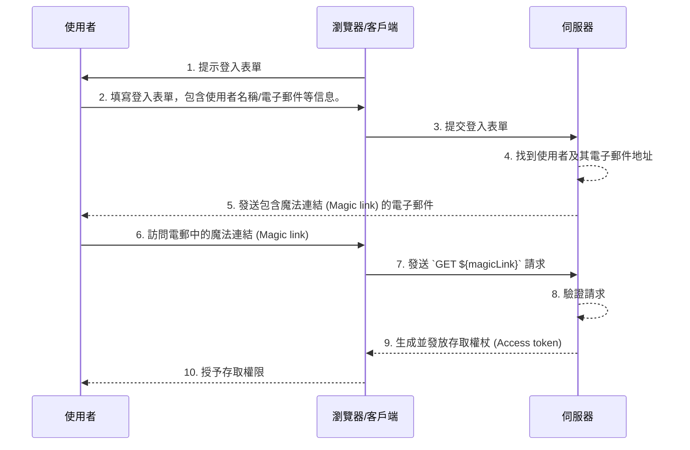

## 什麼是魔法連結 (Magic links)？

魔法連結 (Magic link) 是在认证 (Authentication) 過程中發送給使用者的一次性使用連結。

通過訪問該連結，使用者完成訪問所需資源的授权 (Authorization) 流程，並獲得對應資源的存取權限。隨後，魔法連結 (Magic link) 變得無效。

## 魔法連結 (Magic link) 與一次性密碼 (OTP) 有何不同？

假設使用者使用電子郵件來接收魔法連結 (Magic link) 或一次性密碼 (OTP)。

在許多情況下，使用者使用電子郵件接收一次性密碼 (OTP) 以驗證登入或作為 MFA 的額外驗證因素。使用電子郵件魔法連結 (Magic link) 和電子郵件一次性密碼 (OTP) 有何不同？

使用一次性密碼 (OTP)，使用者需要檢查其電子郵件，記住一次性密碼 (OTP)，然後在登入/驗證過程中輸入該密碼。這需要使用者在不同的應用程式或頁面間反覆切換。

使用電子郵件魔法連結 (Magic link)，使用者只需要在其電子郵件應用程式中打開包含魔法連結 (Magic link) 的電子郵件，然後點擊該連結。這提供了一個更簡化的使用者體驗。

此外，使用魔法連結 (Magic link) 可以在連結中包含超過一次性令牌的信息，例如與登入相關的會話信息。這可以提高安全性和使用者體驗。

## 魔法連結 (Magic link) 如何運作？

在這個序列圖中，我們展示了使用者如何通過魔法連結 (Magic link) 登入並獲得對對應資源的存取權限。

在這個序列圖中，我們假設魔法連結 (Magic link) 是通過電子郵件發送的。然而，還有其他可能的方法來傳送魔法連結 (Magic link)，比如通過簡訊發送到手機。這些替代方法不會在這裡討論，因為流程幾乎相同。

1. **提示登入表單**
瀏覽器/客戶端通過提示使用者登入表單來發起认证 (Authentication) 過程。
2. **使用者填寫登入表單**
使用者在登入表單中輸入其識別情報，如使用者名稱、電子郵件地址或電話號碼。
提供的信息需要足以幫助系統識別唯一的使用者。例如，在大多數系統中，用於登入的使用者名稱是唯一的。在此類系統中，使用者只需要提供其使用者名稱以幫助系統唯一識別其希望登入的帳戶。
3. **提交登入表單**
瀏覽器/客戶端將表單提交給伺服器，其中包含第 2 步描述的使用者信息。
4. **尋找使用者和電子郵件**
伺服器處理請求，通過在數據庫中找到唯一使用者並檢索使用者關聯的電子郵件地址。
5. **發送包含魔法連結 (Magic link) 的電子郵件**
伺服器將帶有用于认证 (Authentication) 的魔法連結 (Magic link) 的電子郵件發送到使用者的電子郵件地址。
6. **使用者訪問魔法連結 (Magic link)**
使用者收到電子郵件並點擊其中提供的魔法連結 (Magic link)。
7. **發送包含魔法連結 (Magic link) 的 GET 請求**
瀏覽器/客戶端使用魔法連結 (Magic link) 的 URL 向伺服器發送 `GET` 請求。
8. **驗證請求**
伺服器驗證該請求以確保魔法連結 (Magic link) 是有效、未被使用和未過期。
9. **生成並發放存取權杖 (Access token)**
一旦請求被驗證，伺服器生成存取權杖 (Access token) 並發放到瀏覽器/客戶端。
10. **授予存取權限**
瀏覽器/客戶端接收到存取權杖 (Access token)，允許使用者訪問請求的資源。

## 魔法連結 (Magic links) 的好處是什麼？

魔法連結 (Magic link) 通過採用基於令牌的互動模型提升了认证 (Authentication) 系統的安全架構。每個連結都是唯一加密的，並且通常包含過期時間戳。由於其短暫的性質，即使魔法連結 (Magic link) 被截獲或洩漏，其短效性限制了惡意利用的機會。

此外，因為使用魔法連結 (Magic link) 需要用戶控制的接收方法，例如受信任的電子郵件地址或電話號碼，它提供了一種超越使用者名稱和密碼的額外驗證方法，提供了額外的帳戶安全性。並且，由於魔法連結 (Magic link) 消除了輸入憑據的需求，使用者的帳戶安全性得到了更好的保護，流程也更加方便。