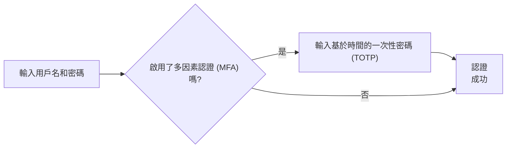
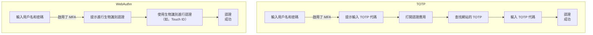

## 什麼是多因素認證 (MFA)？

多因素認證 (MFA) 增強了安全性，要求用戶提供多種形式的身份識別來驗證其身份。它為 <Ref slug="authentication" /> 過程增加了一層額外的安全性，使攻擊者更難獲得未經授權的訪問。

以下是 MFA 的一個例子：

### "因素"的定義

在上述例子中，有兩個因素：

1. 用戶名和密碼
2. 來自移動應用的 <Ref slug="totp" />

每個因素代表可以用來驗證用戶身份的不同類別的憑證（證明你是你所說的那個人）。在實踐中，因素可以分為三大類：

|            | 意義              | 驗證因素                                                                          |
| ---------- | ------------------ | ------------------------------------------------------------------------------------- |
| 知識       | 你知道的東西   | 密碼、電子郵件驗證碼、備份碼                                        |
| 持有       | 你擁有的東西   | SMS 驗證碼、認證應用 OTP、硬體 OTP（安全密鑰）、智能卡 |
| 生物屬性 | 你是什麼的東西 | 生物識別，如指紋、面部 ID                                                 |

一個常見的 MFA 設置涉及結合來自不同類別的兩個因素，如密碼（知識）和來自認證應用的 <Ref slug="totp" />（持有）。

### 為什麼 MFA 很重要？

> 並不存在完美的安全性，只有不同程度的不安全性。—Salman Rushdie

MFA 的重要性可以從數字中看出：MFA在整體上將被入侵的風險降低了 99.22%，在憑證洩露的情況下降低了 98.56%[^1]。借助 MFA，可以更自信地進行更重要的操作，例如訪問敏感數據和進行金融交易。這是一種比單純的密碼或單一因素認證提供更高安全性的簡單而有效的方法。

## 現代應用中的 MFA

顧名思義，MFA 可以涉及超過兩個因素。隨著因素數量的增加，安全等級和認證過程的複雜性也隨之增加，這可能會降低用戶友好性。雖然 <Ref slug="totp" /> 是近年來的熱門選擇，但像 <Ref slug="passkey" /> 這樣的新技術正在出現，以提供更安全和用戶友好的 MFA 體驗。

例如，現代應用可以使用 <Ref slug="webauthn" /> API 通過通行秘鑰實現 MFA，這些是抗釣魚的憑證，由公鍵加密技術保護。蘋果等公司已將通行秘鑰與生物識別認證（Touch ID、Face ID）集成，從而在 MFA 過程中本地增加了生物屬性因素，提高了安全性和用戶便利性。

讓我們進行一個快速比較以便更好地理解。假設我們有一個用戶，他擁有：

1. 一個安裝在手機上的認證應用，用於生成 TOTP 代碼。
2. 一個與設備的生物識別認證集成的通行秘鑰。

當他們在筆記本電腦上進行啟用了 MFA 的網站登錄時，兩個過程會如下所示：

顯然，WebAuthn 過程步驟更少，對用戶來說耗時更短。更重要的是，蘋果等公司支持跨裝置同步通行秘鑰（如 iPhone、iPad、Mac），使 MFA 過程更流暢，同時保持高安全性。

## 安全性考量

在實施 MFA 時，需要考慮以下安全性因素：

- 使用不同類別因素的組合，以確保更高的安全級別。例如，將密碼（知識）與 TOTP 代碼（持有）結合。
- 由於 SMS 易受 SIM 卡交換攻擊的影響，避免使用 SMS 作為 MFA 因素。
- 恢復選項不應繞過 MFA。比如，如果用戶丟失了認證應用，他們應被要求使用備份碼或其他 MFA 因素來恢復訪問。
- 在連續失敗的 MFA 嘗試之間實施冷卻期，以防止暴力破解攻擊。

[^1]: [多因素認證在阻止網絡攻擊方面有多有效？](https://query.prod.cms.rt.microsoft.com/cms/api/am/binary/RW166lD)

<SeeAlso slugs={["totp", "webauthn", "passkey"]} />

<Resources
  urls={[
    "https://blog.logto.io/elaborate-mfa",
    "https://blog.logto.io/web-authn-and-passkey-101",
    "https://blog.logto.io/webauthn-base-knowledge",
  ]}
/>
