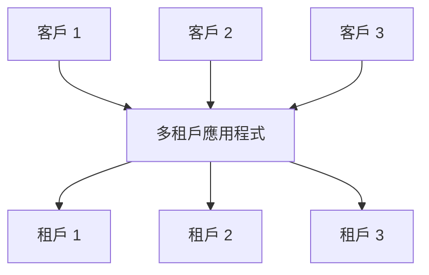
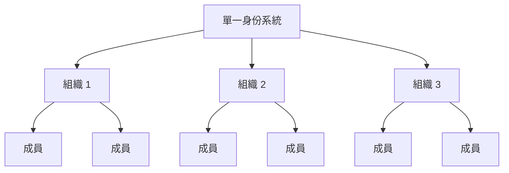

## 什麼是多租戶 (Multi-tenancy)？

軟體多租戶 (Multi-tenancy) 是一種軟體，其中單一軟體實例在伺服器上運行，並為多個租戶提供服務。以這種方式設計的系統是「共享的」（而不是「專用的」或「隔離的」）。

租戶是共享對軟體實例的特定權限訪問的一組用戶。

例如，CRM（客戶關係管理）系統通常使用多租戶架構為所有客戶提供相同的服務。

多租戶 (Multi-tenancy) 的一個關鍵原則是「共享」。這並不意味著解決方案的每個部分都是共享的；這意味著至少有一些組件在多個租戶之間重用。理解這個更廣泛的概念可以幫助你更好地滿足客戶的需求。

## 多租戶 (Multi-tenant) 產品的使用案例是什麼？

多租戶 (Multi-tenant) 應用程式通常用於軟體即服務 (SaaS) 產品，如生產力工具、協作軟體等。在這種設置中，每個「租戶」通常代表一個商業客戶，擁有多個用戶（通常是員工）。在不同的產品中，根據上下文，它可能被稱為租戶、工作空間或項目。單個企業也可能擁有多個租戶來代表不同的部門或組織。

在更複雜的情況下，如超越 SaaS 的 B2B 應用程式，多租戶 (Multi-tenant) 應用程式提供了一個共享平台，供各種團隊、商業客戶和合作夥伴公司訪問你的服務。

## 為什麼應該在 SaaS 產品中採用多租戶 (Multi-tenancy)

### 使用多租戶 (Multi-tenancy) 進行擴展

對於企業業務來說，多租戶 (Multi-tenancy) 是有效滿足其可用性、資源管理、成本管理和數據安全需求的關鍵。在技術層面，採用多租戶 (Multi-tenant) 方法可以簡化你的開發流程，減少技術挑戰，並促進無縫擴展。

### 創造統一的體驗

當檢視 SaaS 產品的根源時，它類似於一棟擁有多個公寓的建築。所有租戶共享水、電、煤氣等公共設施，但他們仍然可以獨立管理自己的空間和資源。這種方法簡化了物業管理。

### 通過租戶隔離確保安全

在多租戶 (Multi-tenancy) 架構中，引入「租戶」這個術語來創建邊界，將不同租戶的資源和數據在共享實例中分隔並保護。這確保了每個租戶的數據和操作保持獨立和安全，即使他們使用相同的底層資源。

## 如何在多租戶 (Multi-tenancy) 架構中實現租戶隔離？

在討論多租戶 (Multi-tenant) 應用程式時，始終需要實現**租戶隔離**。這意味著在共享系統（例如雲基礎設施或多租戶應用程式）中保持不同租戶的數據和資源分開和安全。這可以防止任何未經授權的嘗試訪問其他租戶的資源。

### 租戶隔離與多租戶 (Multi-tenancy) 的「共享」概念一致

這是因為租戶隔離不一定是一個基礎設施資源級別的構造。在多租戶 (Multi-tenancy) 和隔離的領域中，有些人將隔離視為實際基礎設施資源之間的嚴格劃分。這通常導致一種模型，其中每個租戶擁有單獨的數據庫、計算實例、帳戶或私有雲。在共享資源場景中，如多租戶 (Multi-tenant) 應用程式，實現隔離的方法可以是一種邏輯構造。

### 認證 (Authentication) 和授權 (Authorization) 不等於「隔離」

使用認證 (Authentication) 和授權 (Authorization) 來控制對你的 SaaS 環境的訪問很重要，但這並不能保證「隔離」。隔離意味著保持不同用戶或數據集分開，以便一個用戶的數據或操作不會干擾或被另一個用戶訪問。

例如，即使你已經設置了認證 (Authentication) 和授權 (Authorization)，用戶登錄並獲得定義其權限的令牌，這提高了安全性，但並不能確保用戶彼此完全隔離。應引入另一個上下文來實現「隔離」。

### 使用「組織」作為上下文來表示 SaaS 產品租戶，以實現租戶隔離

僅靠認證 (Authentication) 和授權 (Authorization) 無法防止具有正確角色的用戶訪問其他租戶的資源。為了限制訪問，我們需要添加一個「租戶」上下文，如租戶 ID、組織 ID 或工作空間 ID。這些標識符就像牆壁、門和鎖，將租戶分開。

「組織」這個術語通常用於租戶隔離。許多 <Ref slug="identity-provider" /> 包含「組織」功能，以幫助隔離租戶，同時保持統一的身份系統。組織內的用戶稱為「成員」。

## 如何在多租戶 (Multi-tenant) 應用程式中管理身份？

第一個關鍵問題是考慮你的業務或產品的哪些部分需要單獨的身份系統。這將指導你的系統設計。以下是兩個例子：

1. 單一身份系統：同一身份系統內的單個人可以有兩個身份。例如，Sarah 可能註冊了一個個人電子郵件，並且還使用通過 <Ref slug="enterprise-sso" /> 連接的公司電子郵件。
2. 多個身份系統：用戶也可以在完全不相關的產品中擁有兩個不同的身份系統中的身份。

在大多數多租戶 (Multi-tenant) 應用程式中，身份通常在單一池中管理，而每個租戶的資源保持分開。

## 規劃和構建多租戶 (Multi-tenant) 應用程式的考量

1. 專注於你的模型：B2B 或 B2C。
2. 誰將處理身份管理任務：開發人員、你的客戶的管理員，還是最終客戶？
3. 對於 B2B，你的客戶是否需要管理其組織的身份？
4. 確定哪些權限 (<Ref slug="scope" />) 和 <Ref slug="role" /> 需要為組織定義，哪些不需要。
5. 你的客戶是否需要 <Ref slug="enterprise-sso" />？
6. 考慮添加協作功能，如邀請。

<Resources
  urls={[
    "https://blog.logto.io/implement-multi-tenancy",
    "https://blog.logto.io/multi-tenant-ultimate-guide",
    "https://blog.logto.io/case-study-multi-tenancy",
    "https://blog.logto.io/multi-tenancy-explained",
    "https://blog.logto.io/are-multi-tenant-apps-equal-saas",
    "https://blog.logto.io/tenancy-models",
    "https://blog.logto.io/do-you-need-multiple-tenants-identity-model",
  ]}
/>