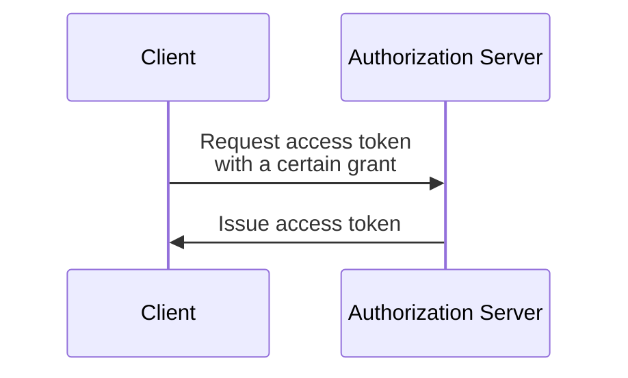

## 什麼是 OAuth 2.0 授權 (Grant)？

OAuth 2.0 授權 (Grant) 是一個授權過程，允許 <Ref slug="client" /> 向 <Ref slug="authorization-server" /> 請求 <Ref slug="access-token" />。你可能還會聽到其他與這個概念相關的術語，所以在深入之前讓我們先澄清它們：

- **OAuth 2.0 授權 (Grant)**：也被稱為 "OAuth 2.0 grant type"、"OAuth 2.0 flow" 或 "OAuth 2.0 authorization grant"。在大多數情況下，這些術語指的是相同的概念。
- <Ref slug="authorization-server" />：向客戶端發佈存取權杖的伺服器。在 OpenID Connect (OIDC) 中，授權伺服器與 <Ref slug="openid-connect" headingId="openid-provider-op" /> 相同。
- <Ref slug="authorization-request" />：客戶端向授權伺服器發出的請求，以獲取存取權杖。在 OpenID Connect (OIDC) 中，也被稱為 <Ref slug="authentication-request" />。

為了清晰起見，我們將在本文中一致地使用上面列出的術語。

OAuth 2.0 授權 (Grant) 的高層次過程相當簡單：

在客戶端獲取存取權杖後，它可以使用該權杖代表用戶或自身訪問受保護的資源（例如，API）。

注意，根據具體的授權 (Grant)，客戶端和授權伺服器可能會交換額外的信息，並在過程中涉及更多步驟。例如，<Ref slug="authorization-code-flow">授權碼授權 (Grant)</Ref> 涉及用戶身份驗證和授權、代碼生成及權杖交換。

## 不同的 OAuth 2.0 授權 (Grant)

基本的 OAuth 2.0 規範定義了四種客戶端可用來獲取存取權杖的授權 (Grant)：

1. <Ref slug="authorization-code-flow">授權碼授權 (Grant)</Ref>：對大多數應用來說最安全和推薦的授權 (Grant)。在 <Ref slug="oauth-2.1" /> 中，對所有客戶端強制使用 <Ref slug="pkce" />。
2. <Ref slug="implicit-flow">隱式授權 (Grant)</Ref>：一種簡化的授權 (Grant)，由於安全問題在 OAuth 2.1 中被棄用。
3. [資源擁有者密碼憑證 (ROPC) 授權 (Grant)](https://datatracker.ietf.org/doc/html/rfc6749#section-4.3)：一種用戶憑證直接交換存取權杖的授權 (Grant)。由於安全風險，不建議大多數應用使用。
4. <Ref slug="client-credentials-flow">客戶端憑證授權 (Grant)</Ref>：<Ref slug="client" headingId="confidential-clients" /> 用來在無用戶參與下獲得存取權杖的授權 (Grant)。

隨著行業的發展，隱式和 ROPC 授權 (Grant) [正被棄用](https://blog.logto.io/oauth-2-1)，以支持更安全和標準化的流程。對於新的應用，選擇是明確的：

- 對於用戶身份驗證和授權，使用帶有 PKCE 的授權碼授權 (Grant)。
- 對於 <Ref slug="machine-to-machine" /> 通信，使用客戶端憑證授權 (Grant)。

### 其他 OAuth 2.0 授權 (Grant)

除了四種基本的授權 (Grant)，還有其他擴展定義了特定用例的新授權 (Grant)。例如：

- <Ref slug="device-flow">設備授權 (Grant)</Ref> 是為輸入能力有限的設備設計的授權 (Grant)，如智慧電視和物聯網設備。
- <Ref slug="hybrid-flow">混合流程 (flow)</Ref> 是一種將授權碼授權 (Grant) 與隱式授權 (Grant) 結合的 OpenID Connect 授權 (Grant)。

## OpenID Connect (OIDC) 中的授權 (Grant)

在 <Ref slug="openid-connect" /> 中，授權 (Grant) 的概念被擴展至包含 <Ref slug="id-token">ID 權杖</Ref>，除了存取權杖外還代表用戶身份信息。OIDC 擴展了兩個 OAuth 2.0 授權 (Grant)（授權碼和隱式）以包含 ID 權杖，並引入了一種新授權 (Grant) 稱為 <Ref slug="hybrid-flow">混合流程 (flow)</Ref>，結合了兩者。

> 如同 OAuth 2.0，建議在 OIDC 中使用帶有 PKCE 的授權碼授權 (Grant) 進行用戶身份驗證和授權。

同時，由於 OIDC 構建在 OAuth 2.0 之上，其他授權 (Grant) 如客戶端憑證授權 (Grant) 仍然可以在相同的授權伺服器上使用，只要伺服器支持它們。

<SeeAlso slugs={["pkce", "oauth-2.1", "authorization-code-flow", "implicit-flow", "client-credentials-flow", "device-flow"]} />

<Resources
  urls={[
    "https://blog.logto.io/implicit-flow-is-dead",
    "https://datatracker.ietf.org/doc/html/rfc6749",
    "https://openid.net/specs/openid-connect-core-1_0.html"
  ]}
/>
