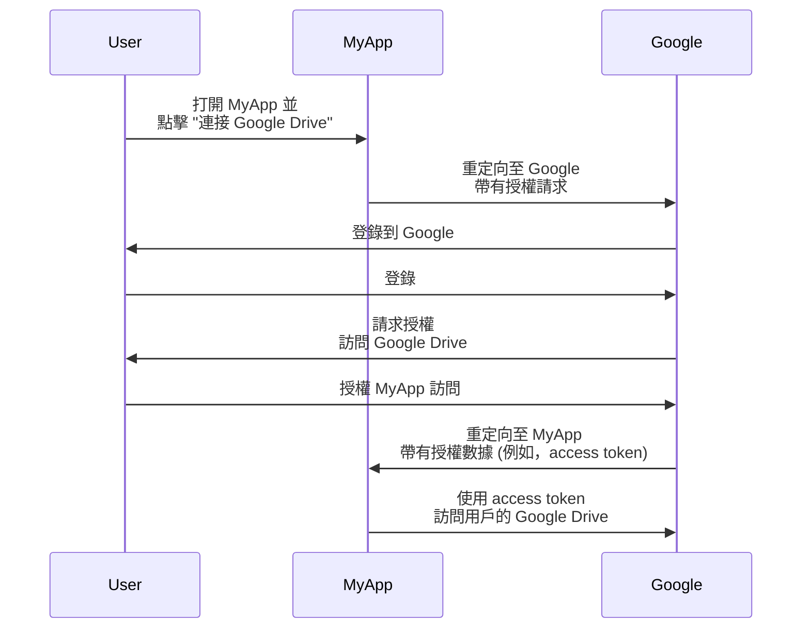
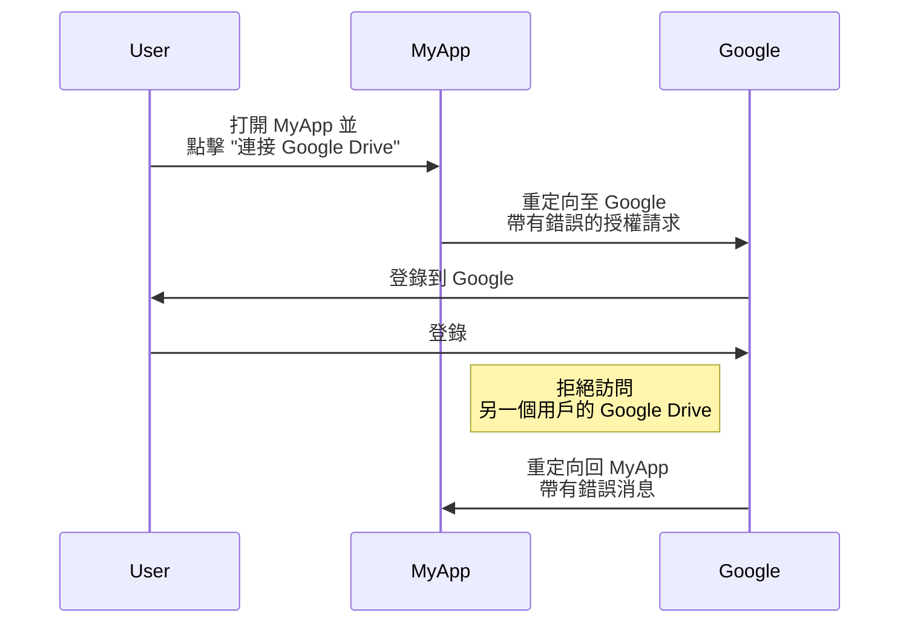
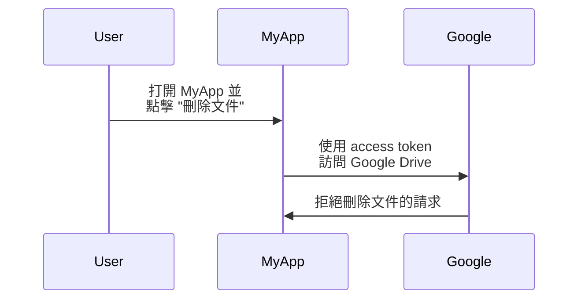

## OAuth 2.0 是什麼？

OAuth 2.0 是授權的事實標準，被廣泛應用於網路上。它允許應用程式安全地獲得在另一個應用程式上受保護資源的有限訪問，例如使用者的個人資料或數據，而不透露憑證如密碼。

讓我們看看一個真實世界的例子來更好地理解。假設你有一個網路應用程式 MyApp 想要訪問用戶的 Google Drive。MyApp 不需要要求用戶分享他們的 Google Drive 憑證，而可以使用 OAuth 2.0 代理用戶請求訪問 Google Drive。以下是一個簡化的流程：

在這個流程中，MyApp 從未見過用戶的 Google Drive 憑證。相反，它從 Google 收到了一個 <Ref slug="access-token" />，允許它代表用戶訪問 Google Drive。

### OAuth 2.0 的關鍵組件

在上述例子中，MyApp 是 <Ref slug="client" />，Google 同時是 <Ref slug="authorization-server" /> 和 <Ref slug="resource-server" />，而用戶是 <Ref slug="resource-owner" />。該流程涉及 OAuth 2.0 的所有關鍵組件：

- **Client**: 希望訪問受保護資源的應用程式。"Client" 和 "application" 經常可以互換使用。
- **Resource owner**: 擁有受保護資源的用戶。資源所有者可以授權或拒絕 client 的訪問。
- **Authorization server**: 執行授權（通常伴隨認證 (authentication)）並向 client 發佈 access token 的服務器。
- **Resource server**: 托管受保護資源的服務器。它驗證 access token 並向 client 提供受保護的資源。

## OAuth 2.0 授權類型 (grants)

<Ref slug="oauth-2.0-grant">Grant</Ref> 構成了 OAuth 2.0 的基礎，並定義了 client 如何從 authorization server 獲取 access token。基本的 OAuth 2.0 規範定義了四種授權類型：

- <Ref slug="authorization-code-flow">授權碼類型 (Authorization code grant)</Ref>
- <Ref slug="implicit-flow">隱式類型 (Implicit grant)</Ref>
- [資源所有者密碼憑證 (ROPC) 類型](https://datatracker.ietf.org/doc/html/rfc6749#section-4.3)
- <Ref slug="client-credentials-flow">client 憑證類型 (Client credentials grant)</Ref>

不深入探討每種授權類型的細節，我們可以將這些類型分為兩類：

- **授權類型**: 當 client 需要代表用戶訪問資源時使用，即需要用戶授權。
- **client 憑證類型**: 當 client 需要在自己名義下訪問資源時使用。這類型適合於 <Ref slug="machine-to-machine" /> 通訊。

### 授權類型

不論是何種授權類型，授權流程通常包括以下共同的步驟：

1. client 向 authorization server 發起 <Ref slug="authorization-request" />。
2. authorization server 認證 (Authentication) 用戶（resource owner）並請求授權訪問資源。
3. 用戶授權 client。
4. authorization server 向 client 發行 access token。
5. client 使用 access token 訪問 <Ref slug="resource-server" /> 上的受保護資源。

需要注意的是，根據不同的授權類型，具體步驟和參數可能會有所不同。例如，<Ref slug="authorization-code-flow">授權碼類型</Ref>包括更多的步驟，如代碼生成和交換。

### client 憑證類型

<Ref slug="client-credentials-flow">client 憑證類型</Ref>則簡單得多，不涉及用戶授權。以下是一個簡化流程：

1. client 向 authorization server 發送 <Ref slug="token-request" />。
2. authorization server 認證 client 並發行 access token。
3. client 使用 access token 訪問 <Ref slug="resource-server" /> 上的受保護資源。

---

欲深入討論 OAuth 2.0 授權類型，請參見 <Ref slug="oauth-2.0-grant" /> 和特定的授權類型文章。

## OAuth 2.0 的訪問控制 (Access Control)

OAuth 2.0 定義了 <Ref slug="scope" /> 參數，用來指定 client 所請求的許可權。authorization server 可以完全或部分忽略所請求的範疇並根據其自身的訪問控制策略授予訪問。

然而，OAuth 2.0 給予了 authorization server 裁量權去執行 <Ref slug="access-control" />。這意味著 authorization server 可以決定該主體（user 或 client）可以訪問哪些資源及他們可以對這些資源執行何種操作。

讓我們繼續使用 Google Drive 的例子。MyApp 可能誤以為要訪問另一個用戶的 Google Drive 並發起授權請求。在這種情況下，Google 的 authorization server 應拒絕該請求，因為該用戶沒有授權訪問另一個用戶的 Google Drive 的必要許可權。

另一種情況是 MyApp 從 Google 收到允許其讀取用戶 Google Drive 文件的 access token。然而，MyApp 嘗試刪除文件而不是讀取文件。resource server（Google）應該拒絕該請求。

這兩種情況均展示了在實施 OAuth 2.0 時所需的 <Ref slug="access-control" />。<Ref slug="authorization-server" /> 和 <Ref slug="resource-server" /> 應該共同合作來施行訪問控制策略並保護資源。

### 訪問控制模型

為了妥善地進行訪問控制，建議使用標準的訪問控制模型如 <Ref slug="rbac" /> 和 <Ref slug="abac" />。這些模型已被證明在業界中是有效的，能夠為未來的需求提供擴展性。

## OAuth 2.1

<Ref slug="oauth-2.1" /> 是對 OAuth 2.0 規範的一個擬定更新，旨在根據多年來的業界經驗改進安全性和可用性。雖然 OAuth 2.1 尚未定稿，我們仍可以了解其擬議的變更並瞭解這些變更可能如何影響現有的 OAuth 2.0 實施。OAuth 2.1 可以被視為行業廣泛採用的最佳實踐和安全建議的正式化。

## OAuth 2.0 和 OpenID Connect (OIDC)

OAuth 2.0 僅定義授權過程，並不涵蓋用戶身份認證 (authentication) 或身份。因此，引入了 <Ref slug="openid-connect" /> 作為 OAuth 2.0 之上的身份層。OIDC 擴展了 OAuth 2.0 以提供用戶身份認證和身份信息，以 <Ref slug="id-token" /> 的形式呈現。

OpenID Connect 擴展了兩種 OAuth 2.0 授權類型（授權碼類型和隱式類型），並引入了一種稱為 <Ref slug="hybrid-flow">混合流程 (hybrid flow)</Ref> 的新授權類型，結合了兩者。

也就是說，所有你的 OAuth 2.0 知識和實踐可以直接應用於 OIDC；所有 OAuth 2.0 擴展，例如 <Ref slug="pkce" /> 和 <Ref slug="resource-indicator" /> 也可以在 OIDC 中使用。

<SeeAlso slugs={["oauth-2.0-grant", "oauth-2.1", "openid-connect"]} />

<Resources
  urls={[
    "https://blog.logto.io/secure-cloud-apps-with-oauth-and-openid-connect",
    "https://blog.logto.io/oauth-2-1",
    "https://datatracker.ietf.org/doc/html/rfc6749",
    "https://datatracker.ietf.org/doc/draft-ietf-oauth-v2-1/",
  ]}
/>
