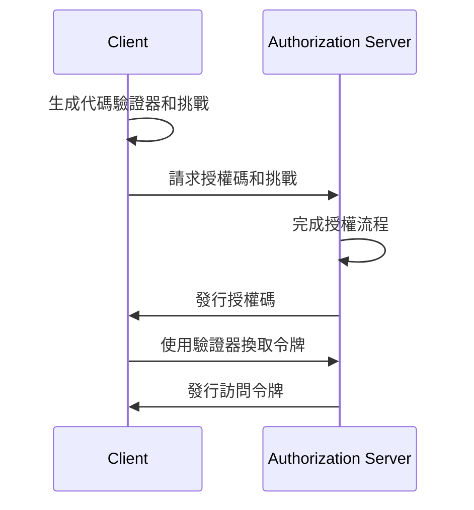

## 什麼是 OAuth 2.1？

OAuth 2.1 是對 <Ref slug="oauth-2.0" /> 授權 (authorization) 框架的建議更新。它涉及對現有 OAuth 2.0 規範的一系列更改和建議，這些更改和建議整合了多年來在行業中廣泛採用的最佳實踐和安全性改進。

OAuth 2.1 的主要更新包括：

1. 由於安全問題，棄用 <Ref slug="implicit-flow">隱式授權 (implicit) 授權</Ref>和[資源所有者密碼憑據 (ROPC) 授權](https://datatracker.ietf.org/doc/html/rfc6749#section-4.3)。
2. 強制所有客戶端使用 <Ref slug="pkce" />，包括<Ref slug="client" headingId="confidential-clients">機密 (private) 客戶端</Ref>。
3. 要求 <Ref slug="redirect-uri">重定向 URI</Ref> 的精確匹配。
4. 明確定義<Ref slug="client">客戶端</Ref>類型（公共和機密客戶端）。
5. <Ref slug="refresh-token">刷新來令牌 (refresh tokens)</Ref>的安全要求。

## 隱式授權 (implicit) 授權的棄用

隱式授權 (implicit grant) 是為單頁應用和基於瀏覽器的應用設計的，這些應用不能安全存儲客戶端密鑰。然而，其安全風險已導致該授權被棄用：授權將訪問令牌放置在前渠道（URL 片段），這可能通過瀏覽器歷史記錄和引用頭暴露給攻擊者。

OAuth 2.1 建議瀏覽器應用使用帶 <Ref slug="pkce" /> 的<Ref slug="authorization-code-flow">授权代码授權 (authorization code grant)</Ref>。

## ROPC 授權的棄用

ROPC 授權允許客戶端直接交換用戶憑據以獲取訪問令牌。它專為無法支持授權碼流程的舊應用程序設計。然而，該授權因以下原因而帶來安全風險：

- 將用戶憑據暴露給客戶端。
- 跳過授權服务器的同意屏幕。
- 限制授權服务器執行其他安全措施（如 <Ref slug="mfa" />）的能力。

OAuth 2.1 建議使用帶 <Ref slug="pkce" /> 的<Ref slug="authorization-code-flow">授权代码授權 (authorization code grant)</Ref>進行用戶認證 (authentication) 和授權 (authorization)。

## 為所有客戶端強制執行 PKCE

<Ref slug="pkce" /> 是授權碼流程的安全擴展，可減少授權碼攔截攻擊風險。它涉及客戶端生成代碼驗證器和代碼挑戰，授權服务器在令牌交換過程中驗證挑戰。

以下是帶 PKCE 的授權代码流程的簡化時序圖：

最初建議<Ref slug="client" headingId="public-clients">公共客戶端</Ref>使用 PKCE，但 OAuth 2.1 將此建議擴展至對所有客戶端的強制要求，包括 <Ref slug="client" headingId="confidential-clients">機密 (private) 客戶端</Ref>。

## 重定向 URI 的精確匹配

<Ref slug="redirect-uri">重定向 URI</Ref> 由客戶端用於接收授權服务器的授權響應。OAuth 2.1 引入了一項新要求，即授權請求中使用的重定向 URI 必須與客戶端在<Ref slug="authorization-server" />註冊的重定向 URI 完全匹配，包括方案、主機和路徑。

在某些 OAuth 2.0 實現中，重定向 URI 匹配是寬鬆的，允許部分匹配或通配符字符。然而，這種靈活性可能引入安全風險，如打開重定向漏洞。

## 客戶端類型的明確定義

OAuth 2.0 沒有明確定義客戶端類型。你可能會在行業中看到各種分類，如按訪問級別（公共與機密）或按應用類型（網頁應用與移動應用）。對於 OAuth 框架來說，客戶端的實現方式無關緊要（因為它們更有關於客戶端的業務屬性），但訪問級別在安全要求中有所不同。

因此，OAuth 2.1 引入了客戶端類型的明確定義：

- <Ref slug="client" headingId="public-clients" />: 無法維持其憑據機密性的客戶端（例如，SPA、移動應用）。
- <Ref slug="client" headingId="confidential-clients" />: 能夠維持其憑據機密性的客戶端（例如，服務器端網頁應用、本機桌面應用）。

## 刷新令牌的安全要求

<Ref slug="refresh-token">刷新令牌</Ref> 是客戶端用於在不進行用戶交互的情況下獲取新訪問令牌的長期有效令牌。與此同時，它們也是攻擊者的高價值目標。由於公共客戶端無法安全存儲憑據，OAuth 2.1 指定<Ref slug="authorization-server" />應使用以下方法之一來保護刷新令牌：

- 發行<Ref slug="refresh-token" headingId="sender-constrained-refresh-tokens">發送者約束的刷新令牌</Ref>。
- 使用<Ref slug="refresh-token" headingId="refresh-token-rotation">刷新令牌輪換</Ref>來限制刷新令牌的可用性和壽命。

## OAuth 2.1 和 OpenID Connect (OIDC)

由於<Ref slug="openid-connect" /> 構建在 OAuth 2.0 之上，因此 OAuth 2.1 中引入的更改也適用於 OIDC。例如，所有 OIDC 客戶端應該使用帶 PKCE 的授權碼流程進行用戶認證 (authentication) 和授權 (authorization)。

<SeeAlso slugs={["oauth-2.0", "authorization-code-flow", "pkce", "implicit-flow", "openid-connect"]} />

<Resources
  urls={[
    "https://datatracker.ietf.org/doc/draft-ietf-oauth-v2-1/",
    "https://blog.logto.io/oauth-2-1",
  ]}
/>
