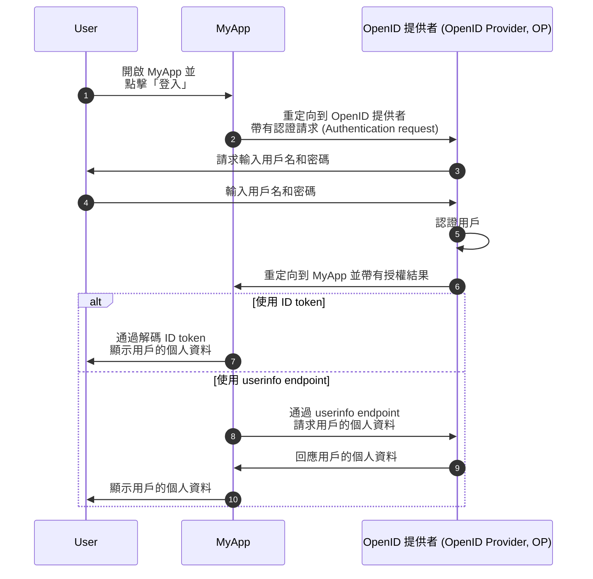
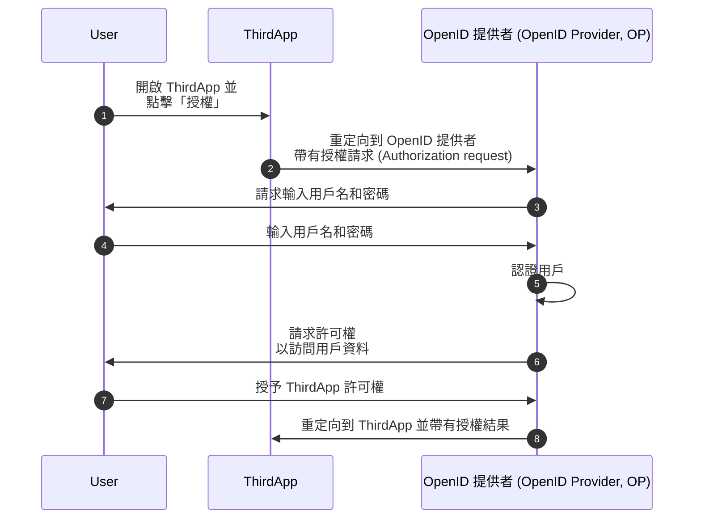

## 什麼是 OpenID Connect (OIDC)？

OpenID Connect (OIDC) 在 <Ref slug="oauth-2.0" /> 授權框架之上引入了一個身份層，增加了認證 (Authentication) 的功能。OIDC 允許客戶端認證用戶並以 <Ref slug="id-token">ID token</Ref> 和 <Ref slug="userinfo-endpoint" /> 響應的形式獲取身份資訊。

讓我們看看一個例子。假設你有一個名為 MyApp 的網頁應用程式，使用者可以用用戶名和密碼登錄；登錄後，他們可以訪問自己的個人資料資訊。以下是一個簡化的流程：



有些術語對你來說可能是新的，所以讓我們澄清一下：

### OpenID 提供者 (OP) ||openid-provider-op||

OpenID 提供者 (OP) 是實現 OIDC 和 OAuth 2.0 規範的 <Ref slug="identity-provider" />。也就是說，OP 也是一個 OAuth 2.0 <Ref slug="authorization-server" />。

OP 負責認證用戶並向客戶端發行 ID token 和 access token。

### Token

- <Ref slug="id-token">ID token</Ref> 是用於表示用戶身份資訊的 <Ref slug="jwt">JSON Web Token</Ref>，例如姓名、電子郵件和個人資料照片。
- <Ref slug="access-token">Access token</Ref> 用於代表用戶訪問受保護的資源（與 OAuth 2.0 相同），例如 userinfo endpoint。

### 認證請求 (Authentication request) 和結果

- <Ref slug="authentication-request" /> 是由客戶端向 OP 發出的請求，用於認證用戶。它包括一些參數以指定某些要求，並會影響認證過程。
- 根據認證請求，認證結果可能會有所不同。當前只需知道結果會提供給客戶端識別用戶所需的資訊。

### Userinfo endpoint

<Ref slug="userinfo-endpoint" /> 是一個 OIDC 特定的端點，允許客戶端檢索用戶的個人資料資訊。這是一個使用 ID tokens 的替代方案，因為 userinfo endpoint 通常提供比 ID token 更詳細的用戶資訊。

OIDC 讓 OpenID 提供者 (OP) 決定在 ID token 和 userinfo 回應中包含哪些資訊。因此，在解析 ID token 或調用 userinfo endpoint 之前，你應該查看 OP 的文檔以了解可用的資訊。

## OAuth 2.0 和 OIDC 的術語差異

由於 OIDC 是基於 OAuth 2.0 建立的，許多術語在這兩個規範之間是共用的。然而，儘管 OAuth 2.0 專注於授權 (Authorization)，OIDC 引入了認證 (Authentication) 和身份，使得某些術語在 OIDC 的上下文中不太合適。以下是一些顯著的差異：

| OAuth 2.0             | OpenID Connect (OIDC)  |
|-----------------------|------------------------|
| 授權伺服器 (Authorization server)  | OpenID 提供者 (OpenID Provider, OP)   |
| 授權請求 (Authorization request) | 認證請求 (Authentication request) |
| 授權 (Grant)                 | 流程 (Flow)                   |

基本上，以上術語可能指向相同的對象，但在 OAuth 2.0 和 OIDC 的上下文中具有不同的含義：

- **OpenID 提供者 (OP)** 是具備認證用戶並發行 ID token 的能力的 OAuth 2.0 <Ref slug="authorization-server" />。
- **<Ref slug="authentication-request" />** 是包含 OIDC 特定參數的 OAuth 2.0 <Ref slug="authorization-request" />，用於請求終端用戶認證並獲取 ID token。
- **流程 (Flow)** 是在 OIDC 中用來描述用戶認證和授權過程的更廣泛術語，該過程可能涉及多個步驟和交互，而不是單一的請求-回應循環。它實質上與 <Ref slug="oauth-2.0-grant" /> 相同。

## OIDC 流程

如上例所示，OIDC 流程由客戶端（例如 MyApp）使用認證請求 (Authentication request) 向 OP 發起。認證請求指定了要使用的流程，可以是以下之一：

- **<Ref slug="authorization-code-flow" />**：用於用戶認證和授權的最安全且推薦的流程。在 <Ref slug="oauth-2.1" /> 中強制所有客戶端採用 <Ref slug="pkce" />。
- **<Ref slug="implicit-flow" />**：由於安全性問題，在 OAuth 2.1 中不再建議使用的一種簡化流程。
- **<Ref slug="hybrid-flow" />**：將授權碼流程與隱式流程結合的 OIDC 流程。由於安全性問題，也不建議用於新應用程式。

授權碼流程和隱式流程是從 OAuth 2.0 擴展而來以包含 ID token，而混合流程是結合了兩者的 OIDC 特定流程。點擊上面的連結以了解有關每個流程的更多資訊。

## OIDC 範圍 (Scopes) 和聲明 (Claims)

與 OAuth 2.0 類似，OIDC 使用 <Ref slug="scope" /> 值來指定客戶端請求的許可權。由於 <Ref slug="id-token">ID token</Ref> 是 <Ref slug="jwt">JSON Web Token</Ref>，它們可以包括根據 <Ref slug="authentication-request" /> 中請求的範圍表示用戶身份資訊的 <Ref slug="claim">聲明</Ref>（名稱-值對）。這些聲明也會在 <Ref slug="userinfo-endpoint" /> 回應中返回。

OIDC 定義了一些標準範圍和相應的聲明，客戶端可以在認證請求中請求：

- **openid**：表示客戶端是 OIDC 客戶端並請求一個 ID token。
- **profile**：請求訪問用戶的預設個人資料聲明，包括：`name`、`family_name`、`given_name`、`middle_name`、`nickname`、`preferred_username`、`profile`、`picture`、`website`、`gender`、`birthdate`、`zoneinfo`、`locale` 和 `updated_at`。
- **email**：請求訪問用戶的 `email` 和 `email_verified` 聲明。
- **address**：請求訪問用戶的 `address` 聲明。
- **phone**：請求訪問用戶的 `phone_number` 和 `phone_number_verified` 聲明。
- **offline_access**：請求一個 refresh token 以允許客戶端在沒有用戶交互的情況下獲取新的 access token。

查閱 OIDC 規範中的 [標準聲明](https://openid.net/specs/openid-connect-core-1_0.html#StandardClaims) 和 [使用範圍值請求聲明](https://openid.net/specs/openid-connect-core-1_0.html#ScopeClaims) 以獲取有關範圍和聲明的更多資訊。也可查看 <Ref slug="offline-access" /> 以獲取有關 `offline_access` 範圍的詳細說明。

> [!注意]
> OpenID 提供者 (OP) 可能支持超出標準的其他範圍和聲明。請查看 OP 的文檔以獲得更多詳細資訊。

## OIDC 中的授權 (Authorization)

如果你熟悉 OAuth 2.0，你可能會注意到上面的例子中沒有涉及任何 <Ref slug="authorization" /> 過程。該例子省略了用戶同意部分，因為我們假設 MyApp 是一個第一方應用程式，不涉及第三方對用戶資料的訪問。授權仍然由 OP 強制執行，但在流程中未明確顯示出來。

當第三方客戶端（例如不由 OP 擁有的應用程式）請求訪問用戶資料時，需要用戶同意部分。在這種情況下，OP 將要求用戶授予客戶端許可權，然後才會發行 ID token 或 access token。假設有一個名為 ThirdApp 的第三方應用程式想要訪問用戶資料：



一旦授權過程完成，ThirdApp 接收到授權結果（通常是一個 <Ref slug="access-token" />），它可以從 <Ref slug="resource-server" /> 訪問用戶的資料。

查看 <Ref slug="oauth-2.0" /> 以獲得有關 OAuth 2.0 和授權流程的更多資訊。

### 範圍 (Scopes)

類似於 OAuth 2.0，OIDC 使用 <Ref slug="scope" /> 值來指定客戶端請求的許可權。我們在 [OIDC 範圍和聲明](#oidc-scopes-and-claims) 中討論了標準範圍和聲明。值得注意的是，這些範圍和聲明在 OIDC 中應被視為保留值，這意味著你不應該將它們用於特定業務目的。

在實踐中，你的 OpenID 提供者 (OP) 可能支持特定業務需求的自定義範圍和聲明。請參閱 OP 的文檔以獲取有關自定義範圍和聲明的更多資訊。如果你沒有定義自定義範圍和聲明，OP 可能會直接忽略它們或返回錯誤響應。

### 資源指示器 (Resource indicators)

由於 OIDC 等框架和 OP 可能為某些特定目的保留特定範圍和聲明，通常建議 OP 在定義自定義範圍和聲明時使用前綴或命名空間以避免與保留值衝突。例如，你可以用 `myapp:` 前綴自定義範圍，以表明它們是應用程式特定的。

```json
{
  "scope": "myapp:custom_scope"
}
```

然而，這不能保證你的自定義範圍和聲明不會與未來的保留值衝突，並且可能會使 token 體積增大。一個名為 <Ref slug="resource-indicator">資源指示器 (Resource indicators)</Ref> 的 OAuth 2.0 擴展提供了一種更靈活和可擴展的方法來達到相同的目標。資源指示器是表示請求資源的 URI，並且可以是反映實際世界資源的實際 API 端點。例如，你可以使用 `https://api.myapp.com` 作為資源指示器來代表你的客戶端想要訪問的 API 資源。

再一次，由於 OIDC 是基於 OAuth 2.0 之上的，你可以在已正確配置的情況下在 OIDC 認證請求中使用資源指示器。以下是一個具有資源指示器的認證請求的非規範示例：

```http
GET /authorize?response_type=code
  &client_id=YOUR_CLIENT_ID
  &redirect_uri=https%3A%2F%2Fclient.example.com%2Fcallback
  &scope=openid%20profile
  &resource=https%3A%2F%2Fapi.example.com HTTP/1.1
Host: your-openid-provider.com
```

要使用資源指示器，你需要首先確認你的 OP 支持此擴展（RFC 8707）。如果支持，你應該向 OP 註冊一個資源指示器 URI，並在認證請求的 `resource` 參數中使用它。

查看 <Ref slug="resource-indicator" /> 以獲取關於資源指示器的詳細資訊。

## OIDC 安全性考量

### 安全通信

客戶端、OP 和資源伺服器之間的所有通信應使用 HTTPS 加密，以防止任何竊聽或數據篡改。

### 選擇安全的流程

在實現 OIDC 時，建議使用：

- 配有 <Ref slug="pkce" /> 的 <Ref slug="authorization-code-flow" /> 用於用戶認證和授權（在 <Ref slug="oauth-2.1" /> 中強制執行）。
- <Ref slug="client-credentials-flow" /> 用於機器對機器 (machine to machine) 通信。

隱式流程和混合流程由於安全問題而被棄用，因此避免用於新應用程式，並考慮將現有應用程式遷移到更安全的流程。

### ID token 驗證

從 OP 收到 ID token 時，客戶端應驗證該 token 以確保其完整性和真實性。驗證過程至少應包括以下檢查：

- **Issuer (發行者)**：`iss` 聲明應匹配 OP 的發行者 URL。
- **Audience (受眾)**：`aud` 聲明應匹配客戶端的客戶端 ID。
- **過期**：`exp` 聲明應在未來的時間點。
- **簽名**：該 token 應由 OP 的 <Ref slug="signing-key" /> 簽名。

### Access token 使用

Access token 用於代表用戶訪問受保護的資源。客戶端應將 access token 視為敏感資訊並遵循以下最佳實踐：

- **Token 存儲**：安全地存儲 access token，並避免將其暴露給未授權的方。
- **Token 過期**：Access token 應設置短的過期時間（例如 1 小時），以減少在 token 被洩露後未授權訪問的風險。
- **Token 撤銷**：實現 token 撤銷機制，以在必要時使 access token 失效。

### 用戶同意

當第三方客戶端請求訪問用戶資料時，OP 應確保用戶了解所請求的許可權並授予同意。用戶同意過程應透明，並提供有關所訪問資料及其用途的清晰資訊。

<SeeAlso slugs={["oauth-2.0", "authorization-code-flow", "implicit-flow", "hybrid-flow", "pkce", "resource-indicator"]} />

<Resources
  urls={[
    "https://blog.logto.io/secure-cloud-apps-with-oauth-and-openid-connect",
    "https://openid.net/specs/openid-connect-core-1_0.html",
  ]}
/>
