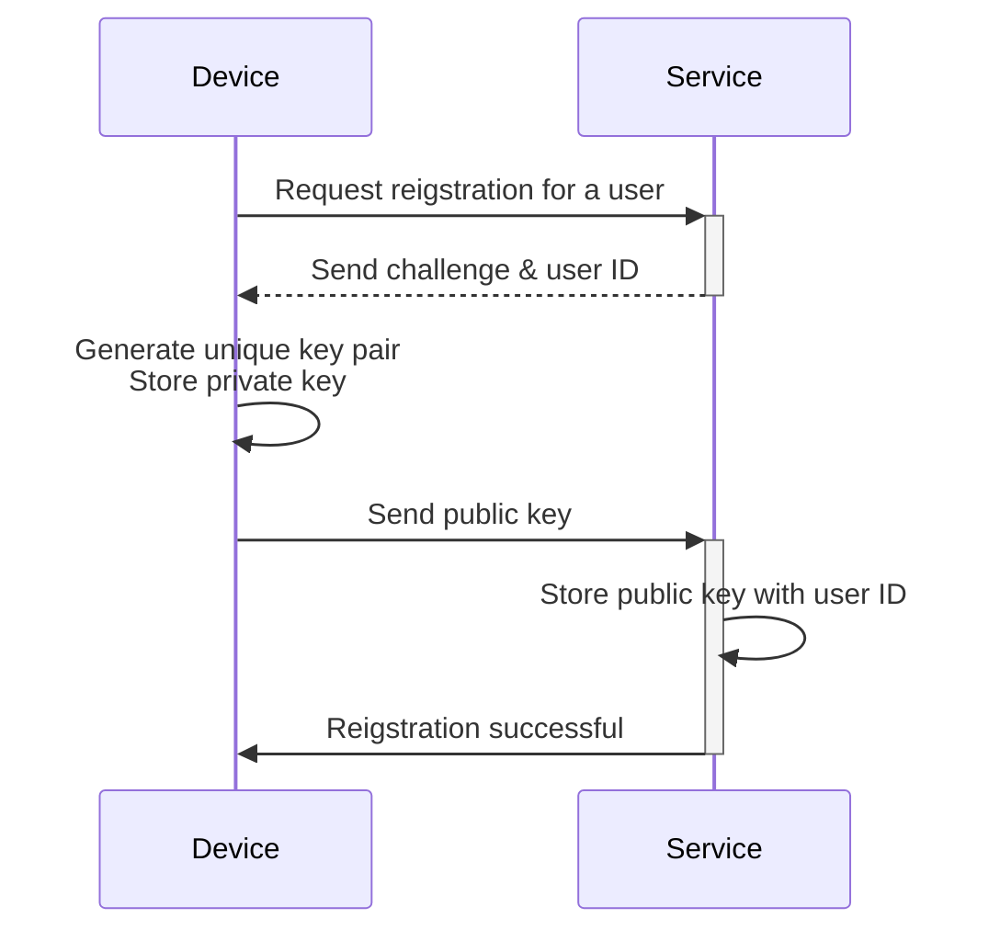
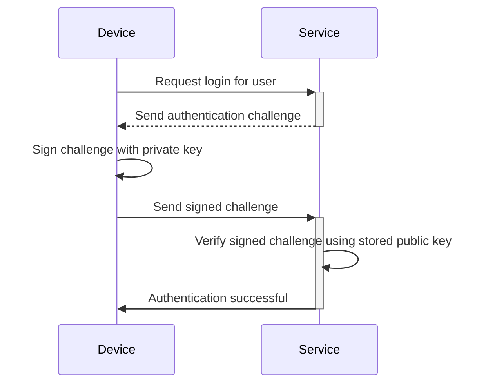

## 什麼是通行密鑰 (Passkey)？

**通行密鑰 (Passkey)** 是一種基於 [FIDO](https://fidoalliance.org/) 的安全且方便的傳統密碼替代方案。它們使用先進的加密技術來保護你的帳戶免受[釣魚](https://en.wikipedia.org/wiki/Phishing)攻擊。

- **每個服務唯一**：當你註冊某個服務時，你的設備會創建一個與該服務域名相關聯的唯一通行密鑰。
- **設備連結**：通行密鑰通常與設備相關聯，例如手機、筆記型電腦、生物識別標識符或硬體安全密鑰。
- **公私鑰對**：設備保留私鑰，而公鑰則與服務共享。這些加密鑰對稱為通行密鑰。（引用自 [FIDO](https://fidoalliance.org/how-fido-works/)）
- **多種認證方法**：你可以使用指紋掃描、面部識別、設備 PIN、QR 碼掃描或安全密鑰來使用通行密鑰進行認證。
- **跨設備同步**：通行密鑰可以使用安全的雲存儲（例如 Apple 的 iCloud 鑰匙圈或 Google 密碼管理器）在設備間同步，讓你可以從任何支持的設備登入。

## 通行密鑰 (Passkey) 的工作流程是什麼樣的？

這裡有一個實際的例子來幫助你更好地理解。你有一個網絡服務 MyApp，想要實施通行密鑰登入來取代基於密碼的登入。用戶選擇當前設備的指紋掃描作為通行密鑰認證方法。

**通行密鑰 (Passkey)** 通過利用公鑰加密來提供安全的憑證。

- **通行密鑰註冊**
    - 當你註冊某個服務時，你的設備會生成一個與該服務相關聯的唯一加密鑰對。
    - **私鑰** 保留在你的設備上，而 **公鑰** 則與服務共享。

- **通行密鑰認證**
    - 當你嘗試登入時，服務會向你的設備發送一個 **挑戰**。
    - 你的設備使用 **私鑰** 基於挑戰生成一個加密 **簽名**。
    - **簽名** 被發送回服務，服務使用 **公鑰** 進行驗證。
    - 如果簽名有效，認證成功。

閱讀 <Ref slug="webauthn" />，一個用於實施通行密鑰的 API，了解詳細信息。

## 通行密鑰 (Passkey) 的終端用戶流程是什麼樣的？

通行密鑰提供靈活性，具有兩種類型的認證器，適用於本地和雲端使用，用戶可以為服務啟用其中一種或兩種。

- **平台認證器（內部認證器）**：與特定設備操作系統相關聯（例如，手機、筆記型電腦），使用生物識別或設備密碼進行授權。它快速且方便。
    - 示例：Apple 設備上的 iCloud 鑰匙圈（通過 Touch ID、Face ID 或設備密碼驗證）、Windows Hello、Android 上的 Google 密碼管理器。
- **漫遊認證器（外部認證器）**：便攜設備或軟體，例如安全密鑰、智能手機。可以跨多個設備使用，但可能需要額外步驟，如 QR 碼掃描或 NFC/藍牙配對。
    - 示例：YubiKey 和智能手機上的雲端帳戶。移動認證器通常需要 QR 碼掃描以與桌面設備連接，跨設備認證需要通過藍牙、NFC 或 USB 連接以確保認證器在附近。

## 什麼時候使用通行密鑰 (Passkey)？

通行密鑰是一種現代的認證因素，可以用作第一或第二因素。

- **通行密鑰登入**：通行密鑰提供比傳統密碼更快且更安全的無密碼認證方法。
    - 現代應用程序通常在登入頁面上設有“使用通行密鑰登入”按鈕，提示用戶主動點擊此選項。
    - 此外，如果登入頁面識別出用戶正在訪問其通行密鑰已註冊的相同設備和瀏覽器，則可以自動提示通行密鑰登入彈出窗口。
- **通行密鑰 MFA**：通行密鑰也可以作為 MFA 的第二因素。
    - 當用戶嘗試登入時，他們首先輸入電子郵件和密碼（或其他第一因素），然後服務提示他們使用通行密鑰完成兩步驗證。
    - 如果瀏覽器中存在現有會話，服務可以直接提示用戶使用通行密鑰登入，而無需再次輸入密碼。這個過程稱為完成 MFA，因為通行密鑰是一種高級安全性，通過綁定到當前設備並通過生物識別、PIN 或其他硬體方法驗證用戶。
- **安全驗證**：在高安全性環境中，通行密鑰通常用於雙重檢查用戶身份。例如，當訪問敏感的財務信息或執行關鍵操作（銀行、政府、企業系統）時。

### 為什麼通行密鑰是最安全的認證方法？

通行密鑰是普通用戶登入的最安全方式之一，因為它們使用 **公鑰加密**。與密碼或一次性代碼 (TOTPs) 不同，你的私鑰永遠不會離開你的設備。即使攻擊者竊取了自由可用的公鑰，他們也無法偽造有效的登入嘗試。

這裡有一個比較來說明為什麼通行密鑰顯著更安全：

| 攻擊 | 通行密鑰 | 軟體 TOTP（認證器） |
| --- | --- | --- |
| **釣魚攻擊** | 對釣魚高度抵抗，因為私鑰從不離開設備或手動輸入任何地方，使其更難被竊取。 | 易受釣魚攻擊，因為軟體 TOTP 顯示在你的屏幕上，因此攻擊者可以誘騙你在假網站上透露。 |
| **中間人攻擊 (MitM)** | 對 MitM 提供強大保護，因為強大的加密協議使私鑰僅保留在你的設備上。 | 易受 MitM 攻擊，因為 TOTPs 可以被 MitM 攻擊者攔截，然後他們可以用它們來冒充你登入。 |
| **重放攻擊** | 對重放攻擊提供強大保護，因為每個通行密鑰請求都是唯一的，使攻擊者捕獲並重放後無用。 | 可能的重放攻擊，因為 TOTP 會定期更改，但如果在過期前被攔截，它們可能會被重用以進行未經授權的訪問。 |

<SeeAlso slugs={["webauthn", "authentication", "authorization"]} />

<Resources
  urls={[
    "https://fidoalliance.org/passkeys/",
    "https://webauthn.io/"
  ]}
/>