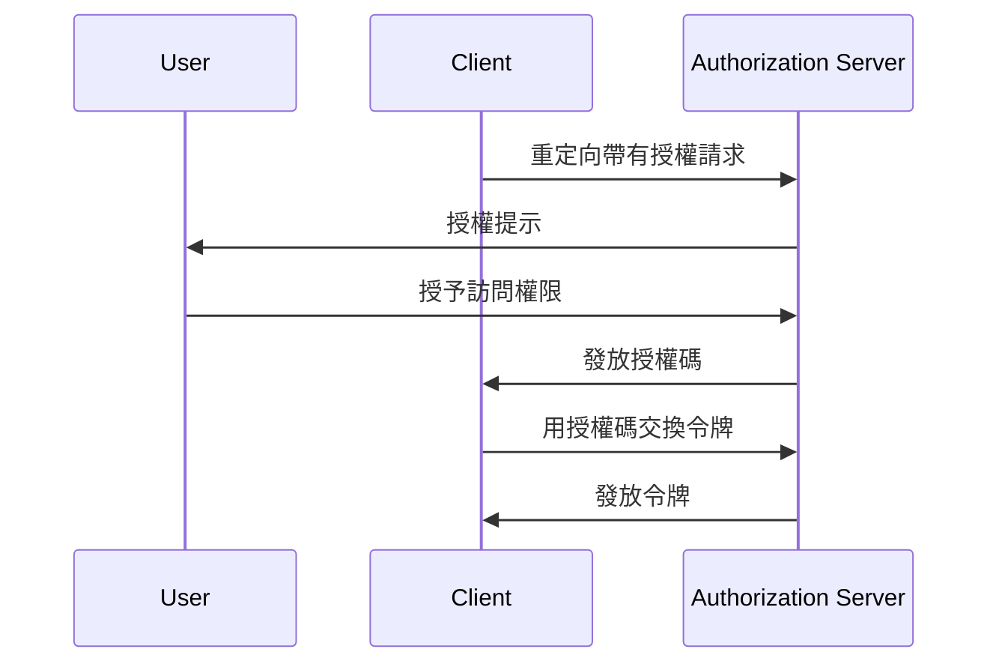

## 什麼是交換驗證碼用的驗證密鑰 (PKCE)？

交換驗證碼用的驗證密鑰 (Proof Key for Code Exchange，PKCE) 作為 <Ref slug="authorization-code-flow" /> 中<Ref slug="oauth-2.0" /> 的一個安全擴展。它旨在保護授權碼免於被攔截和濫用，特別是在客戶端密碼不安全的公共客戶端中。

從 <Ref slug="oauth-2.1" /> 開始，PKCE 被強制應用於所有類型的客戶端，包括<Ref slug="client" headingId="public-clients" /> 和 <Ref slug="client" headingId="confidential-clients">機密 (私有) 客戶端</Ref>。

## PKCE 如何運作？

PKCE 引入了一些附加步驟到授權碼流中，以確保交換授權碼的 <Ref slug="client" /> 與啟動該流程的客戶端相同。

> [!注意]
> PKCE 也適用於依賴授權碼流的 <Ref slug="openid-connect" /> 流。為簡化起見，本文將專注於 OAuth 2.0 的實現。

在深入了解 PKCE 之前，讓我們快速回顧一下標準的授權碼流：



現在，讓我們看看 PKCE 如何增強授權碼流。

### 1. 準備授權請求

#### 1.1. 客戶端生成一個 code verifier

在啟動 <Ref slug="authorization-request" /> 之前，客戶端應該生成一個隨機字符串，稱為 **code verifier**。該字符串應該是一個高熵的加密隨機 URL 安全字符串，長度至少為 43 個字符，最多為 128 個字符。

以下是一個在 JavaScript 中生成 code verifier 的示例：

```javascript
// `js-base64` 是一個可以在 Node.js 和瀏覽器中使用的通用庫
import { fromUint8Array } from 'js-base64';

// 第二個參數 `true` 表示輸出應該是 URL 安全的
const codeVerifier = fromUint8Array(crypto.getRandomValues(new Uint8Array(64)), true);
```

#### 1.2. 客戶端創建一個 code challenge

客戶端應使用一種加密哈希函數（例如 SHA-256）哈希 **code verifier**，並以 URL 安全的 Base64 字符串編碼哈希。結果字符串稱為 **code challenge**。

以下是在 JavaScript 中創建 code challenge 的示例：

```javascript
// `js-base64` 是一個可以在 Node.js 和瀏覽器中使用的通用庫
import { fromUint8Array } from 'js-base64';

const encodedCodeVerifier = new TextEncoder().encode(codeVerifier);
const codeChallenge = new Uint8Array(await crypto.subtle.digest('SHA-256', encodedCodeVerifier));

// 第二個參數 `true` 表示輸出應該是 URL 安全的
return fromUint8Array(codeChallenge, true);
```

#### 1.3. 客戶端將 code challenge 包含在授權請求中

當客戶端啟動授權請求時，它會在請求中包含參數 `code_challenge` 和 `code_challenge_method`。`code_challenge` 參數包含在前一步生成的 **code challenge**，而 `code_challenge_method` 參數指定創建 **code challenge** 時使用的哈希算法（例如，SHA-256 的 `S256`）。

支持的 `code_challenge_method` 值為 `plain` 和 `S256`，其中 `plain` 表示 **code challenge** 是按原樣發送而不進行任何哈希。通常，建議使用 `S256` 以獲得更好的安全性。

以下是一個帶有 PKCE 的授權請求的非規範性示例：

```http
GET /authorize?response_type=code
  &client_id=YOUR_CLIENT_ID
  &redirect_uri=https%3A%2F%2Fclient.example.com%2Fcallback
  &scope=openid%20profile
  &code_challenge=YOUR_CODE_CHALLENGE
  &code_challenge_method=S256
  &state=abc123
  &nonce=123456 HTTP/1.1
```

### 2. 用授權碼交換令牌

客戶端應保存 **code verifier** 以供後續使用，並按常規流程繼續授權流程。一旦客戶端收到授權碼，應將 <Ref slug="token-request" /> 和 **code verifier** 發送給授權伺服器。

以下是一個帶有 PKCE 的令牌請求的非規範性示例：

```http
POST /token HTTP/1.1
Host: your-authorization-server.com
Content-Type: application/x-www-form-urlencoded

grant_type=authorization_code
  &code=YOUR_AUTHORIZATION_CODE
  &redirect_uri=https%3A%2F%2Fclient.example.com%2Fcallback
  &client_id=YOUR_CLIENT_ID
  &code_verifier=YOUR_CODE_VERIFIER
```

授權伺服器將驗證 **code challenge** 與 **code verifier** 以確保客戶端與啟動該流程的實體相同。如果驗證失敗，授權伺服器將拒絕令牌請求。

## PKCE 如何增強安全性

PKCE 的首要安全優勢在於它防止了公共客戶端中的授權碼攔截攻擊。例如，如果攻擊者攔截了授權碼，沒有 **code verifier** 的情況下，他們無法用其交換令牌。PKCE 確保只有啟動該流程的客戶端才能完成令牌交換。

<SeeAlso slugs={['oauth-2.1', 'authorization-code-flow']} />

<Resources
  urls={[
    "https://blog.logto.io/how-pkce-protects-the-authorization-code-flow-for-native-apps",
    "https://datatracker.ietf.org/doc/html/rfc7636",
  ]}
/>