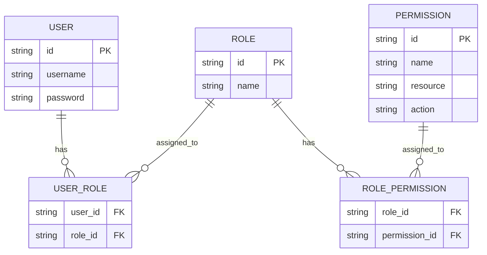
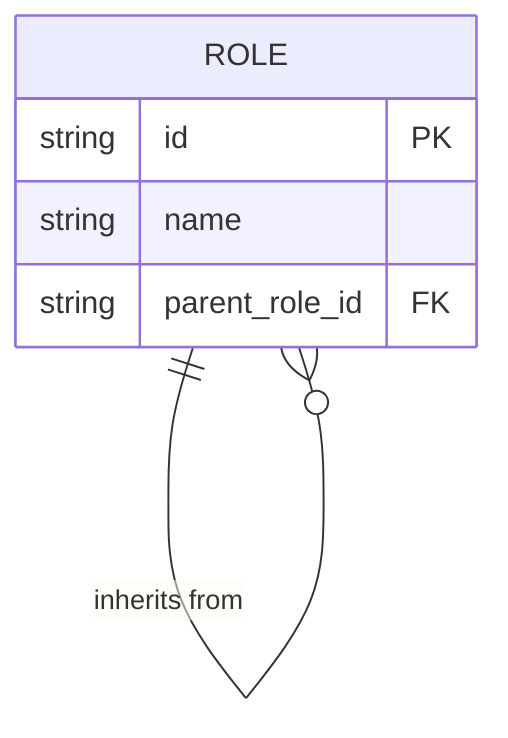
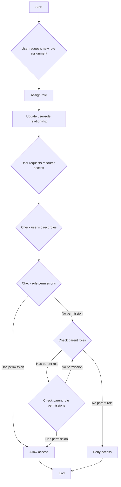
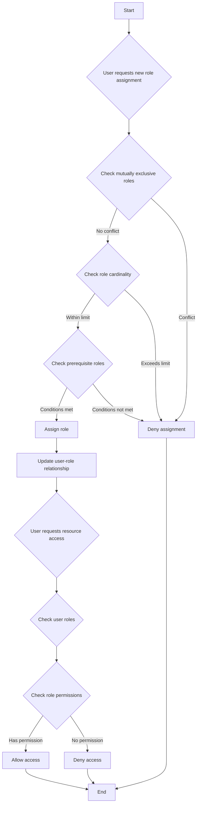

## 什麼是基於角色的存取控制 (Role-based access control, RBAC)？

基於角色的存取控制 (Role-based access control, RBAC) 是一種廣泛採用的存取控制模型，它引入了「角色」的概念，以解耦用戶與權限，從而形成一個靈活且高效的權限管理系統。

RBAC 的核心思想簡單而強大：與其直接將權限分配給用戶，不如將權限分配給角色，然後再將角色分配給用戶。這種間接的權限分配方法大大簡化了管理存取權限的過程。

## RBAC 的關鍵概念是什麼？

RBAC 模型圍繞四個主要元素：

1. 用戶：系統中的個體，通常是真實的人。
2. 角色：組織內工作職能或責任的表示。
3. 權限：執行特定操作於特定資源的授權。
4. 會話：用戶啟用某些角色的動態環境。

RBAC 的基本工作流程可以總結如下：
1. 根據組織結構或業務需求定義角色。
2. 為每個角色分配適當的權限。
3. 根據用戶的責任分配一個或多個角色。
4. 當用戶嘗試存取資源時，系統會檢查其分配的角色是否具有必要的權限。

## RBAC 在現實應用中如何使用？

在典型的商業應用中使用 RBAC 時，可以從回答以下三個基本問題開始：

1. 系統中需要保護哪些資源？
2. 需要控制這些資源上的哪些操作？
3. 在現實場景中，哪些角色負責執行這些資源和操作？

以電子商務系統為例。

你可以先識別需要保護的資源：

- 產品
- 訂單

然後，你可以確定需要控制這些資源上的哪些操作，即定義這些資源的權限：

- 產品
  - `read:product`
  - `create:product`
  - `delete:product`
- 訂單
  - `read:order`
  - `create:order`
  - `delete:order`

有了上述權限，你現在可以根據現實場景中的角色定義以下權限管理模型：

- 產品管理員
  - 產品
    - `read:product`
    - `create:product`
    - `delete:product`
- 訂單管理員
  - 訂單
    - `read:order`
    - `create:order`
    - `delete:order`

最後，根據用戶的責任分配角色：

- Alice: 產品管理員
- Bob: 訂單管理員

當用戶存取資源時，系統會檢查用戶分配的角色是否具有必要的權限。

例如，當 Alice 嘗試讀取產品資訊時，系統首先檢索她的角色資訊，發現她具有產品管理員角色。

然後，系統查詢與該角色相關的權限，其中包括 `read:product`、`create:product` 和 `delete:product`。

系統接著檢查她的權限列表中是否存在所需的 `read:product` 權限。

由於此權限存在，系統允許 Alice 存取產品列表。如果所需權限不在列表中，系統將拒絕存取請求。

## 為什麼不應直接使用角色進行存取控制

在 RBAC 實施中，一個常見的錯誤是直接使用角色進行存取控制：

```typescript
// ❌ 有問題的方法
if (user.hasRole('product_admin')) {
  await deleteProduct(productId);
}
```

雖然這種方法看似簡單，但隨著系統的增長會產生問題。例如：
- 當行銷團隊需要更新產品描述時，你需要修改代碼以檢查行銷角色。
- 當你希望某些產品經理只能發布而不能刪除產品時，你需要為相關操作創建新的角色檢查。
- 當新的內容團隊需要部分產品存取時，你又需要更新代碼。

相反，你應該始終檢查特定的權限：

```typescript
// ✅ 推薦的方法
if (user.hasPermission('delete:product')) {
  await deleteProduct(productId);
}
```

這種基於權限的方法提供了幾個優勢：

1. 細粒度的權限控制：權限可以精確映射到特定的資源操作：

- 創建產品：`create:product`
- 更新產品：`update:product`
- 刪除產品：`delete:product`
- 發布產品：`publish:product`

2. 靈活的角色配置：權限可以自由組合成角色而不需要代碼更改：

```typescript
const roles = {
  product_admin: ['create:product', 'update:product', 'delete:product', 'publish:product'],
  content_editor: ['update:product'],
  publisher: ['publish:product']  // 可以輕鬆添加新角色
};
```

這種設計使你的系統能夠適應業務增長：
- 添加新角色只需配置權限
- 調整角色權限通過配置完成
- 新功能只需新的權限條目

記住：角色應僅作為權限的容器，而不是存取控制決策的基礎。這種設計使 RBAC 能夠提供最大的價值。

## RBAC 模型及其演變

### RBAC0: 基礎

RBAC0 是定義用戶、角色、權限和會話核心概念的基本模型。它是所有其他 RBAC 模型的基礎。

主要特點：
- 用戶-角色關聯：多對多關係
- 角色-權限關聯：多對多關係



此圖表說明了 RBAC0 的基本結構，展示了用戶、角色和權限之間的關係。

主要操作：
1. 分配角色給用戶
2. 分配權限給角色
3. 檢查用戶是否具有特定權限

雖然 RBAC0 提供了一個堅實的起點，但它有一些限制：
1. 角色爆炸：隨著系統複雜性的增加，角色數量可能迅速增長。
2. 權限冗餘：不同角色可能需要類似的權限集，導致重複。
3. 缺乏層次結構：無法表示角色之間的繼承關係。

### RBAC1: 引入角色層次結構

RBAC1 在 RBAC0 的基礎上增加了角色繼承的概念。

```plaintext
RBAC1 = RBAC0 + Role Inheritance
```

主要特點：
- 角色層次結構：角色可以有父角色
- 權限繼承：子角色繼承其父角色的所有權限



此圖表顯示了 RBAC1 中角色如何從其他角色繼承。

主要操作：



此流程圖說明了 RBAC1 中角色分配和權限檢查的過程，包括角色繼承方面。

RBAC1 提供了幾個優勢：
1. 減少角色數量：可以通過繼承創建更少的基礎角色
2. 簡化權限管理：更容易反映組織層次結構

然而，RBAC1 仍然有一些限制：
1. 缺乏約束機制：無法限制用戶同時擁有潛在衝突的角色
2. 性能考量：權限檢查可能需要遍歷整個角色層次結構

### RBAC2: 實施約束

RBAC2 也基於 RBAC0，但引入了約束的概念。

```plaintext
RBAC2 = RBAC0 + Constraints
```

主要特點：
1. 互斥角色：用戶不能同時被分配到這些角色
2. 角色基數：限制可以分配給特定角色的用戶數量
3. 先決角色：用戶必須擁有特定角色才能被分配到另一個角色



此流程圖展示了 RBAC2 中角色分配和存取控制的過程，包含各種約束。

RBAC2 通過防止權限過度集中增強了安全性，並允許更精確的存取控制。然而，由於需要為每個角色分配檢查多個約束條件，它增加了系統的複雜性並可能影響性能。

### RBAC3: 綜合模型

RBAC3 結合了 RBAC1 和 RBAC2 的特點，提供了角色繼承和約束機制：

```plaintext
RBAC3 = RBAC0 + Role Inheritance + Constraints
```

這個綜合模型提供了最大的靈活性，但在實施和性能優化方面也帶來了挑戰。

## RBAC (基於角色的存取控制) 的優勢是什麼？

1. 簡化的權限管理：通過角色進行批量授權，降低了管理個別用戶權限的複雜性。
2. 增強的安全性：更精確的用戶權限控制降低了安全風險。
3. 降低管理成本：修改角色權限會自動影響所有相關用戶。
4. 與業務邏輯對齊：角色通常對應於組織結構或業務流程，使其更易於理解和管理。
5. 支持職責分離：可以通過互斥角色等約束分離關鍵責任。

## 實際實施考量是什麼？

在現實場景中實施 RBAC 時，開發者應考慮以下關鍵方面：

1. 資料庫設計：利用關聯資料庫有效地存儲和查詢 RBAC 結構。
2. 性能優化：實施緩存策略並優化權限檢查，特別是對於複雜的 RBAC3 模型。
3. API 和前端整合：設計清晰的 API 來管理用戶、角色和權限，並考慮如何在前端應用中使用 RBAC。
4. 安全性和審計：確保 RBAC 系統本身的安全性，並實施詳細的日誌記錄和審計功能。
5. 可擴展性：設計時考慮未來的擴展，例如支持更複雜的權限規則或與其他系統整合。
6. 用戶體驗：為系統管理員設計直觀的界面，以便輕鬆配置和維護 RBAC 結構。

<SeeAlso slugs={['abac', 'access-control']} />

<Resources
  urls={[
    "https://blog.logto.io/rbac-and-abac",
    "https://blog.logto.io/mastering-rbac",
    "https://blog.logto.io/organization-and-role-based-access-control",
    "https://docs.logto.io/docs/recipes/rbac/",
    "https://en.wikipedia.org/wiki/Role-based_access_control"
  ]}
/>