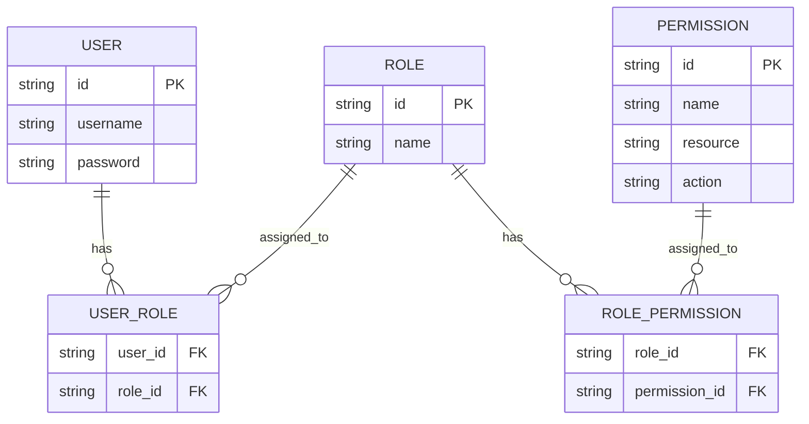
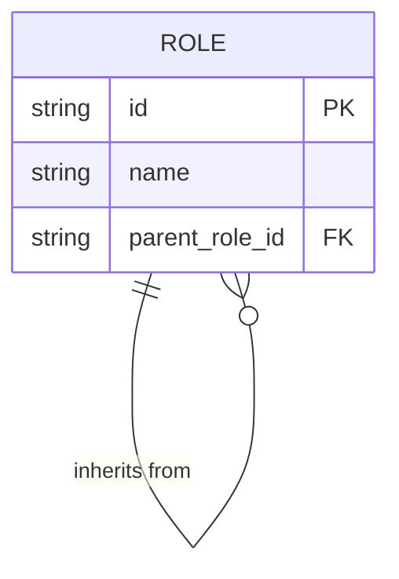
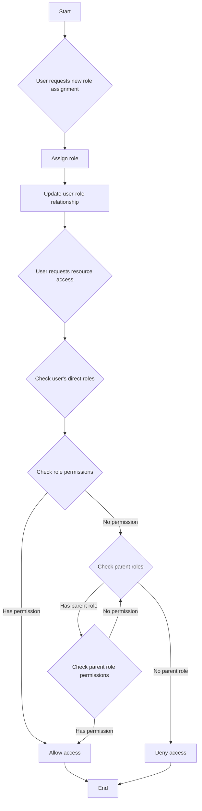
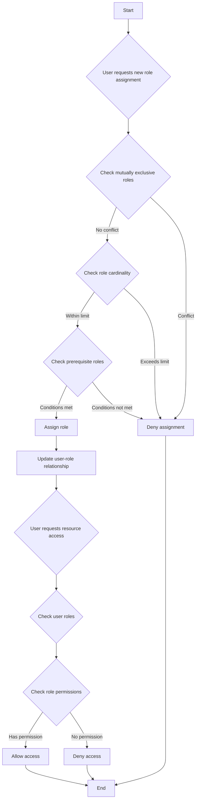

## 什麼是基於角色的存取控制 (RBAC)？

基於角色的存取控制 (RBAC) 是一種被廣泛採用的存取控制模型，它引入了“角色”的概念，使用戶與許可權分離，從而形成一種靈活且高效的許可權管理系統。

RBAC 的核心思想簡單而強大：不是直接將許可權分配給用戶，而是將許可權分配給角色，然後將角色分配給用戶。這種間接的許可權分配方法大大簡化了管理存取權的過程。

### RBAC 的關鍵概念

RBAC 模型圍繞四個主要元素：

1. 用戶：系統中的個體，通常是真實的人。
2. 角色：組織內工作職能或責任的表現。
3. 許可權：在特定資源上執行特定操作的授權。
4. 會話：用戶激活某些角色的動態環境。

RBAC 的基本流程可以總結如下：
1. 根據組織結構或業務需求定義角色。
2. 為每個角色分配適當的許可權。
3. 根據用戶的職責為其分配一個或多個角色。
4. 當用戶嘗試存取某個資源時，系統檢查其已分配的角色是否具有必要的許可權。

### RBAC 的類型

#### RBAC0: 基礎

RBAC0 是定義用戶、角色、許可權和會話核心概念的基本模型。它為其他所有 RBAC 模型提供了基礎。

主要特徵：
- 用戶-角色關聯：多對多關係
- 角色-許可權關聯：多對多關係



此圖說明了 RBAC0 的基本結構，展示了用戶、角色和許可權之間的關係。

主要操作：
1. 將角色分配給用戶
2. 將許可權分配給角色
3. 檢查用戶是否具備特定許可權

儘管 RBAC0 提供了一個穩固的起點，但它存在一些限制：
1. 角色爆炸：隨著系統複雜性的增加，角色數量可能迅速增長。
2. 許可權冗餘：不同角色可能需要類似的許可權集合，導致重複。
3. 缺乏層次結構：無法表達角色之間的繼承關係。

#### RBAC1: 引入角色層次結構

RBAC1 在 RBAC0 的基礎上增加了角色繼承的概念。

```plaintext
RBAC1 = RBAC0 + Role Inheritance
```

主要特徵：
- 角色層次結構：角色可以擁有父角色
- 許可權繼承：子角色繼承所有父角色的許可權



此圖展示了 RBAC1 中角色如何從其他角色繼承。

主要操作：



此流程圖說明了 RBAC1 中角色分配和許可權檢查的過程，包括角色繼承方面。

RBAC1 提供了幾個優點：
1. 減少角色數量：通過繼承可創建更少的基礎角色
2. 簡化許可權管理：更容易反映組織層次

然而，RBAC1 仍然有一些限制：
1. 缺乏約束機制：無法限制用戶同時擁有潛在衝突角色
2. 性能考量：許可權檢查可能需要遍歷整個角色層次

#### RBAC2: 實施約束

RBAC2 也基於 RBAC0，但引入了約束的概念。

```plaintext
RBAC2 = RBAC0 + Constraints
```

主要特徵：
1. 互斥角色：用戶不能同時分配到這些角色
2. 角色基數：限制分配到特定角色的用戶數量
3. 前置角色：用戶必須擁有某特定角色才能被分配到另一角色



此流程圖展示了 RBAC2 中角色分配和存取控制的過程，結合了各種約束。

RBAC2 通過防止過度集中的許可權增進了安全性，並允許更精確的存取控制。然而，由於需要檢查每個角色分配的多個約束條件，它增加了系統的複雜性，可能影響性能。

### RBAC3: 綜合模型

RBAC3 結合了 RBAC1 和 RBAC2 的特點，提供角色繼承和約束機制：

```plaintext
RBAC3 = RBAC0 + Role Inheritance + Constraints
```

這個綜合模型提供了最大的靈活性，但也在實施和性能優化上帶來了挑戰。

## RBAC (基於角色的存取控制) 的優勢是什麼？

1. 簡化許可權管理：通過角色批量授權，降低了管理個別用戶許可權的複雜性。
2. 增強安全性：對用戶許可權的更精確控制降低了安全風險。
3. 減少管理成本：修改角色許可權會自動影響所有相關的用戶。
4. 與業務邏輯對齊：角色通常對應於組織結構或業務流程，使其更易於理解和管理。
5. 支援職責分離：可以通過如互斥角色等約束將關鍵責任分開。

## 實際實施考量有哪些？

在現實世界場景中實施 RBAC，開發者應考慮以下關鍵方面：

1. 資料庫設計：利用關聯資料庫來有效存儲和查詢 RBAC 結構。
2. 性能優化：實施快取策略並優化許可權檢查，特別是對於複雜的 RBAC3 模型。
3. API 和前端整合：設計清晰的 API 來管理用戶、角色和許可權，並考慮如何在前端應用中使用 RBAC。
4. 安全和稽核：確保 RBAC 系統本身的安全性，並實施詳細的日誌和稽核功能。
5. 可擴展性：考慮未來擴展需求的設計，例如支援更複雜的許可權規則或與其他系統的整合。
6. 用戶體驗：設計直觀的介面，便於系統管理員輕鬆配置和維護 RBAC 結構。

<SeeAlso slugs={['abac', 'access-control']} />

<Resources
  urls={[
    "https://blog.logto.io/rbac-and-abac",
    "https://blog.logto.io/mastering-rbac",
    "https://blog.logto.io/organization-and-role-based-access-control",
    "https://docs.logto.io/docs/recipes/rbac/",
    "https://en.wikipedia.org/wiki/Role-based_access_control"
  ]}
/>
