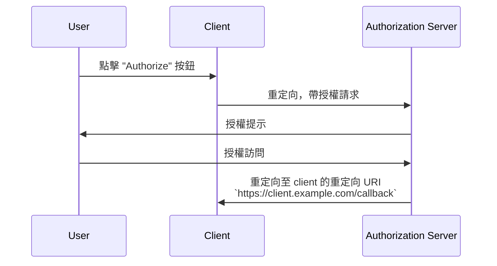

## 什麼是重定向 URI (Redirect URI)？

重定向 URI，也稱為回調 URL 或重定向 URL，是一個 URI，用來指明在<Ref slug="authorization-request" />完成後，<Ref slug="authorization-server" />應將使用者代理重定向至的位置。

> 通用資源標識符 (URI) 常與 URL（統一資源定位器）混淆。欲了解更多資訊，請參閱[揭示 URI、URL 和 URN](https://blog.logto.io/unveiling-uri-url-and-urn)。

讓我們看一個包含重定向 URI (redirect URI) 的授權請求示例：

```http
GET /authorize?response_type=code
  &client_id=YOUR_CLIENT_ID
  &redirect_uri=https%3A%2F%2Fclient.example.com%2Fcallback
  &scope=openid%20profile%20email
  &state=abc123
  &nonce=123456 HTTP/1.1
```

在這個例子中，`redirect_uri` 參數的原始值是 `https%3A%2F%2Fclient.example.com%2Fcallback`，這是 URL 編碼的。實際值是 `https://client.example.com/callback`。

## 重定向 URI (Redirect URI) 如何運作？

> 在<Ref slug="openid-connect" />的上下文中，OAuth 2.0 的<Ref slug="authorization-request" />和<Ref slug="authorization-server" />的工作流程類似地適用。重定向 URI 在<Ref slug="authentication-request" />和<Ref slug="openid-connect" headingId="openid-provider-op" />中與在 OAuth 2.0 中的運作方式相同。

假設<Ref slug="client" />從 URL `https://client.example.com` 發起授權請求。當使用者完成授權過程後，授權伺服器會將使用者代理（瀏覽器）重定向回 `https://client.example.com/callback`。



很明顯，重定向 URI 對於授權伺服器在授權過程完成後將使用者代理重定向回去是至關重要的。此外，根據流程的不同，重定向 URI 也用於接收授權碼或令牌。

下面是<Ref slug="authorization-code-flow" />中實際重定向可能的非規範性例子：

```http
HTTP/1.1 302 Found
Location: https://client.example.com/callback?code=AUTHORIZATION_CODE&state=abc123
```

注意，URL 參數 `code` 和 `state` 是由授權伺服器追加到重定向 URI 中的。client 需要從 URL 中提取 `code` 和 `state` 參數以繼續授權過程。

## 為什麼我們需要重定向 URI (Redirect URI)？

如上例所示，授權伺服器需要知道在成功授權請求後應重定向到哪裡。這在有多個 client（即<Ref slug="single-sign-on" />）時特別有用，且每個 client 都有不同的重定向 URI。

在<Ref slug="authorization-code-flow" />中，重定向 URI 也用於將授權碼傳遞給 client，而不是使用前通道（瀏覽器），以防止令牌暴露於潛在攻擊。

過去可以使用[資源所有者密碼憑據 (ROPC) 授權](https://datatracker.ietf.org/doc/html/rfc6749#section-4.3)來獲得不需要重定向 URI 的令牌。然而，由於安全問題，它在<Ref slug="oauth-2.1" />中已被棄用。

## 安全考量

重定向 URI 是一個關鍵參數，也是攻擊者常瞄準的目標。以下是一些需要注意的安全考量：

- **白名單重定向 URI**：client 應該只接受在授權伺服器註冊的重定向 URI。這可以防止攻擊者將使用者重定向至惡意網站。
- **使用 HTTPS**：應始終使用 HTTPS 來保護 client 和授權伺服器之間的通信。
- **精確匹配**：重定向 URI 應與註冊的 URI 完全匹配。授權伺服器可能強制執行嚴格的匹配規則，禁止寬泛的匹配模式。
- **狀態參數**：使用 `state` 參數來防止<Ref slug="csrf" />攻擊。client 應該驗證 `state` 參數，以確保它與授權請求中發送的值匹配。

<SeeAlso slugs={["csrf", "oauth-2.1", "authorization-code-flow"]} />

<Resources
  urls={[
    "https://blog.logto.io/oauth-2-1",
    "https://blog.logto.io/csrf",
    "https://blog.logto.io/redirect-uri-in-authorization-code-flow",
  ]}
/>