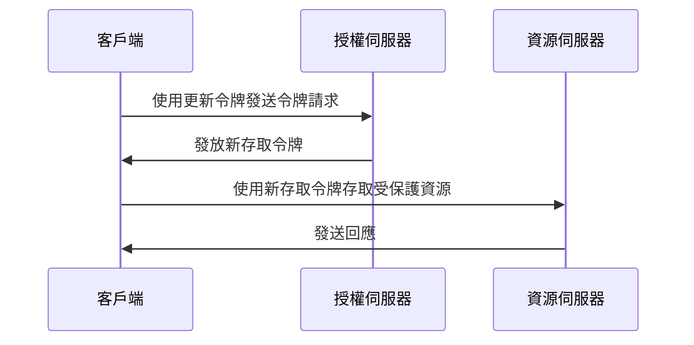

## 什麼是更新令牌 (Refresh token)？

更新令牌 (Refresh token) 是一種長期有效的憑證，通常是隨機字符串，用於在不需要用戶重新進行身份驗證的情況下獲取新的 <Ref slug="access-token">存取令牌 (access tokens)</Ref>。在 OAuth 2.0 和 OpenID Connect (OIDC) 的背景下，<Ref slug="authorization-server">授權伺服器 (authorization servers)</Ref> 可能會在客戶端 (應用程式) 請求 <Ref slug="offline-access" /> 時向客戶端發放更新令牌。

雖然 [OAuth 2.0 RFC](https://datatracker.ietf.org/doc/html/rfc6749#section-1.5) 定義了更新令牌的高級生命週期，但具體實現可能因授權伺服器和客戶端而異。我們將在後續部分中進行探討。

## 更新令牌 (Refresh token) 如何運作？

當客戶端請求 <Ref slug="offline-access" /> 時，通常會與存取令牌 (access token) 一併發出更新令牌 (Refresh token)。行業標準是在 <Ref slug="authorization-request" /> 中包含 `offline_access` 範圍來請求離線存取 (offline access)，而 <Ref slug="openid-connect" /> 正式定義了 `offline_access` 範圍來達成此目的（可用於 <Ref slug="authentication-request" />）。

以下是一個包含 `offline_access` 範圍的授權請求的非標準示例：

```http
GET /authorize?response_type=code
  &client_id=YOUR_CLIENT_ID
  &redirect_uri=https%3A%2F%2Fclient.example.com%2Fcallback
  &scope=openid%20profile%20email%20offline_access
  &state=abc123
  &nonce=123456 HTTP/1.1
```

一旦客戶端收到更新令牌 (Refresh token)，它可以在當前存取令牌過期時使用它來請求新的存取令牌。以下是使用更新令牌的簡化示例：



如序列圖所示，使用更新令牌需要客戶端和授權伺服器兩者的支持：

- 客戶端應該安全地存儲更新令牌並在 <Ref slug="token-request" /> 中使用它來獲取新的存取令牌。
- 當客戶端呈現有效的更新令牌時，授權伺服器應該驗證更新令牌並發放新存取令牌。

更新令牌不應與 <Ref slug="resource-server" /> 共享。資源伺服器應只檢查存取令牌以進行授權。

以下是一個使用更新令牌的令牌請求的非標準示例：

```http
POST /token HTTP/1.1
Host: your-authorization-server.com
Content-Type: application/x-www-form-urlencoded

grant_type=refresh_token
  &refresh_token=YOUR_REFRESH_TOKEN
  &client_id=YOUR_CLIENT_ID
  &client_secret=YOUR_CLIENT_SECRET
  &scope=openid%20profile%20email
```

## 安全考量 ||security-considerations||

由於更新令牌是長期有效的（例如，數天、數週）且可以在不需用戶交互的情況下獲取新的存取令牌，因此相較於短期的存取令牌（例如，數分鐘、數小時），它們帶來更高的安全風險。應仔細考慮和實現更新令牌的使用，以減輕潛在的安全威脅。以下是一些最佳實踐：

### 安全存儲

在客戶端安全地存儲更新令牌以防止未經授權的訪問。此類存儲機制包括：

- **僅 HTTP cookie**：將令牌存儲在僅 HTTP cookie 中以防止客戶端 JavaScript 訪問它們。
- **加密存儲**：在行動裝置上使用安全存儲，如鑰匙串 (iOS) 或 KeyStore (Android)，或在網頁應用上使用加密資料庫。

### 更新令牌輪換 ||refresh-token-rotation||

雖然更新令牌可以是長期有效的，但定期輪換或基於某些條件（例如成功的令牌交換後）進行輪換可以顯著降低未經授權訪問的風險。具體的輪換策略可能根據應用的安全要求和授權伺服器的能力而異。

以下是兩種常見的令牌輪換策略：

- **基於時間的輪換**：每隔一段時間輪換更新令牌（例如，每 7 天）。
- **基於事件的輪換**：在特定事件後輪換更新令牌（例如，成功的令牌交換、密碼更改）。

當更新令牌被輪換時，應該使先前的更新令牌無效以防止重複使用。這些策略通常與會話 TTL（生命週期）結合使用，以確保在一段時間後，無論更新令牌的有效性如何，用戶必須重新身份驗證。

### 發送者限制的更新令牌 ||sender-constrained-refresh-tokens||

發送者限制的更新令牌是為了將更新令牌綁定到請求它的客戶端，如果客戶端不是 <Ref slug="client" headingId="confidential-clients">機密客戶端 (confidential client)</Ref>。常見的方法有 [DPoP](https://datatracker.ietf.org/doc/html/rfc9449) 和 [mTLS](https://datatracker.ietf.org/doc/html/rfc8705)。

### 客戶端類型

將更新令牌的使用限制在 <Ref slug="client" headingId="confidential-clients">機密 (私密) 客戶端 (confidential clients)</Ref> 是個好做法。

- 公共客戶端（例如，單頁應用程式）將源代碼暴露在客戶端，使攻擊者更容易提取和濫用更新令牌。通常，針對公共客戶端會使用更安全的機制，如 <Ref slug="pkce" /> 和更新令牌輪換，如果確實需要使用更新令牌。
- 機密客戶端則運行在安全的伺服器環境中，其中源代碼和環境不會暴露在客戶端。在此類環境下，可以更安全地使用更新令牌。

### 令牌撤銷

由於更新令牌通常是 <Ref slug="opaque-token">不透明的令牌 (opaque tokens)</Ref>（即對客戶端無意義）且必須由授權伺服器驗證，因此授權伺服器可以輕鬆實現令牌撤銷機制，在必要時使更新令牌無效。在用戶登出、帳戶被破壞或令牌被濫用等情況下，這會很有用。

<SeeAlso slugs={["access-token", "id-token", "jwt", "opaque-token"]} />

<Resources urls={[
  "https://blog.logto.io/understanding-refresh-token-rotation",
  "https://blog.logto.io/understanding-tokens-in-oidc",
  {
    url: "https://openid.net/specs/openid-connect-core-1_0.html#OfflineAccess",
    result: {
      ogTitle: "Offline Access in OpenID Connect Core 1.0",
    }
  },
  {
    url: "https://datatracker.ietf.org/doc/html/rfc6749#section-1.5",
    result: {
      ogTitle: "Refresh Token in OAuth 2.0",
      ogDescription: "Refresh tokens are credentials used to obtain access tokens."
    },
  },
]} />
