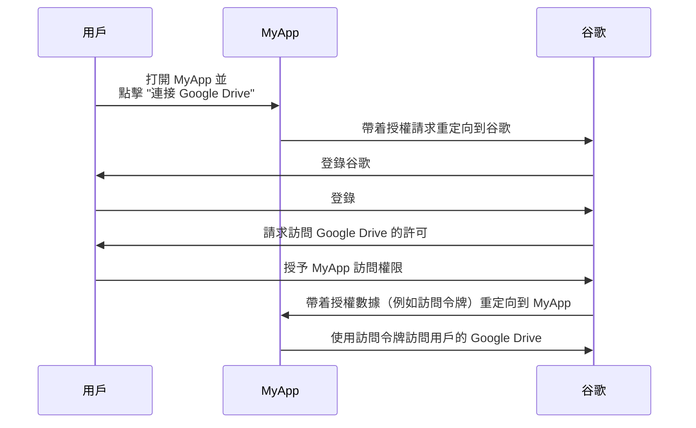

## 什麼是資源擁有者 (Resource owner)？

在 <Ref slug="oauth-2.0" /> 的上下文中，資源擁有者是有能力授予訪問受保護資源（例如數據、檔案或服務）權限的身分（通常是用戶）。

例如，你有一個名為 MyApp 的網絡應用程式，希望訪問用戶的 Google Drive。以下是一個典型的 OAuth 2.0 流程：

在這個流程中，**用戶** 是授予 MyApp 訪問其 Google Drive 權限的 **資源擁有者 (Resource owner)**，而 **MyApp** 是想要訪問受保護資源的 <Ref slug="client" />，而 **谷歌** 則是既作為 <Ref slug="authorization-server" /> 又作為 <Ref slug="resource-server" />。

顧名思義，資源擁有者在 <Ref slug="resource-server" /> 中擁有某些資源，並且可以在 <Ref slug="oauth-2.0" /> 的上下文中授權客戶端代表他們訪問這些資源。

## 為什麼資源擁有者重要？

在 <Ref slug="authorization" /> 過程中，資源擁有者不可忽視，因為他們是明確授予或拒絕訪問其資源的人。資源擁有者的同意在技術和合規方面都是必須的：

- **技術方面**：資源擁有者的同意確保了客戶端有必要的權限來訪問資源。與其提供一刀切的訪問，資源擁有者可以根據客戶端的請求授予部分訪問權限。另一方面，資源擁有者也可以隨時明確撤銷訪問。這種方法為 <Ref slug="access-control" /> 提供了一種清晰且可審計的方法。
- **合規方面**：資源擁有者的同意在許多司法管轄區都是法律要求，特別是在處理敏感數據時。例如，《通用數據保護條例 (GDPR)》要求數據主體（資源擁有者）必須對數據處理活動提供明確的同意。

## 資源擁有者與資源伺服器

<Ref slug="resource-server">資源伺服器</Ref> 負責托管和提供 **受保護的資源**。他們是驗證訪問令牌並將資源提供給客戶端的看門人。

另一方面，資源擁有者可以根據 <Ref slug="access-control" /> 策略對資源伺服器中的受保護資源進行完全或部分控制。

<SeeAlso slugs={["resource-server", "oauth-2.0", "resource-indicator", "access-control"]} />

<Resources
  urls={[
    "https://tools.ietf.org/html/rfc6749",
  ]}
/>