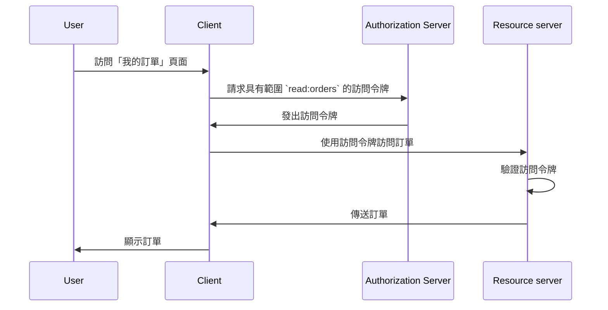

## 什麼是資源伺服器 (Resource server)？

在 <Ref slug="oauth-2.0" /> 的上下文中，**資源伺服器 (Resource server)** 是一個托管 **受保護資源** 的伺服器，客戶端 (<Ref slug="client" />) 想要訪問這些資源。資源伺服器還負責驗證 <Ref slug="access-token" />，並根據 <Ref slug="access-control" /> 政策向客戶端提供受保護的資源。

例如，考慮一個名為 MyApp 的網頁應用程式要訪問用戶的 Google Drive。在這種情況下：

- **MyApp** 是想要訪問受保護資源的客戶端。
- **Google** 是托管用戶 Google Drive 的資源伺服器。
- **Google** 也是向 MyApp 發出訪問令牌 (Access Token) 的 <Ref slug="authorization-server" />。

讓我們再看一個例子，其中一個電子商務網站想要從內部訂單服務訪問用戶的訂單歷史。在這種情況下：

- **電子商務網站** 是想要訪問受保護資源的客戶端。
- **訂單服務** 是托管用戶訂單歷史的資源伺服器。
- 如果電子商務網站整合了一個 OAuth 2.0 服務或 OpenID 提供者，那麼該服務（提供者）就會充當授權伺服器 (Authorization Server)。

## 資源伺服器 (Resource server) 如何運作？

OAuth 2.0 定義了資源伺服器和授權伺服器 (Authorization Server) 的角色，以提供一個明確的關注點分離。然而，它在框架中並未定義資源伺服器的具體表示，將其視為一個托管受保護資源的虛擬概念；<Ref slug="client" /> 需要為其想訪問的受保護資源指定 <Ref slug="scope">範圍</Ref>。

假設客戶端想要從訂單服務訪問用戶的訂單歷史。發送 <Ref slug="token-request" /> 訪問訂單的一個非規範示例可能如下所示：



在上述序列圖中，客戶端從授權伺服器請求具有 `read:orders` 範圍的訪問令牌。我們假設所有各方已經就 `read:orders` 範圍的含義達成一致：它指定客戶端想要執行資源伺服器提供的 `orders` 上的 `read` 操作。然後，客戶端使用訪問令牌從資源伺服器訪問訂單。

> [!Note]
> OAuth 2.0 並未定義範圍的含義和結構，應由客戶端、授權伺服器和資源伺服器協商一致。

資源伺服器負責驗證訪問令牌，並根據 <Ref slug="access-control" /> 政策確定客戶端是否有權訪問所請求的資源。根據實現，訪問令牌可能是 <Ref slug="opaque-token" /> 或 <Ref slug="jwt" />。

## 命名約定

可以根據應用程式的上下文靈活地命名資源伺服器。由於 OAuth 2.0 並未在 <Ref slug="scope" /> 參數中定義資源伺服器的具體表示，因此在業界可以看到多種約定：

- 省略資源伺服器名稱，僅使用行為：例如，`read` 和 `write`。
- `[verb]:[resource]`：一個常見的約定是使用 `verb` 和 `resource` 的組合來指定客戶端可以在資源上執行的操作。例如，`read:orders` 和 `write:profile`。有時，順序會反轉為 `orders:read` 和 `profile:write`。
- `[uri]:[action]`：另一種約定是使用資源的 URI 以及客戶端可以執行的行為。例如，`https://api.example.com/orders:read` 和 `https://api.example.com/profile:write`。

## 資源指示器

讓我們看一下 <Ref slug="authentication-request" />（已解碼）中的範圍參數示例：

```plaintext
openid profile email https://api.example.com/orders:read
```

在此示例中，`scope` 參數包含 <Ref slug="openid-connect" /> 的標準範圍 `openid`、`profile` 和 `email`，以及指定資源伺服器位置和讀取資源許可權的 `https://api.example.com/orders:read` 範圍。

在此特定情況下，它看起來沒問題，但隨著資源和範圍數量的增長，管理和理解範圍可能會變得具有挑戰性。為了解決此問題，OAuth 2.0 引入了一個名為 <Ref slug="resource-indicator">資源指示器</Ref>（RFC 8707）的擴展，允許客戶端使用 URI 指定他們想要訪問的資源，使得資源伺服器在過程中更加明確。

在身份驗證請求中添加資源指示器參數 (`resource=https://api.example.com/orders`) 後，範圍參數可以簡化為：

```plaintext
openid profile email read
```

這樣看起來更清晰，也更易於管理。

> [!Note]
> 並非所有授權伺服器 (OpenID 提供者) 都支持資源指示器擴展。在使用之前，請仔細檢查授權伺服器的文檔。

<SeeAlso slugs={["access-control", "resource-indicator", "resource-owner", "client"]} />

<Resources
  urls={[
    "https://datatracker.ietf.org/doc/html/rfc8707",
  ]}
/>
