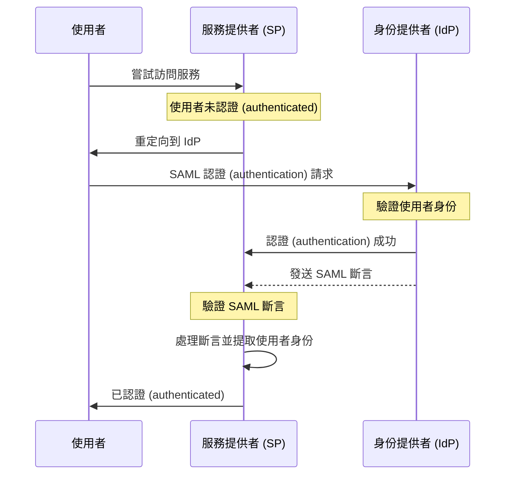

## 什麼是 SAML？

SAML（通常稱為 SAML 2.0）是一種基於 XML 的標準，用於在兩方之間交換認證 (authentication) 和授權 (authorization) 數據：<Ref slug="identity-provider" /> 和 <Ref slug="service-provider" />。它被廣泛用於身份聯合和 <Ref slug="enterprise-sso" /> 解決方案。

如同名稱所示，SAML 傳遞關於使用者身份和屬性的斷言。這些斷言被數位簽名並可選擇加密以確保其完整性和機密性。

## SAML 如何運作？

在深入了解 SAML 認證 (authentication) 流程之前，我們需要了解身份提供者和服務提供者如何識別和信任彼此。這種信任是通過元數據交換建立的，雙方分享以下信息：

- **Entity ID**: 一個用於身份提供者或服務提供者的唯一標識符。
- **Public key**: 用於驗證 SAML 斷言中的數位簽名。
- **Endpoints**: 不同 SAML 操作的 URL，如認證請求和響應。

一旦建立了信任，SAML 認證 (authentication) 流程就可以進行：

### RelayState

在 SAML 流程中，`RelayState` 參數用於在認證 (authentication) 過程中維持使用者的狀態。它作為使用者在重定向到身份提供者前的原始請求的參考。服務提供者可以使用此參數在成功認證 (authentication) 後將使用者重定向回原始頁面或資源。

RelayState 還用於防止 <Ref slug="csrf" /> 攻擊，通過確保使用者在認證 (authentication) 後被重定向回正確的頁面。

### SAML 斷言

SAML 斷言是 SAML 協議的核心組件。它們包含有關使用者身份、屬性和認證 (authentication) 狀態的信息。有三種類型的 SAML 斷言：

- **認證 (Authentication) 斷言**: 表示使用者已由身份提供者認證 (authenticated)。
- **屬性斷言**: 包含關於使用者的其他信息，如角色、權限和個人資料數據。
- **授權決策斷言**: 指定使用者對特定資源的訪問權。

## 採用 SAML 的考慮因素

自 2000 年代初SAML 被廣泛採用於企業環境中。在為你的應用程序採用 SAML 時，這裡有一些關鍵考慮因素：

- 複雜性：與現代框架如 <Ref slug="oauth-2.0" /> 和 <Ref slug="openid-connect" /> 相比，SAML 集成可能會較為複雜。
- 傳輸效率：由於 XML 格式，SAML 消息可能較大，這可能影響網絡性能。
- 安全性：SAML 斷言必須防止篡改和竊聽。確保你的 SAML 實現遵循最佳加密和數位簽名做法。

儘管有這些考慮因素，SAML 仍然是一個強大且被廣泛使用的標準，用於企業環境中的安全身份聯合和單一登入解決方案。然而，對於新的應用程序或服務，你可能想考慮像 OAuth 2.0 和 OpenID Connect 這樣的現代替代方案，以獲得更輕量級和開發者友好的認證 (authentication) 和授權 (authorization) 方法。

<SeeAlso slugs={["enterprise-sso", "oauth-2.0", "openid-connect"]} />

<Resources
  urls={[
    "https://blog.logto.io/saml-security-cheat-sheet",
    "https://blog.logto.io/picking-your-sso-method",
    "https://blog.logto.io/differences-between-saml-and-oidc",
  ]}
/>
