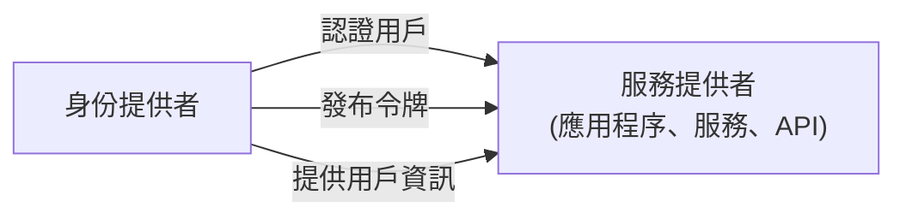

## 什麼是服務提供者 (Service provider, SP)？

在 <Ref slug="iam" /> 的領域中，服務提供者 (SP)（或者在 <Ref slug="openid-connect" /> 的上下文中稱為**信賴方**）是一個依賴 <Ref slug="identity-provider" /> 進行認證 (Authentication) 和授權的應用程序或服務。它負責向用戶提供服務，並根據身份提供者發布的令牌執行 <Ref slug="access-control" /> 策略。

## 服務提供者標準

對於服務提供者來說，沒有嚴格的標準，因為它們可以是任何需要身份管理的應用程序或服務。然而，服務提供者通常遵循其所依賴的身份提供者設置的標準。例如，如果身份提供者支持 <Ref slug="openid-connect" />，則服務提供者通常會使用 OIDC 進行認證 (Authentication) 和授權。

## 服務提供者架構

"服務提供者"這個術語並不特指某種架構或實現。通常，服務提供者需要向身份提供者註冊以建立信任並啟用安全通信。註冊過程通常涉及交換元數據和客戶端憑證。

例如，在 OpenID Connect 的上下文中，服務提供者的元數據通常包括：

- **Client ID**：服務提供者的唯一標識符。
- **Client secret**：用來認證 (Authentication) 服務提供者的共享密鑰。
- **<Ref slug="redirect-uri">重定向 URI</Ref>**：身份提供者在認證 (Authentication) 和授權後將用戶重定向回的 URI。

一旦註冊，服務提供者可以通過將用戶重定向到身份提供者的指定端點來啟動認證 (Authentication) 過程。

當服務提供者是為非交互性使用情境構建時，它們通常被稱為需要 <Ref slug="machine-to-machine" /> 通訊的 <Ref slug="client">客戶端</Ref>。

<SeeAlso slugs={["identity-provider", "openid-connect", "oauth-2.0"]} />

<Resources
  urls={[
    "https://blog.logto.io/secure-cloud-apps-with-oauth-and-openid-connect",
    "https://blog.logto.io/incorporate-identity-solution",
    "https://blog.logto.io/centralized-identity-system"
  ]}
/>
