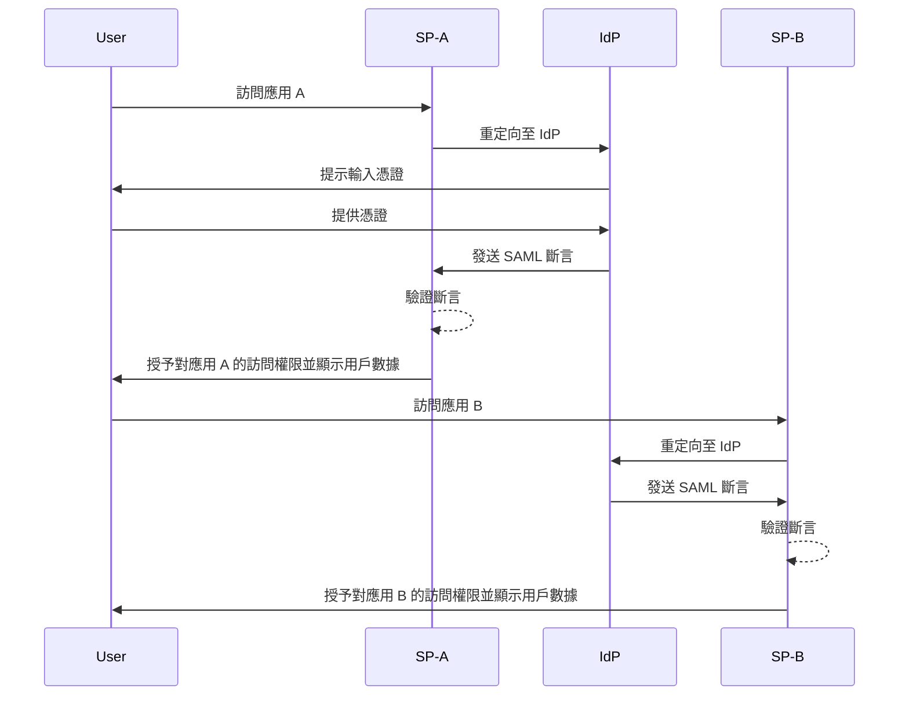
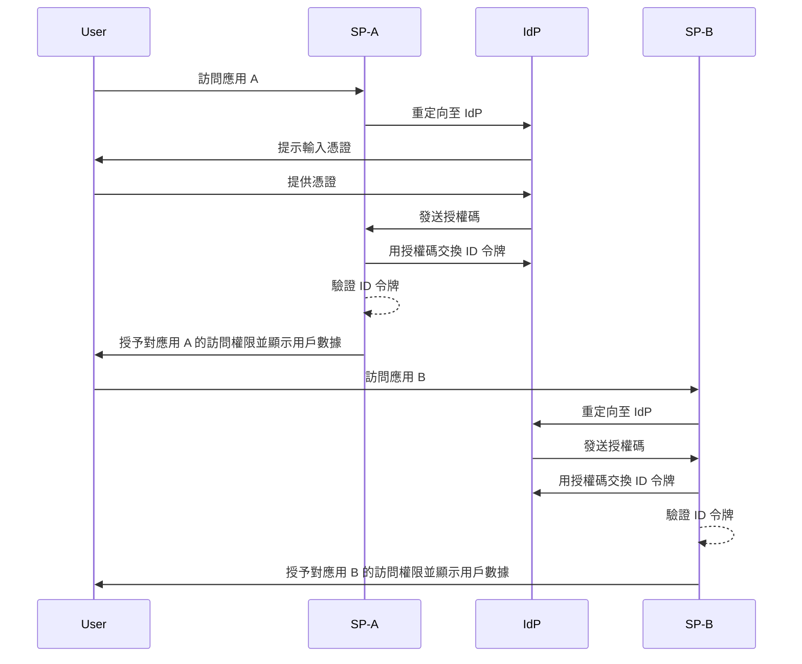

## 什麼是單一登入 (Single sign-on, SSO)？

單一登入 (Single sign-on, SSO) 是一種認證 (Authentication) 方法，允許用戶使用一組憑證訪問多個應用或服務。用戶不需要為每個系統單獨管理登入，而是可以一次認證後，自動登入所有連接的平台。

SSO 在個人和商業環境中廣泛使用，特別是在企業環境中，員工或遠程工作者依賴於各種 SaaS 應用來完成工作。通過實施 SSO，組織可以增強安全性、簡化訪問管理並提高用戶生產力。

一個眾所周知的 SSO 例子是 Google 的服務套件，如 Gmail、Google Drive 和 Google Calendar。用戶登入他們的 Google 帳戶後，可以輕鬆訪問所有這些服務，而無需重新輸入憑證。

## 單一登入如何運作？

SSO 運作於應用或服務（稱為<Ref slug="service-provider" />）與<Ref slug="identity-provider" />之間的信任關係。IdP 處理用戶認證，並安全地與 SP 共享授予訪問所需的信息。這種信任是通過一個稱為聯邦身份驗證的流程來建立的，在這裡 SP 和 IdP 同意遵循特定標準和協議，以安全交換認證數據。

當用戶嘗試訪問已啟用 SSO 的應用時，SP 會將用戶重定向至 IdP 進行認證。IdP 要求用戶提供憑證，驗證其身份，並生成一個包含用戶信息的安全令牌或斷言。該令牌被傳回至 SP，SP 隨後使用它來授予訪問權限。

如果用戶嘗試訪問另一個啟用 SSO 的應用，該流程會自動重複，無需用戶再次登入。IdP 直接向 SP 發送所需的認證數據，允許用戶無縫訪問新應用。

SAML (Security Assertion Markup Language) 和 OIDC (OpenID Connect) 是兩個廣泛使用的協議來實施 SSO。這些標準定義了認證數據如何在 IsP 和 SP 之間交換，確保安全和可靠的通信。

### 基於 SAML 的 SSO

在基於 SAML 的 SSO 中，一旦用戶被 IdP 認證，將生成一個基於 XML 的 SAML 斷言，經簽署後安全地發送至 SP。SP 隨後驗證斷言並根據用戶的身份授予訪問。

### 基於 OIDC 的 SSO

相較之下，OIDC 構建於 OAuth 2.0 之上，提供了一種更現代化的 SSO 方法。它使用 JSON Web Tokens (JWT) 在 IdP 和 SP 之間交換身份信息，提供了增強的安全性和更大的靈活性。

## 單一登入的優勢

1. **增強安全性**：SSO 通過減少用戶需要記憶的憑證數量來降低與密碼相關的安全漏洞風險。它還允許組織實施更強的認證方法，如多因素認證 (MFA)，以保護用戶帳戶。

2. **改進的用戶體驗**：用戶可以無縫訪問多個應用，而無需重複登入，提高了生產力並減少了挫折感。SSO 簡化了登入過程並在不同平台提供了一致的用戶體驗。

3. **集中管理訪問**：組織可以通過 IdP 集中管理用戶訪問和權限，確保所有連接應用的安全策略和訪問控制的一致性。這簡化了用戶的供應、取消供應和審計過程。

## 何時使用單一登入

1. **企業和組織環境**：SSO 對於依賴多個應用和服務以簡化工作流程的企業特別有利。它簡化了用戶訪問，減少了 IT 團隊管理個別用戶帳戶的負擔。例如，使用多個 SaaS 應用的公司，如 CRM、HR 和協作工具。
2. **面向客戶的應用**：SSO 還可以提高用戶訪問在線服務或電子商務平台的體驗。例如，允許用戶使用其社交媒體帳戶或電子郵件地址登入，而不是為每個服務創建新帳戶。
3. **多產品服務**：提供一套互聯產品或服務的公司可以利用 SSO 在其產品中提供無縫的用戶體驗。用戶可以在不同應用之間切換，而無需重複登入的麻煩。例如，Google 的 G Suite。用戶可以在其 Chrome 瀏覽器上登入一次，然後無需重新輸入憑證即可訪問多個 Google 服務。

SSO 的使用不僅限於這些情境，並可以根據組織或應用的特定需求適應各種用例。它被廣泛認為是在現代數位環境中增強安全性、用戶體驗和運營效率的最佳實踐。

<SeeAlso slugs={['enterprise-sso']} />