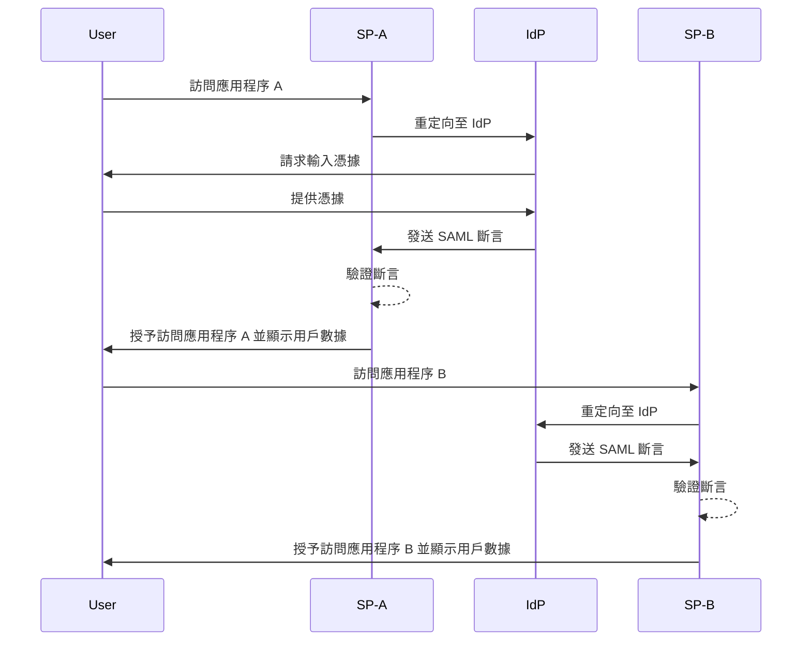
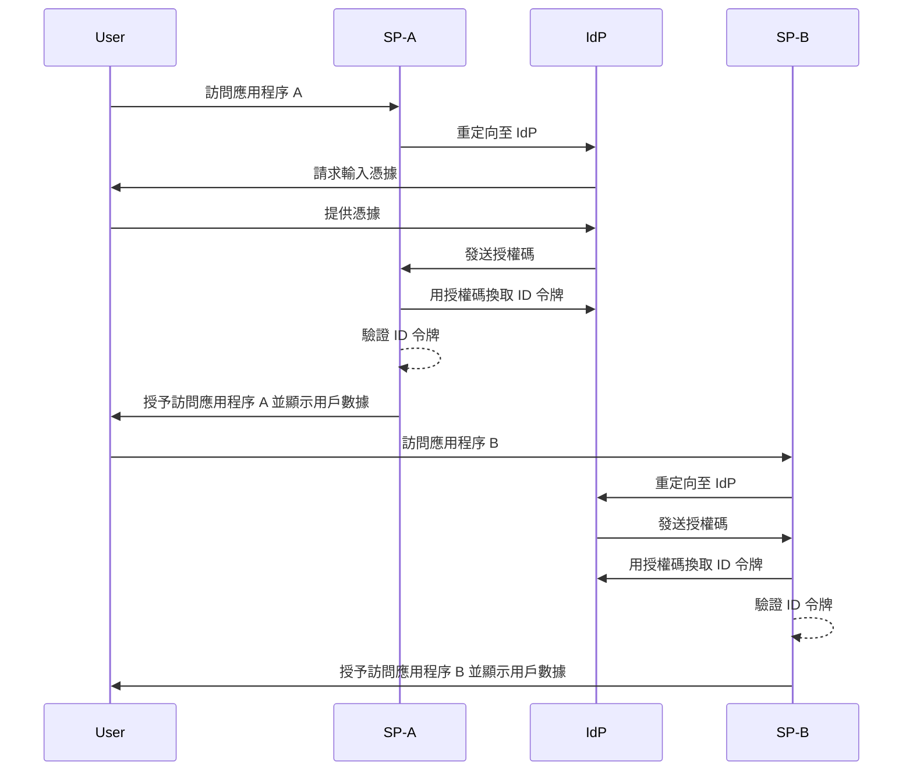

## 什麼是單一登入 (Single sign-on, SSO)？

單一登入 (Single sign-on, SSO) 是一種允許用戶使用一組憑據訪問多個應用程序或服務的<Ref slug="authentication" />方法。用戶只需一次驗證，就可以自動登入所有連接的平台，而無需為每個系統管理單獨的登入。

SSO 在個人和商業環境中都很常見，特別是在企業環境中，員工或遠程工作者依賴各種 SaaS 應用來完成工作。通過實施 SSO，組織可以增強安全性、簡化訪問管理並提高用戶生產力。

一個眾所周知的 SSO 例子是 Google 的服務套件，如 Gmail、Google Drive 和 Google Calendar。用戶登入 Google 帳戶後，可以輕鬆訪問所有這些服務，而無需重新輸入憑據。

## 單一登入如何運作？

SSO 在一個應用或服務（稱為<Ref slug="service-provider" />）與<Ref slug="identity-provider" />之間的信任關係上運作。IdP 負責用戶驗證並將必要的信息安全地共享給 SP 以授予訪問權限。這種信任通過稱為聯盟的過程建立，SP 和 IdP 皆同意遵循特定標準和協議以安全地交換驗證數據。

當用戶嘗試訪問啟用了 SSO 的應用程序時，SP 將他們重定向到 IdP 進行驗證。IdP 提示用戶輸入憑據，驗證他們的身份，並生成包含用戶信息的安全令牌或斷言。此令牌被發送回 SP，而 SP 則使用它授予訪問權限。

如果用戶嘗試訪問另一個啟用 SSO 的應用程序，此過程將自動重複，而無需再次登錄。IdP 直接將所需的驗證數據發送給 SP，允許用戶無縫訪問新應用程序。

<Ref slug="saml" />和<Ref slug="openid-connect" />是兩種廣泛使用的實現 SSO 的協議。這些標準定義了如何在 IsP 和 SP 之間交換驗證數據，確保安全可靠的通信。

### 基於 SAML 的 SSO

在基於 SAML 的 SSO 中，一旦用戶被 IdP 驗證，將生成一個基於 XML 的 SAML 斷言，被簽名並安全地發送給 SP。然後，SP 驗證該斷言並根據用戶的身份授予訪問權限。

### 基於 OIDC 的 SSO

相比之下，OIDC 構建於<Ref slug="oauth-2.0" />之上，提供了一種現代化的 SSO 方法。它使用<Ref slug="jwt" />在 IdP 和 SP 之間交換身份信息，提供增強的安全性和更大的靈活性。

## 單一登入的好處

1. **增強的安全性**：SSO 通過減少用戶需要記住的憑據數量來降低與密碼相關的安全風險。它還允許組織實施更強的驗證方法，例如<Ref slug="mfa" />，以保護用戶帳戶。

2. **提升的用戶體驗**：用戶可以無縫訪問多個應用程序而無需重複登錄，提高了生產力並減少了挫折感。SSO 簡化了登錄過程，並在不同平台間提供一致的用戶體驗。

3. **集中的訪問管理**：組織可以通過 IdP 集中管理用戶訪問和權限，確保在所有連接的應用程序中執行一致的安全策略和存取控制。這簡化了用戶的配置、解除配置和審計過程。

## 什麼時候使用單一登入

1. **企業和組織環境**：SSO 對於依賴多個應用程序和服務以精簡工作流程的企業特別有利。它簡化了用戶訪問，減輕了 IT 團隊管理單個用戶帳戶的負擔。例如，使用多個 SaaS 應用程序的公司，如 CRM、HR 和協作工具。
2. **面向客戶的應用程序**：SSO 還可以提升客戶訪問在線服務或電子商務平台的用戶體驗。例如，允許用戶使用其社交媒體帳戶或電子郵件地址登入，而不是為每個服務創建新帳戶。
3. **多產品服務**：提供一套互聯產品或服務的公司可以利用 SSO 在其產品中提供無縫的用戶體驗。用戶可以在不同應用程序間導航，而無需重複登錄。例如，Google 的 G Suite。用戶可以在其 Chrome 瀏覽器上登錄一次，然後訪問多個 Google 服務而無需重新輸入憑據。

SSO 的使用不僅限於這些場景，可以根據組織或應用的具體需求適應於多種用例。它被廣泛認為是增強安全性、用戶體驗和現代數字環境中的運營效率的最佳實踐之一。

<SeeAlso slugs={["enterprise-sso"]} />