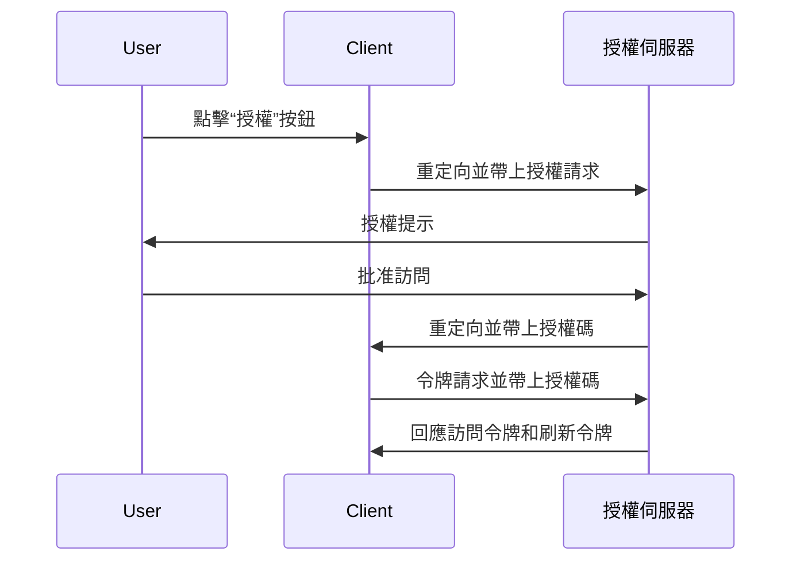
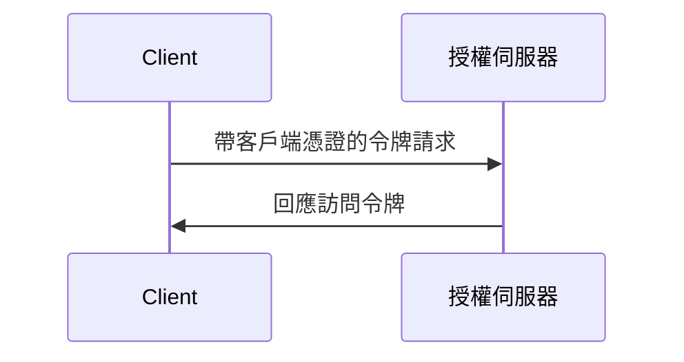

## 什麼是令牌請求 (Token request)？

在 <Ref slug="oauth-2.0" /> 和 <Ref slug="openid-connect" /> 中，令牌請求 (Token request) 是向 <Ref slug="authorization-server" />（或在 OIDC 中的 <Ref slug="openid-connect" headingId="openid-provider-op" />）提出的請求，以憑證交換（例如，授權碼、刷新令牌）來獲取一組令牌。該令牌集通常包括以下一個或多個：

- <Ref slug="access-token" />：賦予訪問受保護資源的令牌。
- <Ref slug="id-token" />：包含用戶信息的令牌（特定於 OIDC）。
- <Ref slug="refresh-token" />：可用於在不進行用戶交互的情況下獲取新訪問令牌的令牌。

根據所使用的 <Ref slug="oauth-2.0-grant">授權類型 (grant type)</Ref>，請求可能包含不同的參數並返回不同的令牌。

例如，在 <Ref slug="client-credentials-flow" /> 中，<Ref slug="client" /> 直接使用客戶端憑證請求訪問令牌 (access token)。以下是一個非規範性的令牌請求示例：

```http
POST /token HTTP/1.1
Host: authorization-server.example.com
Content-Type: application/x-www-form-urlencoded

grant_type=client_credentials
  &client_id=client-id
  &client_secret=client-secret
  &scope=read
```

如果請求成功，授權伺服器將回應一個訪問令牌：

```http
HTTP/1.1 200 OK
Content-Type: application/json

{
  "access_token": "eyJhbGci...zHg",
  "token_type": "Bearer",
  "expires_in": 3600,
  "scope": "read"
}
```

## 令牌請求 (Token request) 如何運作？

如上述示例所示，令牌請求本身很簡單。客戶端向授權伺服器的令牌端點發送一個 HTTP 請求並附上必要的參數。授權伺服器驗證、處理請求，並在回應中返回令牌。

然而，根據使用的特定授權類型 (flow)，令牌請求可能需要更多的準備。

### 授權碼流程 (Authorization code flow)

在 <Ref slug="authorization-code-flow" /> 中，客戶端首先通過在授權伺服器發起 <Ref slug="authorization-request" />（或在 OIDC 中的 <Ref slug="authentication-request" />）來獲取授權碼。當用戶授予權限後，客戶端通過令牌請求交換授權碼以獲取訪問令牌，並可選擇獲取刷新令牌。

以下是授權碼流程的簡化序列圖：



### 客戶端憑證流程 (Client credentials flow)

如第一部分的示例所示，<Ref slug="client-credentials-flow" /> 更加簡單。客戶端直接使用其客戶端憑證請求訪問令牌。授權伺服器驗證客戶端憑證，並在成功後發出訪問令牌。

以下是客戶端憑證流程的非規範性序列圖：



### 刷新令牌

在某些授權類型中，客戶端還可以通過在授權請求中包含 `offline_access` scope 來請求 <Ref slug="offline-access" />。如果授權，授權伺服器將隨訪問令牌一同發出刷新令牌。客戶端可以使用刷新令牌通過令牌請求獲取新訪問令牌，而無需用戶交互。

以下是使用刷新令牌獲取新訪問令牌的非規範性示例：

```http
POST /token HTTP/1.1
Host: authorization-server.example.com
Content-Type: application/x-www-form-urlencoded

grant_type=refresh_token
  &refresh_token=refresh-token
  &client_id=client-id
  &client_secret=client-secret
```

---

其他 <Ref slug="oauth-2.0-grant">授權類型 (grant types)</Ref> 也可能涉及令牌請求，但基本道理相同。

## 令牌請求中的關鍵參數

以下是令牌請求中常用的一些關鍵參數：

- **`grant_type`**：所請求的授權類型。常見的值包括 `authorization_code`、`client_credentials`、`refresh_token` 等。
- **`client_id`**：授權伺服器發出的客戶端識別碼。
- **`client_secret`**：授權伺服器發出的客戶端密鑰（適用於保密客戶端）。
- **`code`**：從授權伺服器獲得的授權碼（適用於授權碼流程）。
- **`refresh_token`**：從授權伺服器獲得的刷新令牌（用於刷新訪問令牌）。
- **`scope`**：所請求的 <Ref slug="scope">範圍 (scopes)</Ref>（訪問令牌的權限）。
- **`redirect_uri`**：授權伺服器發送回應的 URI（適用於授權碼流程）。
- **`code_verifier`**：在 <Ref slug="pkce" /> 擴展中使用的代碼驗證器（適用於授權碼流程）。

實際的參數及其值取決於授權類型和應用程序的具體要求。在進行令牌請求之前，你應該參考你所使用的特定授權類型的完整參數列表。

<SeeAlso slugs={["oauth-2.0", "openid-connect", "authorization-request", "authentication-request"]} />