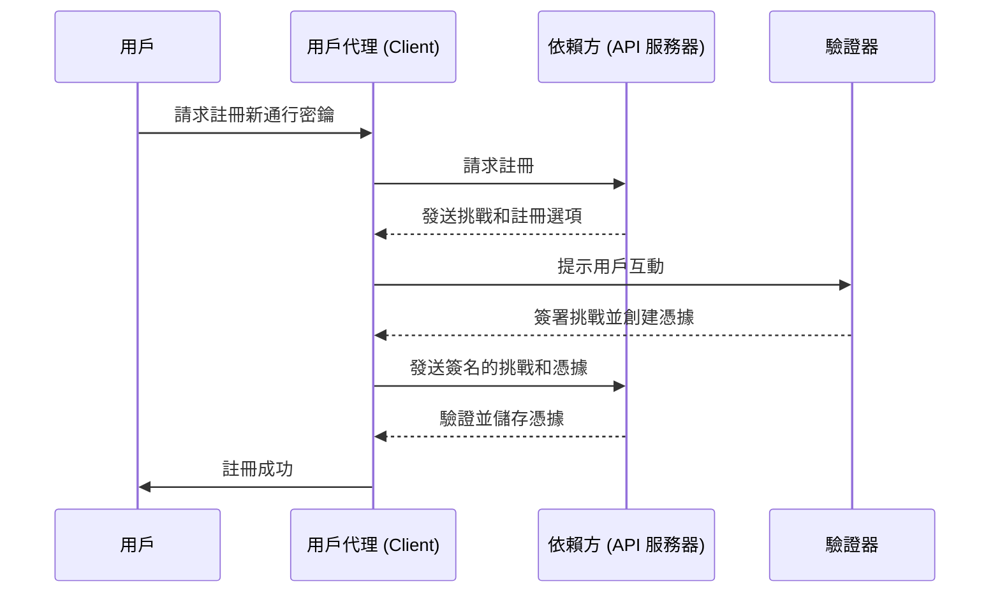
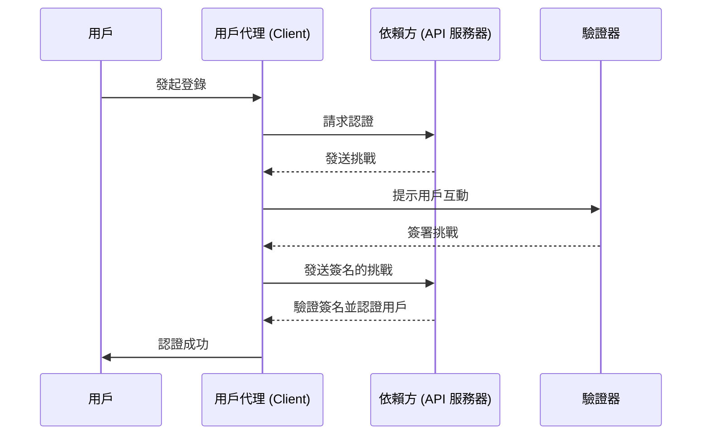

## 什麼是 WebAuthn？

WebAuthn (Web Authentication API)，由 [W3C](https://www.w3.org/) 和 [FIDO Alliance](https://fidoalliance.org/) 開發，是一套使用 FIDO2 標準的安全網頁認證規範。WebAuthn 提供了 API，允許網站實施<Ref slug="passkey" />，這些是透過公鑰加密技術保護的釣魚防禦憑據。通行密鑰 (passkeys) 可以替代密碼以進行無密碼登錄和多因子認證 (MFA)。

## WebAuthn 工作流程是什麼樣的？

為了提供更詳細的解釋，我們可以將過程分為兩個階段：註冊和認證。首先，理解 WebAuthn 流程中涉及的四個關鍵實體是很重要的。

### 4 個關鍵實體

1. **用戶：** 嘗試訪問網頁應用的個人。
2. **用戶代理：** 處理 WebAuthn API 調用並管理用戶、依賴方和驗證器之間認證過程的網頁瀏覽器。
3. **依賴方：** 用戶試圖訪問的服務、應用程序或 API 服務器。
4. **驗證器：** 用於驗證用戶身份的硬件或軟件組件。它可以根據平台或瀏覽器功能採用多種形式，例如安全密鑰（如 Yubikey）、通過 Bluetooth、NFC 或 USB 連接的手機或平板電腦、基於設備的生物識別或 PIN 等。

### WebAuthn 註冊

非對稱公鑰加密是核心過程。

1. **密鑰對生成：** 
用戶代理生成公私鑰對。
   - **公鑰：** 與依賴方共享。
   - **私鑰：** 安全地存儲在用戶的驗證器中。
2. **註冊挑戰：** 
當用戶嘗試註冊通行密鑰 (passkey) 並發起註冊過程時，依賴方會發送一個註冊挑戰給用戶代理。
3. **用戶驗證：** 
用戶代理將挑戰轉發給驗證器，驗證器提示用戶進行驗證（例如，生物識別認證或硬件安全密鑰）。
4. **密碼學簽名：** 
驗證器使用其私鑰對挑戰進行簽名，創建一個密碼學簽名。
5. **驗證和訪問：** 
用戶代理將簽名的挑戰發送回依賴方，依賴方使用公鑰驗證簽名並完成註冊過程。



### WebAuthn 認證

1. **認證挑戰：** 
當用戶嘗試登錄時，依賴方向用戶代理發送認證挑戰。
2. **用戶驗證：** 
用戶代理將挑戰發送給驗證器，驗證器提示用戶進行驗證（例如，生物識別認證或硬件安全密鑰）。
3. **密碼學簽名：** 
驗證器使用其私鑰對挑戰進行簽名，創建一個密碼學簽名。
4. **驗證和訪問：** 
用戶代理使用公鑰驗證簽名並通知依賴方認證成功。如果驗證成功，就授予訪問權限。



## 如何使用 WebAuthn？

WebAuthn API 可用於實施通行密鑰 (passkey) 登錄或兩步驗證。參考通行密鑰體驗以獲取更多詳情。

要使用 Web Authentication API (WebAuthn) 進行安全認證，您需要處理兩個主要過程：註冊和認證。以下是如何使用 JavaScript 實現這些過程的簡單代碼示例。

**註冊**

依賴方（您的網頁應用程序）通過調用 `navigator.credentials.create()` 方法啟動註冊過程。

```jsx
// 註冊
navigator.credentials.create({
  publicKey: {
    rp: {
      name: "您的依賴方名稱",
      id: "您的依賴方 ID"
    },
    user: {
      id: "用戶 ID",
      displayName: "用戶名稱",
      name: "用戶名稱"
    },
    challenge: "您的挑戰值",
    timeout: 60000 // 60 秒
  }
}).then(credential => {
  // 存儲憑證的 id 以供未來認證使用
  localStorage.setItem("credentialId", credential.id);
}).catch(error => {
  console.error("註冊錯誤:", error);
});
```

依賴方通過調用 `navigator.credentials.get()` 方法啟動認證過程。

```jsx
// 認證
navigator.credentials.get({
  publicKey: {
    rp: {
      name: "您的依賴方名稱",
      id: "您的依賴方 ID"
    },
    challenge: "您的挑戰值",
    timeout: 60000 // 60 秒
  }
}).then(credential => {
  // 驗證憑證的 id 和其他屬性
  if (credential.id === localStorage.getItem("credentialId")) {
    // 認證成功
    console.log("用戶成功認證");
  } else {
    console.error("無效的憑證");
  }
}).catch(error => {
  console.error("認證錯誤:", error);
});
```

要了解更多詳情，請閱讀規範：https://fidoalliance.org/specifications/download/。

注意：在 WebAuthn 操作中，無論是註冊還是認證，“rp ID” （依賴方 ID）是一個必填字段。它代表當前網頁的域名主機名。如果它與當前域不匹配，瀏覽器將拒絕請求。這意味著通行密鑰 (passkeys) 與特定域綁定，現在還沒有辦法將現有的通行密鑰 (passkeys) 遷移到不同域。此外，通行密鑰 (passkeys) 不能跨不同域使用。

## WebAuthn 和 CTAP2 有何不同？

**WebAuthn** 和 **CTAP2** 都是 FIDO2 標準的重要組成部分，但它們具有不同的用途：

- **CTAP2 (Client to Authenticator Protocol 2)：** 此協議定義了設備（如安全密鑰或智能手機）如何與網頁應用程序通信。它在 **驗證器** 和 **用戶設備** 之間建立了一個安全通道，確保敏感的認證數據受到保護。
- **WebAuthn (Web Authentication API)：** 此 API 提供了一種標準化的方法，使網頁應用程序可以與符合 CTAP2 的驗證器互動。它處理整個認證過程，包括 **用戶設備** 和 **依賴方** 之間的認證數據交換。

## 需知的術語

- <Ref slug="passkey" />
- FIDO
- FIDO2
- CTAP2
- MFA
- 驗證器

<Resources
  urls={[
    "https://fidoalliance.org/specs/fido-v2.0-id-20180227/fido-client-to-authenticator-protocol-v2.0-id-20180227.html",
    "https://blog.logto.io/webauthn-nextjs",
    "https://blog.logto.io/webauthn-base-knowledge"
  ]}
/>