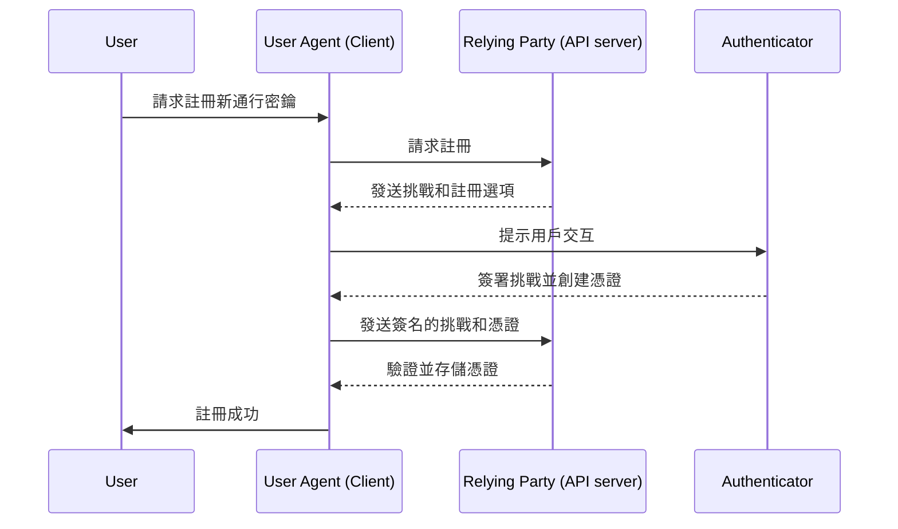
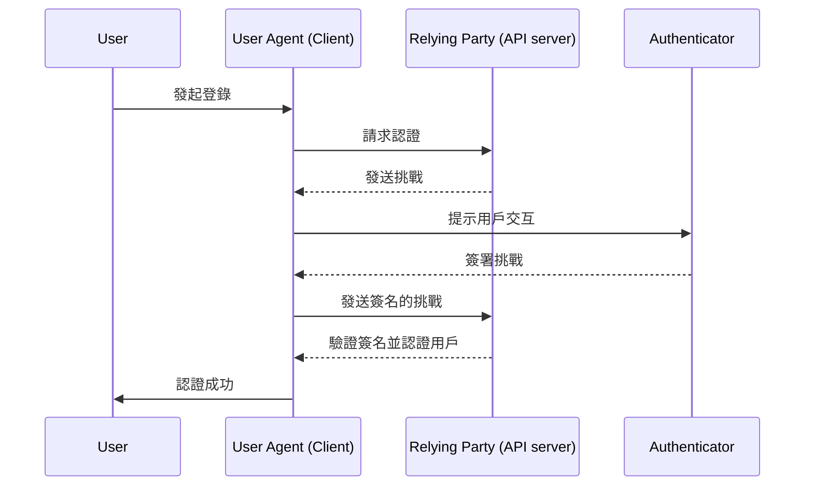

## 什麼是 WebAuthn？

WebAuthn（Web Authentication API），由 [W3C](https://www.w3.org/) 和 [FIDO Alliance](https://fidoalliance.org/) 開發，是一個使用 FIDO2 標準進行安全網絡認證的規範。WebAuthn 提供了一個 API，允許網站實現 <Ref slug="passkey" />，這些是由公鑰加密保護的防釣魚憑證。通行密鑰可以替代密碼，用於無密碼登錄和 <Ref slug="mfa" />。

## WebAuthn 的工作流程是什麼樣的？

這裡有一個現實世界的例子來更好地理解。你有一個名為 MyApp 的網絡應用程序，想要整合 WebAuthn API 來實現多因素認證的通行密鑰。

**註冊階段：** 在通過電子郵件驗證並設置新密碼後，系統提示用戶創建一個通行密鑰。他們選擇使用指紋來連接他們的設備。這在他們的設備上安全地建立了通行密鑰。

**認證階段：** 在下次登錄時，用戶在輸入密碼後被要求驗證他們的通行密鑰。只需快速掃描指紋，他們就可以輕鬆完成認證過程。


為了提供更詳細的解釋，我們可以將過程分為兩個階段：註冊和認證。首先，了解 WebAuthn 流程中涉及的四個關鍵實體是至關重要的。

### 4 個關鍵實體

1. **用戶：** 試圖訪問網絡應用程序的個人。
2. **用戶代理：** 處理 WebAuthn API 調用的網絡瀏覽器，並管理用戶、依賴方和認證器之間的認證過程。
3. **依賴方：** 用戶試圖訪問的服務、應用程序或 API 服務器。
4. **認證器：** 用於驗證用戶身份的硬件或軟件組件。它可以根據平台或瀏覽器的能力採取多種形式，例如安全密鑰（如 Yubikeys）、通過藍牙、NFC 或 USB 連接的手機或平板電腦、基於設備的生物識別或 PIN 等。

### WebAuthn 註冊

非對稱公鑰加密是核心過程。

1. **密鑰對生成：** 
用戶代理生成一對公鑰和私鑰。
   - **公鑰：** 與依賴方共享。
   - **私鑰：** 安全地存儲在用戶的認證器中。
2. **註冊挑戰：** 
當用戶嘗試註冊通行密鑰時，依賴方向用戶代理發送註冊挑戰。
3. **用戶驗證：** 
用戶代理將挑戰轉發給認證器，認證器提示用戶進行驗證（例如，生物識別認證或硬件安全密鑰）。
4. **加密簽名：** 
認證器使用其私鑰對挑戰進行簽名，創建加密簽名。
5. **驗證和訪問：** 
用戶代理將簽名的挑戰發送回依賴方，依賴方使用公鑰驗證簽名並完成註冊過程。



### WebAuthn 認證

1. **認證挑戰：**
當用戶嘗試登錄時，依賴方向用戶代理發送認證挑戰。
2. **用戶驗證：**
用戶代理將挑戰發送給認證器，認證器提示用戶進行驗證（例如，生物識別認證或硬件安全密鑰）。
3. **加密簽名：**
認證器使用其私鑰對挑戰進行簽名，創建加密簽名。
4. **驗證和訪問：**
用戶代理使用公鑰驗證簽名並通知依賴方認證成功。如果驗證成功，則授予訪問權限。



## 如何使用 WebAuthn？

WebAuthn API 可用於實現通行密鑰登錄或兩步驗證。參考通行密鑰體驗以了解更多詳情。

要使用 Web Authentication API（WebAuthn）進行安全認證，你需要處理兩個主要過程：註冊和認證。以下是如何使用 JavaScript 實現這些過程的簡單代碼示例。

**註冊**

依賴方（你的網絡應用程序）通過調用 `navigator.credentials.create()` 方法啟動註冊過程。

```jsx
// 註冊
navigator.credentials.create({
  publicKey: {
    rp: {
      name: "Your Relying Party Name",
      id: "your-relying-party-id"
    },
    user: {
      id: "user-id",
      displayName: "User Name",
      name: "User Name"
    },
    challenge: "your-challenge-value",
    timeout: 60000 // 60 秒
  }
}).then(credential => {
  // 存儲憑證的 id 以便未來認證
  localStorage.setItem("credentialId", credential.id);
}).catch(error => {
  console.error("註冊錯誤:", error);
});
```

依賴方通過調用 `navigator.credentials.get()` 方法啟動認證過程。

```jsx
// 認證
navigator.credentials.get({
  publicKey: {
    rp: {
      name: "Your Relying Party Name",
      id: "your-relying-party-id"
    },
    challenge: "your-challenge-value",
    timeout: 60000 // 60 秒
  }
}).then(credential => {
  // 驗證憑證的 id 和其他屬性
  if (credential.id === localStorage.getItem("credentialId")) {
    // 認證成功
    console.log("用戶認證成功");
  } else {
    console.error("無效的憑證");
  }
}).catch(error => {
  console.error("認證錯誤:", error);
});
```

要了解詳情，請閱讀規範：https://fidoalliance.org/specifications/download/。

注意：在 WebAuthn 操作中，無論是註冊還是認證，“rp ID”（依賴方 ID）都是必填字段。它代表當前網頁的域名主機名。如果它與當前域不匹配，瀏覽器將拒絕請求。這意味著通行密鑰與特定域綁定，目前無法將現有通行密鑰遷移到不同域。此外，通行密鑰不能跨不同域使用。

## WebAuth 和 OpenID Connect (OIDC)

通過結合 WebAuthn 的強大安全性和 OIDC 的標準化身份協議，我們可以創建更安全且用戶友好的認證體驗。

了解其工作原理：

- **註冊階段：** 用戶完成標準的 <Ref slug="openid-connect" /> 註冊過程（例如，電子郵件驗證和密碼創建）。WebAuthn 生成一對公私鑰，將公鑰存儲在 OIDC <Ref slug="identity-provider" /> 中，並將私鑰保存在用戶的設備上。
- **認證階段：** 用戶訪問受 OIDC 保護的資源並被重定向到登錄頁面。在提供基本憑證（例如，電子郵件和密碼）後，系統調用 WebAuthn 進行通行密鑰認證。一旦通行密鑰驗證通過，OIDC 發行訪問令牌或 ID 令牌以供用戶訪問。

## WebAuthn 和 CTAP2 有什麼區別？

**WebAuthn** 和 **CTAP2** 都是 FIDO2 標準的重要組成部分，但它們的用途不同：

- **CTAP2（Client to Authenticator Protocol 2）：** 此協議定義了設備（如安全密鑰或智能手機）如何與網絡應用程序通信。它在 **認證器** 和 **用戶設備** 之間建立了一個安全通道，確保敏感的認證數據受到保護。
- **WebAuthn（Web Authentication API）：** 此 API 提供了一種標準化的方法，讓網絡應用程序與符合 CTAP2 的認證器交互。它處理認證過程，包括 **用戶設備** 和 **依賴方** 之間的認證數據交換。

<SeeAlso slugs={["passkey", "mfa", "openid-connect"]} />

<Resources
  urls={[
    "https://fidoalliance.org/specs/fido-v2.0-id-20180227/fido-client-to-authenticator-protocol-v2.0-id-20180227.html",
    "https://blog.logto.io/webauthn-nextjs",
    "https://blog.logto.io/webauthn-base-knowledge"
  ]}
/>