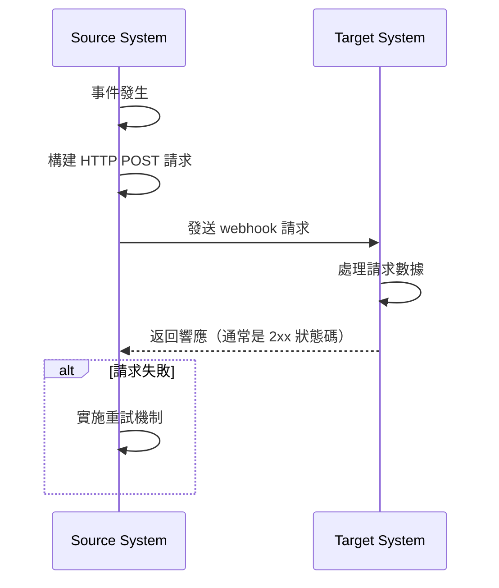
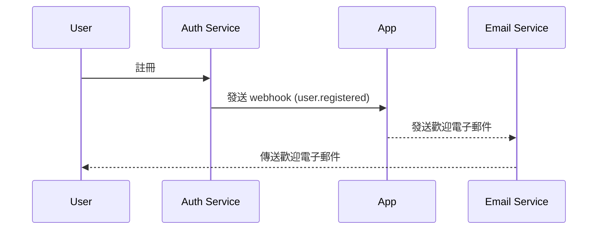

## 什麼是 webhook？

Webhook 是一種 HTTP 回調機制，允許應用程式在特定事件發生時向預定義的 URL 發送即時通知。這種機制使系統之間的自動化數據交換和即時通信成為可能。

## Webhook 如何運作？



1. 在來源系統中發生特定事件
2. 來源系統構建包含事件數據的 HTTP POST 請求
3. 來源系統將請求發送到預配置的目標系統 URL
4. 目標系統接收請求並處理數據
5. 目標系統向來源系統返回響應
6. 如果請求失敗，來源系統可能會實施重試機制

## Webhook 在現實場景中如何運作？

讓我們以一個與 auth (身份驗證) 服務集成的應用程式為例。當一個新用戶註冊時，應用程式會向用戶發送歡迎電子郵件。

通常，auth (身份驗證) 服務提供一個 `user.registered` webhook 事件，當新用戶完成註冊時觸發。

Webhook 事件負載包含用戶的信息，如電子郵件和用戶名，可用於發送歡迎電子郵件：

```json
// 注意：實際的負載結構取決於 auth 服務。
{
  "event": "user.registered",
  "timestamp": "2024-03-21T08:00:00Z",
  "data": {
    "user_id": "u_1234567890",
    "email": "john@example.com",    // 發送歡迎電子郵件的電子郵件地址
    "username": "johndoe",          // 個性化電子郵件的用戶名
    "registered_at": "2024-03-21T08:00:00Z"
  }
}
```

以下是 webhook 流程的運作方式：



## 實施 webhook 的最佳實踐是什麼？

當你是 webhook 的發送者（生產者）時，考慮以下方面：

### Webhook 設計

設計清晰且一致的 webhook 結構：

- 定義清晰的事件類型：例如，`order.created`、`user.updated` 等。
- 使用標準 JSON 格式：確保數據結構清晰且易於解析。
- 版本控制：在請求標頭或負載中包含版本信息。例如：

  ```javascript
  // 在請求標頭中
  headers: {
    'Content-Type': 'application/json',
    'X-Webhook-Version': '1.0'
  }
  
  // 或在負載中
  {
    "version": "1.0",
    "event_type": "order.created",
    "data": {
      // 事件詳情
    }
  }
  ```

- 提供足夠的上下文：包括事件發生的時間戳、相關資源的唯一標識符等。
- 保持一致性：在所有事件類型中使用一致的命名約定和數據結構。

### 發送機制

實施可靠的 webhook 發送機制：

- 使用異步任務隊列：避免阻塞主程序並提高系統響應能力。
- 實施重試機制：處理網絡故障或接收方的臨時不可用。

### 重試策略

設計適當的重試策略：

- 實施指數退避：避免頻繁重試對系統和接收方造成壓力。
- 設置最大重試次數：防止無限重試消耗系統資源。
- 提供手動重試機制：為最終失敗的 webhook 提供手動重試的介面。

### 安全實施

實施簽名機制以允許接收方驗證請求的真實性：

```javascript
const crypto = require('crypto');

function generateSignature(payload, secret) {
  return crypto.createHmac('sha256', secret)
    .update(JSON.stringify(payload))
    .digest('hex');
}

function sendWebhookWithSignature(url, payload, secret) {
  const signature = generateSignature(payload, secret);
  return axios.post(url, payload, {
    headers: { 'X-Webhook-Signature': signature }
  });
}
```

### 性能優化

優化 webhook 發送性能：

- 使用連接池：減少建立連接的開銷並提高性能。
- 實施批量處理：在適當時以批量方式發送 webhook，以減少網絡交互次數。

### 文檔和測試工具

為 webhook 用戶提供支持：

- 詳細的 API 文檔：包括所有可能的事件類型、請求格式和字段描述。
- 提供測試工具：實施 webhook 測試端點，允許用戶模擬接收 webhook 通知。
- 範例代碼：提供各種編程語言的集成示例。

## 使用 webhook 的最佳實踐是什麼？

當作為接收者（消費者）使用 webhook 時，考慮以下方面：

### 安全性

由於接收 webhook 的端點通常是公開可訪問的，安全性是首要考慮。注意以下幾點：

- 驗證請求真實性：實施簽名驗證機制，以確保請求來自預期的發送者。
  
  ```javascript
  const crypto = require('crypto');

  function verifySignature(payload, signature, secret) {
    const expectedSignature = crypto
      .createHmac('sha256', secret)
      .update(JSON.stringify(payload))
      .digest('hex');
    
    return crypto.timingSafeEqual(
      Buffer.from(signature),
      Buffer.from(expectedSignature)
    );
  }
  ```

- 使用 HTTPS：確保你的 webhook 接收端點使用 HTTPS，以防止數據在傳輸過程中被攔截或篡改。
- 實施 IP 白名單：僅接受來自可信 IP 地址的 webhook 請求，以降低攻擊風險。

### 可靠性

確保可靠地處理接收到的 webhook：

- 實施冪等處理：設計系統以正確處理重複的 webhook 通知，因為發送者可能會重試失敗的請求。
- 快速響應：在接收到 webhook 請求後立即返回響應（通常是 2xx 狀態碼），以防止發送者認為請求失敗並觸發重試。

### 性能

保持系統運行效率：

- 異步處理：在接收到 webhook 後，在後台執行實際數據處理，而不阻塞響應。
- 設置超時限制：為 webhook 處理設置合理的超時期限，以防止長時間運行的任務影響系統性能。

### 錯誤處理

適當處理潛在的錯誤情況：

- 日誌記錄：詳細記錄接收到的 webhook 請求和處理過程，以便於問題調查。
- 優雅降級：在無法處理 webhook 時，具有適當的錯誤處理機制，以確保系統的其他部分不受影響。

### 版本兼容性

由於 webhook 格式可能會隨時間變化：

- 處理版本信息：準備好處理不同版本的 webhook 格式。版本信息通常在 URL 或請求標頭中提供。
- 向後兼容：在更新你的 webhook 處理邏輯時，確保繼續支持舊的格式版本。

### 監控

持續監控 webhook 的接收和處理：

- 設置警報：對異常情況（如高失敗率或異常流量）實施實時監控和警報。
- 性能指標：跟踪 webhook 處理的性能指標，如響應時間和成功率。

<Resources
  urls={[
    "https://docs.logto.io/docs/recipes/webhooks/",
    "https://docs.logto.io/docs/recipes/webhooks/securing-your-webhooks/",
    "https://en.wikipedia.org/wiki/Webhook"
  ]}
/>