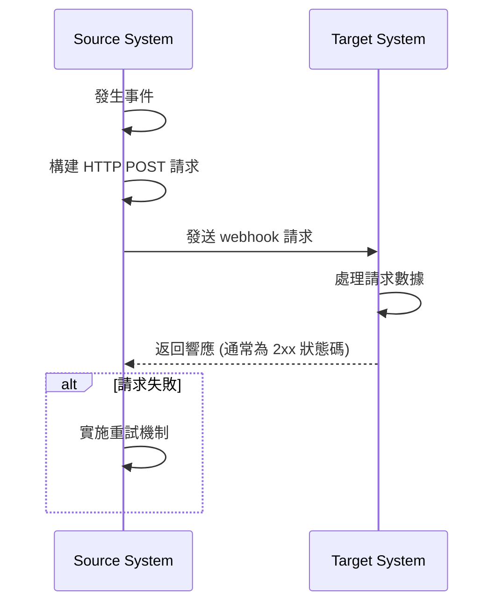
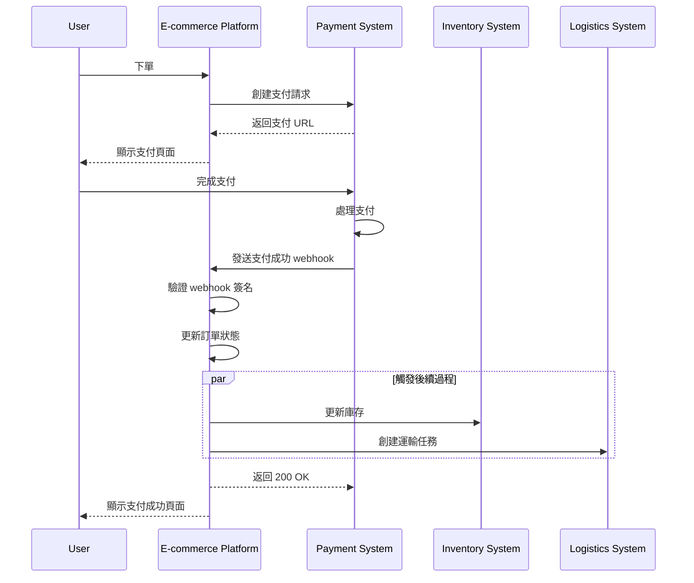

## 什麼是 webhook？

Webhook 是一種 HTTP 回調機制，允許應用程式在特定事件發生時向預定義的 URL 發送即時通知。這種機制使系統之間能夠自動化數據交換和即時通訊。

## Webhook 如何運作？



1. 發生特定事件於源系統
2. 源系統構建包含事件數據的 HTTP POST 請求
3. 源系統將請求發送至預配置的目標系統 URL
4. 目標系統接收到請求並處理數據
5. 目標系統返回響應至源系統
6. 若請求失敗，源系統可能實施重試機制

## Webhook 的常見使用案例有哪些？

1. 支付系統：通知訂單狀態變更
2. 版本控制系統：通知代碼提交、合併請求和其他事件
3. CRM 系統：客戶信息更新通知
4. IoT 設備：設備狀態變更通知
5. 社交媒體平台：新消息和評論通知

## Webhooks 在現實場景中如何運作？

讓我們來看看一個涉及電子商務平台與第三方支付系統整合的場景：

### 場景

一個電子商務平台使用第三方支付系統來處理訂單支付。當用戶完成支付時，支付系統需要即時通過 webhook 通知電子商務平台有關支付狀態，以允許平台更新訂單狀態並觸發後續過程。

### Webhook 實施流程



1. 訂單創建和支付請求：
   - 用戶在電子商務平台上下訂單。
   - 平台向支付系統發送支付請求。
   - 支付系統返回支付 URL，平台將其顯示給用戶。

2. 用戶支付：
   - 用戶在支付系統上完成支付。

3. Webhook 觸發：
   - 支付系統檢測到“支付成功”事件。
   - 它構建包含支付詳情的 webhook 負載。

4. 發送 webhook：
   - 支付系統將 POST 請求發送到預配置的電子商務平台 URL。

5. 接收方處理：
   - 電子商務平台接收到 webhook，並首先驗證請求簽名以確保安全。
   - 驗證後，平台將相應的訂單狀態更新為“已支付”。
   - 平台觸發後續過程，例如更新庫存和創建運輸任務。

6. 響應處理：
   - 電子商務平台在接收到 webhook 後立即返回 200 OK 響應。
   - 如果處理過程中出現錯誤，平台將在背景中重試或涉及人工干預。

7. 用戶體驗：
   - 電子商務平台向用戶顯示支付成功頁面。

這個例子展示了 webhooks 如何在第三方支付系統和電子商務平台之間實現即時通信。通過 webhooks，支付系統可以即時通知電子商務平台支付已完成，從而允許立即更新訂單狀態並快速觸發後續的業務流程。這提高了整體系統的響應能力和效率，最終為用戶提供了更好的購物體驗。

## 實施 webhook 的最佳實踐是什麼？

當你是 webhooks 的發送方（生產者）時，考慮以下方面：

### Webhook 設計

設計清晰一致的 webhook 結構：

- 定義清晰的事件類型：如 `order.created`、`user.updated` 等。
- 使用標準 JSON 格式：確保數據結構清晰易於解析。
- 版本控制：在請求頭或負載中包含版本信息。例如：

  ```javascript
  // 在請求頭中
  headers: {
    'Content-Type': 'application/json',
    'X-Webhook-Version': '1.0'
  }
  
  // 或在負載中
  {
    "version": "1.0",
    "event_type": "order.created",
    "data": {
      // 事件詳情
    }
  }
  ```

- 提供充分的上下文：包括事件發生的時間戳、相關資源的唯一標識符等。
- 保持一致性：在所有事件類型中使用一致的命名規則和數據結構。

### 發送機制

實施可靠的 webhook 發送機制：

- 使用異步任務隊列：避免阻塞主程序並提高系統響應能力。
- 實施重試機制：處理網絡故障或接收方的暫時不可用情況。

### 重試策略

設計合適的重試策略：

- 實施指數退避：避免頻繁重試對系統和接收方造成壓力。
- 設定最大重試次數：防止無限重試消耗系統資源。
- 提供手動重試機制：為最終失敗的 webhooks 提供手動重試的接口。

### 安全性實施

實施簽名機制以允許接收方驗證請求的真實性：

```javascript
const crypto = require('crypto');

function generateSignature(payload, secret) {
  return crypto.createHmac('sha256', secret)
    .update(JSON.stringify(payload))
    .digest('hex');
}

function sendWebhookWithSignature(url, payload, secret) {
  const signature = generateSignature(payload, secret);
  return axios.post(url, payload, {
    headers: { 'X-Webhook-Signature': signature }
  });
}
```

### 性能優化

優化 webhook 發送性能：

- 使用連接池：減少建立連接的開銷並提高性能。
- 實施批處理：在適當時候以批次方式發送 webhooks 減少網絡交互次數。

### 文檔和測試工具

為 webhook 的用戶提供支持：

- 詳細的 API 文檔：包含所有可能的事件類型、請求格式和字段描述。
- 提供測試工具：實施 webhook 測試端點以允許用戶模擬接收 webhook 通知。
- 示例代碼：提供各種編程語言的集成示例。

## 使用 webhooks 的最佳實踐是什麼？

當作為 webhooks 的接收方（消費者）時，考慮以下方面：

### 安全性

由於接收 webhooks 的端點通常是公開可訪問的，因此安全性是一個首要考量。注意以下幾點：

- 驗證請求的真實性：實施簽名驗證機制以確保請求來自預期的發送方。
  
  ```javascript
  const crypto = require('crypto');

  function verifySignature(payload, signature, secret) {
    const expectedSignature = crypto
      .createHmac('sha256', secret)
      .update(JSON.stringify(payload))
      .digest('hex');
    
    return crypto.timingSafeEqual(
      Buffer.from(signature),
      Buffer.from(expectedSignature)
    );
  }
  ```

- 使用 HTTPS：確保你的 webhook 接收端點使用 HTTPS 以防止數據在傳輸過程中被攔截或篡改。
- 實施 IP 白名單：只接受來自可信 IP 地址的 webhook 請求，以降低攻擊風險。

### 可靠性

為確保可靠地處理接收到的 webhooks：

- 實施冪等處理：設計系統正確處理重複的 webhook 通知，因為發送方可能會重試失敗的請求。
- 快速響應：在接收到 webhook 請求後立即返回響應（通常為 2xx 狀態碼），以防發送方認為請求失敗並觸發重試。

### 性能

維持系統高效運行：

- 異步處理：在接收到 webhook 後，執行實際數據處理在背景進行，避免阻塞響應。
- 設定超時限制：為 webhook 處理設置合理的超時期限，以防長時間運行的任務影響系統性能。

### 錯誤處理

適當處理潛在錯誤情況：

- 記錄日志：對接收到的 webhook 請求和處理過程保持詳細記錄，便於問題調查。
- 優雅降級：當無法處理 webhooks 時，具有適當的錯誤處理機制以確保系統其它部分不受影響。

### 版本兼容性

由於 webhook 格式可能隨時間而改變：

- 處理版本信息：準備好處理不同版本的 webhook 格式。版本信息通常在 URL 或請求頭中提供。
- 向後兼容：在更新你的 webhook 處理邏輯時，確保繼續支持舊版本格式。

### 監控

持續監控 webhooks 的接收和處理：

- 設置警報：對異常情況（如高失敗率或不尋常的流量）實施實時監控和警報。
- 性能指標：追踪 webhook 處理的性能指標，如響應時間和成功率。

<Resources
  urls={[
    "https://docs.logto.io/docs/recipes/webhooks/",
    "https://docs.logto.io/docs/recipes/webhooks/securing-your-webhooks/",
    "https://en.wikipedia.org/wiki/Webhook"
  ]}
/>