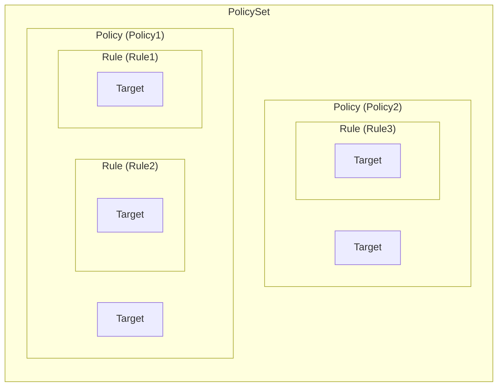
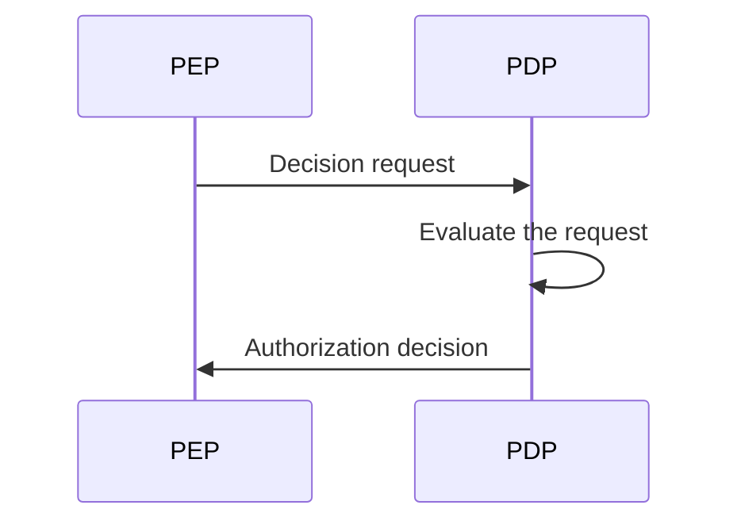
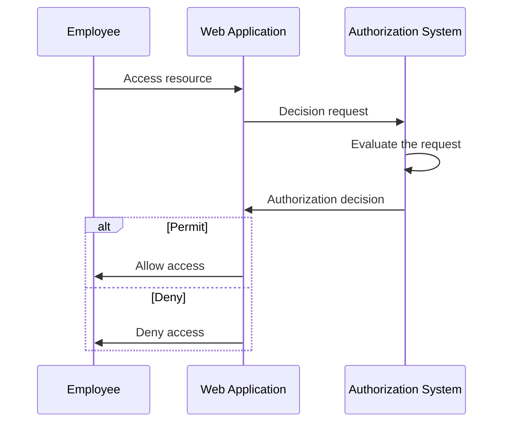
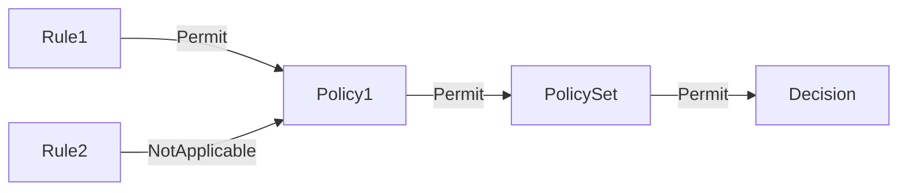
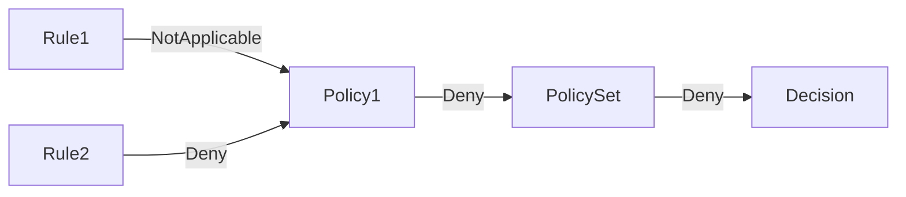
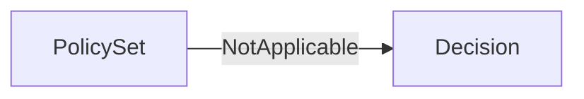

## 什麼是 XACML？

如其名稱所示，可擴展存取控制標記語言 (XACML) 是一種主要用於存取控制的基於 XML 的語言。它是一種由結構化資訊標準促進組織 (OASIS) 定義的標準。

[XACML 3.0](https://docs.oasis-open.org/xacml/3.0/xacml-3.0-core-spec-os-en.html) 是該標準的最新版本，於 2013 年發布。雖然它並未指定特定的存取控制模型，但 XACML 常用於實施 <Ref slug="abac" /> 政策。我們來看看 XACML 如何用於表示 ABAC 政策的一個簡單示例：

```xml
<PolicySet PolicySetId="ABAC_Policies" PolicyCombiningAlgId="urn:oasis:names:tc:xacml:3.0:policy-combining-algorithm:deny-overrides">
  <Description>ABAC Policies</Description>
  <Policy PolicyId="Policy1" RuleCombiningAlgId="urn:oasis:names:tc:xacml:3.0:rule-combining-algorithm:deny-overrides">
    <Description>Employees can read data</Description>
    <Target>
      <AnyOf>
        <AllOf>
          <Match MatchId="urn:oasis:names:tc:xacml:1.0:function:string-equal">
            <AttributeValue DataType="http://www.w3.org/2001/XMLSchema#string">read</AttributeValue>
            <AttributeDesignator
              AttributeId="urn:oasis:names:tc:xacml:1.0:action:action-id"
              Category="urn:oasis:names:tc:xacml:3.0:attribute-category:action"
              DataType="http://www.w3.org/2001/XMLSchema#string"
              MustBePresent="true"
            />
          </Match>
        </AllOf>
      </AnyOf>
    </Target>
    <Rule RuleId="Rule1" Effect="Permit">
      <Target>
        <AnyOf>
          <AllOf>
            <Match MatchId="urn:oasis:names:tc:xacml:1.0:function:string-equal">
              <AttributeValue DataType="http://www.w3.org/2001/XMLSchema#string">employee</AttributeValue>
              <AttributeDesignator
                AttributeId="urn:oasis:names:tc:xacml:1.0:subject:subject-id"
                Category="urn:oasis:names:tc:xacml:1.0:subject-category:access-subject"
                DataType="http://www.w3.org/2001/XMLSchema#string"
                MustBePresent="true"
              />
            </Match>
          </AllOf>
        </AnyOf>
      </Target>
    </Rule>
    <Rule RuleId="Rule2" Effect="Deny">
      <Target>
        <AnyOf>
          <AllOf>
            <Match MatchId="urn:oasis:names:tc:xacml:1.0:function:string-equal">
              <AttributeValue DataType="http://www.w3.org/2001/XMLSchema#string">user</AttributeValue>
              <AttributeDesignator
                AttributeId="urn:oasis:names:tc:xacml:1.0:subject:subject-id"
                Category="urn:oasis:names:tc:xacml:1.0:subject-category:access-subject"
                DataType="http://www.w3.org/2001/XMLSchema#string"
                MustBePresent="true"
              />
            </Match>
          </AllOf>
        </AnyOf>
      </Target>
    </Rule>
  </Policy>
  <!-- ...other policies... -->
</PolicySet>
```

XACML 在自解釋命名約定方面表現出色。該語言被設計為易於閱讀和理解。

簡而言之，這項政策表示員工可以讀取數據，而用戶被拒絕讀取數據。讓我們通過分析關鍵組件來剖析該政策：

- `<PolicySet>`：政策集合的根元素。一個 `PolicySet` 可以包含多個 `Policy` 和 `PolicySet` 元素，形成一個政策的層次結構。
- `<Policy>`：包含一個或多個規則的政策。每個政策可以有：
  - 一個 `Target` 元素，用於指定政策適用的條件。
  - 多個 `Rule` 元素，用於定義存取控制規則。
  - 一個 `RuleCombiningAlgId` 屬性，指定如何組合規則以做出決定。
- `<Rule>`：定義授予或拒絕存取的條件的規則。每條規則都有：
  - 一個 `Target` 元素，指定規則適用的條件。
  - 一個 `Effect` 屬性，指定規則允許或拒絕存取。

> [!Note]
> XACML 中可用的組件和屬性不僅限於我們剛剛提到的那些。請查閱 [XACML 3.0 規範](https://docs.oasis-open.org/xacml/3.0/xacml-3.0-core-spec-os-en.html) 以獲取完整的元素和屬性列表。

下圖顯示了不同關鍵組件之間關係的圖形化表示：



對於示例中其他元素和屬性的詳細說明，將在接下來的部分中提供。

## XACML 如何運作

為了簡便起見，假設在上述政策集中僅定義了一項政策。為了觸發政策評估過程，**需要從**政策執行點 (PEP)**向**政策決策點 (PDP)**發送一個**決策請求**。PDP 根據政策評估請求，並返回一個**授權決定**給 PEP。



- PEP：該組件向 PDP 發送決策請求並執行授權決定（即執行 <Ref slug="access-control" />）。
- PDP：該組件根據政策評估決策請求並返回授權決定。

讓我們用一個現實世界的例子來替代莎士比亞式的語言。假設有一個網絡應用允許員工訪問某些資源，且該應用與基於 XACML 的授權系統集成。

當員工嘗試訪問一個資源時，網絡應用（**PEP**）會向授權系統（**PDP**）發送一個**決策請求**。授權系統根據 XACML 政策評估請求後，它會將**授權決定**返回給網絡應用。



## 決策請求

在 XACML 中，決策請求由以下關鍵組件組成：

- **Subject**：請求訪問資源的實體。它可以是用戶、設備或任何其他實體。
- **Resource**：被訪問的資源。它可以是文件、資料庫、API 端點或任何其他資源。
- **Action**：對資源執行的操作。它可以是讀取、寫入、刪除或任何其他操作。
- **Environment**：提出存取請求的上下文。它可以包含時間、地點或任何其他上下文信息。

以下是 XACML 中決策請求的示例：

```xml
<Request>
  <Attributes Category="urn:oasis:names:tc:xacml:3.0:attribute-category:resource">
    <Attribute AttributeId="urn:oasis:names:tc:xacml:1.0:resource:resource-id" DataType="http://www.w3.org/2001/XMLSchema#string">
      <AttributeValue>http://example.com/data</AttributeValue>
    </Attribute>
  </Attributes>
  <Attributes Category="urn:oasis:names:tc:xacml:3.0:attribute-category:action">
    <Attribute AttributeId="urn:oasis:names:tc:xacml:1.0:action:action-id" DataType="http://www.w3.org/2001/XMLSchema#string">
      <AttributeValue>read</AttributeValue>
    </Attribute>
  </Attributes>
  <Attributes Category="urn:oasis:names:tc:xacml:3.0:attribute-category:subject">
    <Attribute AttributeId="urn:oasis:names:tc:xacml:1.0:subject:subject-id" DataType="http://www.w3.org/2001/XMLSchema#string">
      <AttributeValue>employee</AttributeValue>
    </Attribute>
  </Attributes>
</Request>
```

## 評估過程

一旦 PDP 檢索到政策集，它將按照以下步驟對決策請求進行評估：

1. **目標匹配**：對於每個政策，PDP 會檢查請求是否匹配政策的目標。如果請求與目標匹配，PDP 會進一步評估規則。
2. **規則評估**：PDP 評估政策中的每個規則。如果規則的目標與請求匹配，PDP 評估規則的條件。如果條件為 `true`，則返回規則的效果（准許或拒絕）。如果條件為 `false`，則 PDP 繼續評估下一個規則。
3. **規則組合**：PDP 根據政策的 `RuleCombiningAlgId` 屬性組合所有規則的效果。組合的效果作為政策的決策返回。
4. **政策組合**：如果政策集中包含多個政策，PDP 根據政策集的 `PolicyCombiningAlgId` 屬性組合所有政策的決定。組合的決定作為最終的授權決定返回。

### 示例 1

例如，在示例政策集中，假設決策請求如上所述。PDP 將針對 `Policy1` 政策進行評估：

#### 目標匹配

政策的 `Target` 規定任何具有 `read` 動作 ID 的對象都應由政策進行評估。由於請求的動作是 `read`，因此請求匹配政策的目標。

#### 規則評估

該政策包含兩項規則：

1. `Rule1`：由於請求的 subject ID 是 `employee`，規則的條件評估為 `true`，且規則效果為 `Permit`。
2. `Rule2`：由於請求的 subject ID 不是 `user`，規則的條件評估為 `false`，且規則效果為 `NotApplicable`。

#### 規則和政策組合

- 由於 `Policy1` 使用 `deny-overrides` 規則組合算法，政策決策是 `Permit`，因為 `Rule1` 准許存取且它的效果覆蓋了 `Rule2` 的 `NotApplicable` 效果。
- 該政策集也使用 `deny-overrides` 政策組合算法，最終決策是 `Permit`，因為政策決策是 `Permit`。

下面是該評估過程的非正式圖形化表示：



### 示例 2

現在，讓我們考慮一個不同的決策請求，其中所有其他屬性都相同，但 subject ID 是 `user` 而不是 `employee`。

#### 目標匹配

由於動作未更改，因此請求仍匹配政策的目標。

#### 規則評估

- `Rule1`：請求的 subject ID 不是 `employee`，規則的條件為 `false`，且規則效果為 `NotApplicable`。
- `Rule2`：請求的 subject ID 是 `user`，規則的條件為 `true`，且規則效果為 `Deny`。

#### 規則和政策組合

- 政策決策為 `Deny`，因為 `Rule2` 拒絕存取，且其效果覆蓋了 `Rule1` 的 `NotApplicable` 效果。
- 最終決策為 `Deny`，因為政策集的 `deny-overrides` 政策組合算法返回最嚴格的決策。

下面是該評估過程的非正式圖形化表示：



### 示例 3

最後，讓我們考慮一個請求中的動作是 `write` 而不是 `read` 的決策請求。其他所有屬性保持與示例 1 相同。

#### 目標匹配

由於動作是 `write` 而不是 `read`，因此請求不再與政策的目標匹配。因此，政策不被評估。

#### 規則和政策組合

由於未評估政策，最終決策為 `NotApplicable`。

下面是該評估過程的非正式圖形化表示：



## 組合算法

XACML 定義了多個標準組合算法，用於決定如何組合多個規則或政策的效果以做出決策。在上述示例中，我們提到了用於規則和政策的 `deny-overrides` 組合算法。

顧名思義，`deny-overrides` 算法優先考慮 `Deny` 決策而非 `Permit` 決策。以下是 `deny-overrides` 算法如何工作的簡化說明：

- 如果任何規則或政策拒絕訪問，最終決策是 `Deny`;
- 如果沒有規則或政策拒絕訪問，且至少有一個規則或政策允許訪問，最終決策是 `Permit`;
- 如果沒有規則或政策拒絕訪問，且沒有規則或政策允許訪問，最終決策是 `NotApplicable`。

實際算法更為複雜，並考慮其他 "不確定" 決策，例如 `Indeterminate{D}` 和 `Indeterminate{P}`。

> [!Note]
> 該算法不提供在沒有規則或政策匹配請求時的 "後備" 決策。在這種情況下，決策為 `NotApplicable`。

欲詳細了解組合算法及其行為，請參閱 [XACML 3.0 規範](https://docs.oasis-open.org/xacml/3.0/xacml-3.0-core-spec-os-en.html#_Toc325047268)。

## 實施考量

XACML 是一種強大的語言，用於表達基於屬性的存取控制政策。在你的系統中實施 XACML 之前，請考慮以下因素：

- 存取控制設計：XACML 具有靈活性和表達力，但它需要仔細設計，因為它可能涉及複雜的政策集合，導致意想不到的後果。
- 複雜性：XACML 政策通常比較複雜，可能難以管理。對於大多數應用，較簡單的存取控制模型如 <Ref slug="rbac" /> 可能更合適。
- 性能：評估 XACML 政策計算開銷可能較大，尤其是在處理大型政策集的情況下。考慮在你的系統中使用 XACML 的性能影響。

<SeeAlso slugs={['abac', 'rbac', 'access-control', 'authorization']} />

<Resources
  urls={[
    'https://docs.oasis-open.org/xacml/3.0/xacml-3.0-core-spec-os-en.html',
  ]}
/>