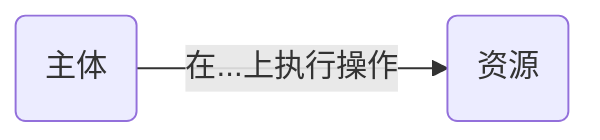
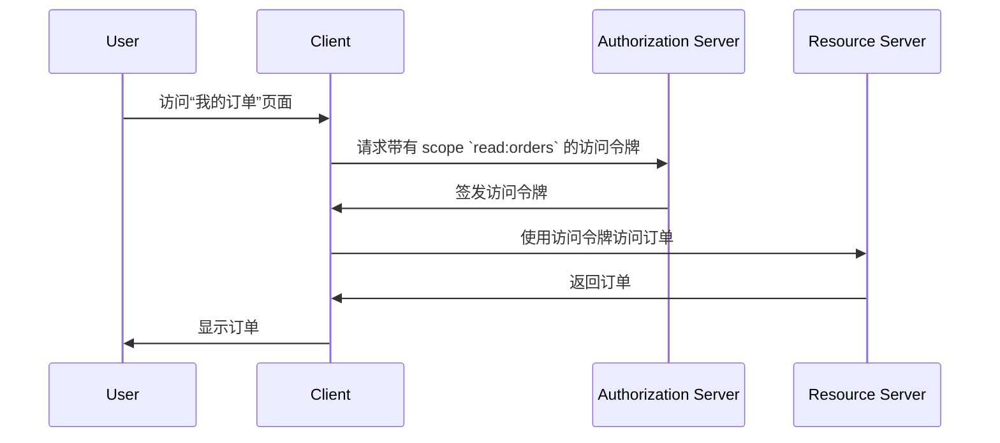

## 什么是访问控制 (Access control)？

访问控制涉及三个主要组成部分：

- **Subject** (主体)：在资源上执行操作的实体。主体可以是用户、服务或设备。
- **Resource** (资源)：受访问控制保护的实体。资源可以是文件、数据库、API 或任何其他数字资产。
- **Action** (操作)：主体可以在资源上执行的操作。操作可以是读取、写入、执行或任何其他操作。

> 访问控制根据 **主体** 和 **操作** 对 **资源** 的访问进行选择性限制。

以下是一些访问控制的实际例子：

- 在电子商务系统中，用户 (主体) **可以** 阅读 (操作) 他们的订单 (资源)。
- 在社交网络中，用户 (主体) **不能** 删除 (操作) 其他用户的个人资料 (资源)。
- 在微服务架构中，服务 (主体) **可以** 写入 (操作) 数据到数据库 (资源)。

有时，在技术实现中会忽略资源，将访问控制定义为谁 (主体) 可以执行哪些操作的限制。例如，基本的 OAuth 2.0 框架仅通过使用 scopes (权限) 来指定操作，并未定义资源。

访问控制的支持可能因 <Ref slug="authorization-server" /> 或 <Ref slug="identity-provider" /> 而异。某些系统可能支持 [OAuth 2.0 的资源指示符](https://datatracker.ietf.org/doc/html/rfc8707)，这是一种扩展 OAuth 2.0 的机制，允许客户端指定他们想要访问的资源。

## 访问控制模型 ||access-control-models||

对少数主体和资源进行限制的决策很简单，但不具备可扩展性。因此，行业开发了许多访问控制模型，以便有效管理。在 <Ref slug="iam" /> 的背景下，以下是一些常见的访问控制模型：

- <Ref slug="rbac" />：一种将权限分配给角色，然后将角色分配给主体的模型。例如，管理员角色可能对所有资源都有访问权限，而用户角色可能对有限的资源有访问权限。
- <Ref slug="abac" />：一种使用主体、资源和环境的属性 (属性) 来做出访问控制决策的模型。例如，具有属性 "department=engineering" 的用户可能有权访问工程资源。

还有其他访问控制模型，如 [基于策略的访问控制 (PBAC)](https://csrc.nist.gov/glossary/term/policy_based_access_control)。每种模型都有其自身的优势和劣势，选择模型取决于你的用例和需求。

## OAuth 2.0 中的访问控制

在 OAuth 2.0 的背景下，访问控制通常通过 <Ref slug="scope">scopes</Ref> 来实现。通常，scope 的值是一个将资源和操作结合在一起的字符串。例如，`read:orders` 或 `write:profile`。

> [!注意]
> 在大多数情况下，"scopes" 这个术语可以与 "permissions" 互换使用。

值得注意的是，OAuth 2.0 并未定义 scopes 的结构和含义。scopes 的解释留给 <Ref slug="resource-server" />，而 scopes 的签发留给 <Ref slug="authorization-server" />。

例如，用户 (主体) 需要访问他们在电子商务系统中的订单 (资源)。通过利用 OAuth 2.0，你可以定义一个 scope `read:orders`，并且一个 web 应用 (客户端) 将从授权服务器请求这个 scope。以下是一个简化的流程：

在此流程中，取决于技术架构，资源服务器可以是一个 API 服务，也可以是有能力访问资源 (订单) 的客户端 (web 应用) 自身。

### 资源指示符参数

尽管人们通常用资源和操作来定义 scopes（例如，`read:orders`，其中 `orders` 是资源，`read` 是操作），但当资源和操作的数量增加时，这种方法的可扩展性有限。RFC 8707 向 OAuth 2.0 引入了 `resource` 参数 (即 <Ref slug="resource-indicator">资源指示符</Ref>)，允许客户端指定他们想要访问的资源。

RFC 规定 `resource` 参数应为代表资源的 URI。例如，可以使用 `https://api.example.com/orders` 而不是简单地使用 `orders`。这种方法有助于防止命名冲突，并通过允许使用实际的资源 URL 来增强资源匹配的精确性。

### 授权服务器支持

OAuth 2.0 并未定义授权服务器应如何执行访问控制。它将实现细节留给授权服务器的自行决定。因此，授权服务器的选择可能极大地影响访问控制机制。例如，某些授权服务器可能支持资源指示符，而其他服务器则可能不支持。重要的是根据你的业务需求决定使用哪种访问控制模型，然后选择支持该模型的授权服务器。如果你不确定使用哪个访问控制模型，<Ref slug="rbac" /> 对大多数情况来说已经足够好。

<SeeAlso slugs={["rbac", "abac", "resource-indicator", "authorization"]} />

<Resources
  urls={[
    "https://blog.logto.io/mastering-rbac",
    "https://blog.logto.io/rbac-and-abac",
    "https://datatracker.ietf.org/doc/html/rfc8707",
    "https://blog.logto.io/organization-and-role-based-access-control",
  ]}
/>
